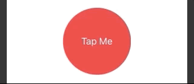
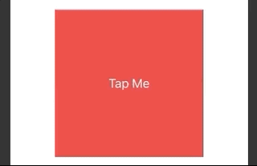
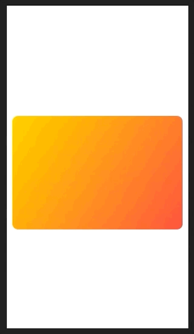
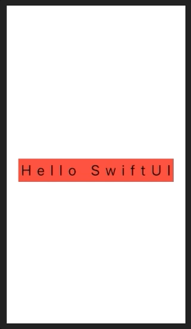
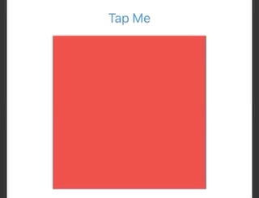

# Animations

## Implicit animations

Implicit animations means we define the animation we want, and let SwiftUI take care of the rest. We can animation views, or we can animation state through a binding.

### Adding animations to a view

We can add animation to a view.

```swift
struct ContentView: View {
    
    @State private var animationAmount: CGFloat = 1
    
    var body: some View {
        
        Button("Tap Me") {
            self.animationAmount += 1
        }
        .padding(50)
        .background(Color.red)
        .foregroundColor(.white)
        .clipShape(Circle())
        .scaleEffect(animationAmount)
        .blur(radius: (animationAmount - 1) * 3)
        .animation(.default)
    }
}
```


### Adding animations to a binding

And we can add animation to a binding.

```swift
struct ContentView: View {
    
    @State private var animationAmount: CGFloat = 1
    
    var body: some View {
    
        VStack {
            Stepper("Scale amount", value: $animationAmount.animation(), in: 1...10)
                        
            Button("Tap Me") {
                self.animationAmount += 1
            }
            .padding(40)
            .background(Color.red)
            .foregroundColor(.white)
            .clipShape(Circle())
            .scaleEffect(animationAmount)
        }
    }
    
}
```


## Explicit animations

Explicit animations are where we are explicit about the animation we want when some state change occurs. It
s not attached to a binding. And it's not attached to a view. It's just us explicitly asking for a particulr animation to occur because of a state change.

And we do that using `withAnimation()`.

```swift
struct ContentView: View {
    
    @State private var animationAmount = 0.0
    
    var body: some View {
        
        Button("Tap Me") {
            withAnimation {
                self.animationAmount += 360
            }
        }
        .padding(50)
        .background(Color.red)
        .foregroundColor(.white)
        .clipShape(Circle())
        .rotation3DEffect(.degrees(animationAmount), axis: (x: 0, y: 1, z: 0))
    }

}
```



```swift
withAnimation(.interpolatingSpring(stiffness: 5, damping: 1)) {
    self.animationAmount += 360
}
```


## Order matters

If you don't set the view modifer after all the effects changes you want to see, you won't get them. So add the modifier at the end of the view to get them all.

```swift
Button("Tap Me") {
    self.enabled.toggle()
}
.frame(width: 200, height: 200)
.background(enabled ? Color.blue : Color.red)
.animation(.default)
.foregroundColor(.white)
.clipShape(RoundedRectangle(cornerRadius: enabled ? 60 : 0))
.animation(.interpolatingSpring(stiffness: 10, damping: 1))
```



## Animating gestures

Dragging a card around the screen and then letting it snap back to its original position.

Here is the card with no animation.

```swift
struct ContentView: View {
    
    @State private var dragAmount = CGSize.zero
    
    var body: some View {
        
        LinearGradient(gradient: Gradient(colors: [.yellow, .red]), startPoint: .topLeading, endPoint: .bottomTrailing)
            .frame(width: 300, height: 200)
            .clipShape(RoundedRectangle(cornerRadius: 10))
            .offset(dragAmount)
            .gesture(
                DragGesture()
                    .onChanged { self.dragAmount = $0.translation }
                    .onEnded { _ in self.dragAmount = .zero }
            )
        
    }
}
```


### Implicit animation

Here we add an implicity animation that will animate the drag *and* the release.

```swift
.gesture(
    DragGesture()
        .onChanged { self.dragAmount = $0.translation }
        .onEnded { _ in self.dragAmount = .zero }
)
.animation(.spring())
```



### Explicit animation

To explicitly set the animation, remove the `.animation` modifier and explicitly change `.onEnded` to this.

```swift
.onEnded { _ in
    withAnimation(.spring()) {
        self.dragAmount = .zero
    }
}
```


Now the card will follow your drag immediately (because it is not being animated), but will animate when released.

Can combine these in interesting ways like this.

```swift
struct ContentView: View {
    let letters = Array("Hello SwiftUI")
    @State private var enabled = false
    @State private var dragAmount = CGSize.zero

    var body: some View {
        HStack(spacing: 0) {
            ForEach(0..<letters.count) { num in
                Text(String(self.letters[num]))
                    .padding(5)
                    .font(.title)
                    .background(self.enabled ? Color.blue : Color.red)
                    .offset(self.dragAmount)
                    .animation(Animation.default.delay(Double(num) / 20))
            }
        }
        .gesture(
            DragGesture()
                .onChanged { self.dragAmount = $0.translation }
                .onEnded { _ in
                    self.dragAmount = .zero
                    self.enabled.toggle()
                }
        )
    }
}
```



## Showing and hiding views with transtions

Here is an example of how to make the red square appear with a scaled transition.

```swift
struct ContentView: View {
    
    @State private var isShowingRed = false

    var body: some View {
        VStack {
            Button("Tap Me") {
                withAnimation {
                    self.isShowingRed.toggle()
                }
            }

            if isShowingRed {
                Rectangle()
                    .fill(Color.red)
                    .frame(width: 200, height: 200)
                    .transition(.scale)
            }
        }
    }
}
```



Here's another.

```swift
.transition(.asymmetric(insertion: .scale, removal: .opacity))
```


## Building custom transitions with ViewModifier

```swift
struct CornerRotateModifier: ViewModifier {
    let amount: Double
    let anchor: UnitPoint

    func body(content: Content) -> some View {
        content.rotationEffect(.degrees(amount), anchor: anchor).clipped()
    }
}

extension AnyTransition {
    static var pivot: AnyTransition {
        .modifier(
            active: CornerRotateModifier(amount: -90, anchor: .topLeading),
            identity: CornerRotateModifier(amount: 0, anchor: .topLeading)
        )
    }
}

struct ContentView: View {
    
    @State private var isShowingRed = false

    var body: some View {
        VStack {
            Button("Tap Me") {
                withAnimation {
                    self.isShowingRed.toggle()
                }
            }

            if isShowingRed {
                Rectangle()
                    .fill(Color.red)
                    .frame(width: 200, height: 200)
                    .transition(.pivot)
            }
        }
    }
}
```


### Links that help

- [Implicit animations](https://www.hackingwithswift.com/books/ios-swiftui/creating-implicit-animations)
- [Customizing animations in SwiftUI](https://www.hackingwithswift.com/books/ios-swiftui/customizing-animations-in-swiftui)
- [Animating bindings](https://www.hackingwithswift.com/books/ios-swiftui/animating-bindings)
- [Explicit animations](https://www.hackingwithswift.com/books/ios-swiftui/creating-explicit-animations)
- [Controlling the animation stack](https://www.hackingwithswift.com/books/ios-swiftui/controlling-the-animation-stack)
- [Animating gestures](https://www.hackingwithswift.com/books/ios-swiftui/animating-gestures)
- [Showing and hiding views with transitions](https://www.hackingwithswift.com/books/ios-swiftui/showing-and-hiding-views-with-transitions)
- [Custom transitions with view modifier](https://www.hackingwithswift.com/books/ios-swiftui/building-custom-transitions-using-viewmodifier)