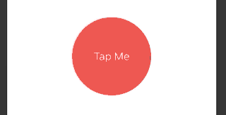
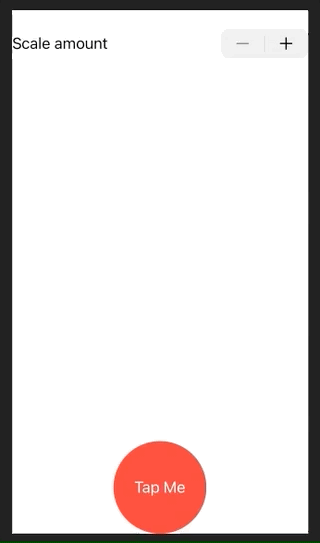

# Animations

## Implicit animations

Implicit animations means we define the animation we want, and let SwiftUI take care of the rest. We can animation views, or we can animation state through a binding.

### Adding animations to a view

We can add animation to a view.

```swift
struct ContentView: View {
    
    @State private var animationAmount: CGFloat = 1
    
    var body: some View {
        
        Button("Tap Me") {
            self.animationAmount += 1
        }
        .padding(50)
        .background(Color.red)
        .foregroundColor(.white)
        .clipShape(Circle())
        .scaleEffect(animationAmount)
        .blur(radius: (animationAmount - 1) * 3)
        .animation(.default)
    }
}
```




### Adding animations to a binding

And we can add animation to a binding.

```swift
struct ContentView: View {
    
    @State private var animationAmount: CGFloat = 1
    
    var body: some View {
    
        VStack {
            Stepper("Scale amount", value: $animationAmount.animation(), in: 1...10)
                        
            Button("Tap Me") {
                self.animationAmount += 1
            }
            .padding(40)
            .background(Color.red)
            .foregroundColor(.white)
            .clipShape(Circle())
            .scaleEffect(animationAmount)
        }
    }
    
}
```



## Explicit animations

Explicit animations are where we are explicit about the animation we want when some state change occurs. It
s not attached to a binding. And it's not attached to a view. It's just us explicitly asking for a particulr animation to occur because of a state change.

And we do that using `withAnimation()`.

```swift
struct ContentView: View {
    
    @State private var animationAmount = 0.0
    
    var body: some View {
        
        Button("Tap Me") {
            withAnimation {
                self.animationAmount += 360
            }
        }
        .padding(50)
        .background(Color.red)
        .foregroundColor(.white)
        .clipShape(Circle())
        .rotation3DEffect(.degrees(animationAmount), axis: (x: 0, y: 1, z: 0))
    }

}
```


```swift
withAnimation(.interpolatingSpring(stiffness: 5, damping: 1)) {
    self.animationAmount += 360
}
```


## Order matters

If you don't set the view modifer after all the effects changes you want to see, you won't get them. So add the modifier at the end of the view to get them all.

```swift
Button("Tap Me") {
    self.enabled.toggle()
}
.frame(width: 200, height: 200)
.background(enabled ? Color.blue : Color.red)
.animation(.default)
.foregroundColor(.white)
.clipShape(RoundedRectangle(cornerRadius: enabled ? 60 : 0))
.animation(.interpolatingSpring(stiffness: 10, damping: 1))
```


### Links that help

- [Implicit animations](https://www.hackingwithswift.com/books/ios-swiftui/creating-implicit-animations)
- [Customizing animations in SwiftUI](https://www.hackingwithswift.com/books/ios-swiftui/customizing-animations-in-swiftui)
- [Animating bindings](https://www.hackingwithswift.com/books/ios-swiftui/animating-bindings)
- [Explicit animations](https://www.hackingwithswift.com/books/ios-swiftui/creating-explicit-animations)
- [Controlling the animation stack](https://www.hackingwithswift.com/books/ios-swiftui/controlling-the-animation-stack)