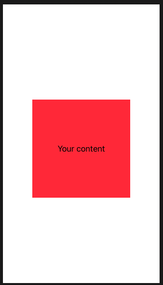

# Color

SwiftUI has its own color pallete separate from `UIKit`. If you want to access `UIKit` colors you can do so like thi.

```swift
.background(Color(.systemFill))
```

## Stacks

Note how only the text gets the background color.

```swift
ZStack {
    Text("Your content")
}
.background(Color.red)
```


Same result as this.

```swift
ZStack {
    Text("Your content")
        .background(Color.red)
}
```

If you want to fill in the whole area behind the text, you should place the color into the `ZStack`. Treat it as a whole view all by itself.

```swift
ZStack {
    Color.red
    Text("Your content")
}
```


`Color.red` is a view in it's own right, which is why ic can be sued for shapes and text. It automatically takes up all the space, but you can also use the `frame()` modifier too.



If you want to ignore safeArea.

```swift
ZStack {
    Color.red.edgesIgnoringSafeArea(.all)
    Text("Your content")
}
```

## Specific color

```swift
Color(red: 1, green: 0.8, blue: 0)
```


### Links that help

- [Color and frames](https://www.hackingwithswift.com/books/ios-swiftui/colors-and-frames)
