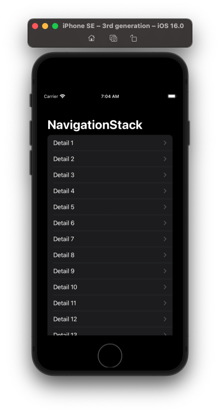

# NavigationStack

## Simple



```swift
import SwiftUI

struct ContentView: View {
    var body: some View {
        NavigationStack {
            List(1..<20) { i in
                NavigationLink("Detail \(i)") {
                    Text("Detail \(i)")
                }
            }
            .navigationTitle("NavigationStack")
        }
    }
}

struct ContentView_Previews: PreviewProvider {
    static var previews: some View {
        ContentView()
    }
}
```

## With Value

```swift
import SwiftUI

struct ContentView: View {
    @EnvironmentObject var modelData: ModelData
    var body: some View {
        NavigationStack {
            List(modelData.companies) { company in
                NavigationLink(value: company) {
                    Text(company.name)
                }
            }
            .navigationDestination(for: Company.self) { company in
                CompanyView(company: company)
            }
            .navigationTitle("Companies")
        }
    }
}

struct ContentView_Previews: PreviewProvider {
    static var previews: some View {
        ContentView()
            .preferredColorScheme(.dark)
            .environmentObject(ModelData())
    }
}
```

## Preselect rows from layout

```swift
struct ContentView: View {
    @State private var presentedNumbers = [1, 4, 8]

    var body: some View {
        NavigationStack(path: $presentedNumbers) {
            List(1..<20) { i in
                NavigationLink(value: i) {
                    Label("Row \(i)", systemImage: "\(i).circle")
                }
            }
            .navigationDestination(for: Int.self) { i in
                Text("Detail \(i)")
            }
            .navigationTitle("NavigationStack")
        }
    }
}
```

Path is an array of links that you can walk back:


## Navigation Path

You can push different values based on the type passed in - i.e. `String` or `Int`:

```swift
struct ContentView: View {
    @State private var presentedNumbers = NavigationPath()

    var body: some View {
        NavigationStack(path: $presentedNumbers) {

            NavigationLink(value: "Example String") {
                Text("Tap me")
            }

            List(1..<20) { i in
                NavigationLink(value: i) {
                    Label("Row \(i)", systemImage: "\(i).circle")
                }
            }
            .navigationDestination(for: String.self) { s in
                Text("String: \(s)")
            }
            .navigationDestination(for: Int.self) { i in
                Text("Detail \(i)")
            }
            .navigationTitle("NavigationStack")
        }
    }
}
```


## Inline title


```swift
.navigationBarTitleDisplayMode(.inline)
```


### Links that help

- [Paul Hudson](https://www.youtube.com/watch?v=4obxmYn2AoI&ab_channel=PaulHudson)