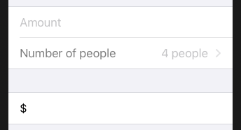
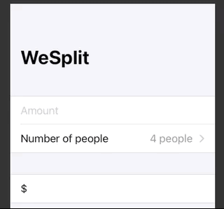

# Picker

### ForEach

This example uses a `ForEach` to view within a `Picker`. Nice thing about `ForEach` is it isn't hit that 10-view limit that we would of hit had we typed this by hand.


```swift
struct ContentView: View {
    let students = ["Harry", "Hermione", "Ron"]
    @State private var selectedStudent = 0

    var body: some View {
        VStack {
            Picker("Select your student", selection: $selectedStudent) {
                ForEach(0 ..< students.count) {
                    Text(self.students[$0])
                }
            }
            Text("You chose: Student # \(students[selectedStudent])")
        }
    }
}
```


Form with 100 rows.

```swift
Form {
    ForEach(0 ..< 100) { number in
        Text("Row \(number)")
    }
}
```

Or shorthand in a closure like this.

```swift
Form {
    ForEach(0 ..< 100) {
        Text("Row \($0)")
    }
}
```

### Picker inside a form

If you create a picker outside a form you get the spinning wheel. Inside a form however, you get the master details view.

```swift
Form {
    Section {
        TextField("Amount", text: $checkAmount)
            .keyboardType(.decimalPad)
        Picker("Number of people", selection: $numberOfPeople) {
                ForEach(2 ..< 100) {
                    Text("\($0) people")
                }
            }
    }

    Section {
        Text("$\(checkAmount)")
    }
}
```



The reason for this, is that in a form, we don't want to take up too much space. Hense the one-liner.

Reason why picker starts with 4 is because initial value was 2, and we started our loop at 2. So the second selection is actually bound to 4.

#### Adding a NavigationBar

To make our picker selectable, we need to embed the form in a NavigationBar.

```swift
NavigationView {
    Form {
        Section {
            TextField("Amount", text: $checkAmount)
                .keyboardType(.decimalPad)
            Picker("Number of people", selection: $numberOfPeople) {
                ForEach(2 ..< 100) {
                    Text("\($0) people")
                }
            }
        }
        
        Section {
            Text("$\(checkAmount)")
        }
    }.navigationBarTitle("WeSplit")
}
```



This will give us the detail view along with it's selected value. This is a good example of *declarative programming*. We say what we want to happen and the framework takes care of it for us. We don't worry about the how, which would be *imperative programming*.

[Creating pickers in a form](https://www.hackingwithswift.com/books/ios-swiftui/creating-pickers-in-a-form)

## Segmented control

Special kind of picker showing a handful of options in a horizontal list. Great for when you have only a small selection to choose from.

```swift
Section {
    Picker("Tip percentage", selection: $tipPercentage) {
        ForEach(0 ..< tipPercentages.count) {
            Text("\(self.tipPercentages[$0])%")
        }
    }.pickerStyle(SegmentedPickerStyle())
}
```


### Links that help

- [Creating views in a loop](https://www.hackingwithswift.com/books/ios-swiftui/creating-views-in-a-loop)
