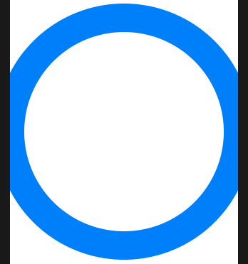
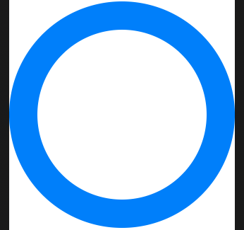
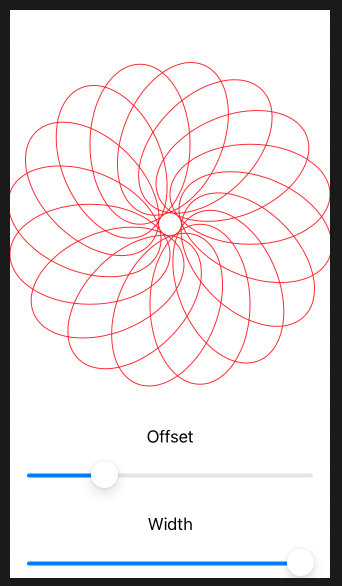
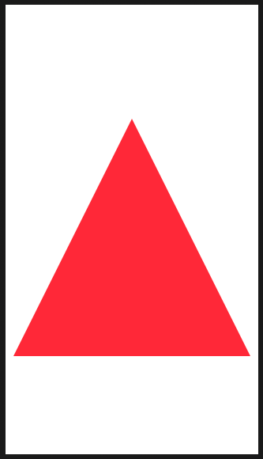
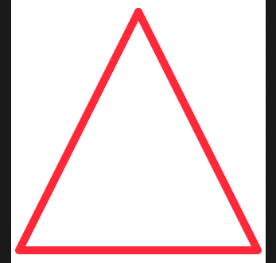

# Shape

If you create a shape without a specific size, it will expand to occupy all available space.

```swift
struct ContentView: View {
    var body: some View {
        Circle()
            .stroke(Color.blue, lineWidth: 40)
    }
}
```



## StrokeBorder

```swift
Circle()
    .strokeBorder(Color.blue, lineWidth: 40)
```



## CGAffineTransform

How a path or view should be rotated, scaled, or sheared in radians (not degrees).

- `3.14` rads = `180` degress

```swift
struct Flower: Shape {
    // How much to move this petal away from the center
    var petalOffset: Double = -20

    // How wide to make each petal
    var petalWidth: Double = 100

    func path(in rect: CGRect) -> Path {
        // The path that will hold all petals
        var path = Path()

        // Count from 0 up to pi * 2, moving up pi / 8 each time
        for number in stride(from: 0, to: CGFloat.pi * 2, by: CGFloat.pi / 8) {
            // rotate the petal by the current value of our loop
            let rotation = CGAffineTransform(rotationAngle: number)

            // move the petal to be at the center of our view 
            let position = rotation.concatenating(CGAffineTransform(translationX: rect.width / 2, y: rect.height / 2))

            // create a path for this petal using our properties plus a fixed Y and height
            let originalPetal = Path(ellipseIn: CGRect(x: CGFloat(petalOffset), y: 0, width: CGFloat(petalWidth), height: rect.width / 2))

            // apply our rotation/position transformation to the petal
            let rotatedPetal = originalPetal.applying(position)

            // add it to our main path
            path.addPath(rotatedPetal)
        }

        // now send the main path back
        return path
    }
}

struct ContentView: View {
    @State private var petalOffset = -20.0
    @State private var petalWidth = 100.0

    var body: some View {
        VStack {
            Flower(petalOffset: petalOffset, petalWidth: petalWidth)
                .stroke(Color.red, lineWidth: 1)

            Text("Offset")
            Slider(value: $petalOffset, in: -40...40)
                .padding([.horizontal, .bottom])

            Text("Width")
            Slider(value: $petalWidth, in: 0...100)
                .padding(.horizontal)
        }
    }
}
```



- [CGAffineTransform](https://www.hackingwithswift.com/books/ios-swiftui/transforming-shapes-using-cgaffinetransform-and-even-odd-fills)

## Blend

How one view is rendered on top of another - mostly by changing color and opacity.

### Multiply

Multiplieseach source pixel color with the destination pixel color giving a tint color.

```swift
ZStack {
    Image("Tron")

    Rectangle()
        .fill(Color.red)
        .blendMode(.multiply)
}
.frame(width: 400, height: 500)
.clipped()
```


So popular there is a shortcut for it on image.

```swift
var body: some View {
    Image("PaulHudson")
        .colorMultiply(.red)
}
```

## Info

- A path is a series of drawing instructions such as “start here, draw a line to here, then add a circle there”, all using absolute coordinates. 
- A shape has no idea where it will be used or how big it will be used, but instead will be asked to draw itself inside a given rectangle.
- Shapes are built from paths.
- `Shape` is a protocol with a single method. Given this rectangle, what path do you want me to draw.
- The advantage of shape is because it is given a `CGRect`, it will know exactly how big to draw the `Path`, and we no longer need to rely on the fixed corrdinate system.
- This is acheived through `minX`, `maxX`, `midX` etc.
- Paths are specific. Shapes are reusable.

```swift
struct Triangle: Shape {
    func path(in rect: CGRect) -> Path {
        var path = Path()

        path.move(to: CGPoint(x: rect.midX, y: rect.minY))
        path.addLine(to: CGPoint(x: rect.minX, y: rect.maxY))
        path.addLine(to: CGPoint(x: rect.maxX, y: rect.maxY))
        path.addLine(to: CGPoint(x: rect.midX, y: rect.minY))

        return path
    }
}

struct ContentView: View {
    
    var body: some View {
        
        Triangle()
            .fill(Color.red)
            .frame(width: 300, height: 300)
        
    }
}
```



## StrokeStyle

```swift
Triangle()
    .stroke(Color.red, style: StrokeStyle(lineWidth: 10, lineCap: .round, lineJoin: .round))
    .frame(width: 300, height: 300)
```




## Coordinate system

SwiftUI has a strange coordinate system.

What’s happening here is two-fold:

- In the eyes of SwiftUI 0 degrees is not straight upwards, but instead directly to the right.
- Shapes measure their coordinates from the bottom-left corner rather than the top-left corner, which means SwiftUI goes the other way around from one angle to the other. This is, in my not very humble opinion, extremely alien.

We can fix both of those problems with a new path(in:) method that subtracts 90 degrees from the start and end angles, and also flips the direction so SwiftUI behaves the way nature intended:

```swift
func path(in rect: CGRect) -> Path {
    let rotationAdjustment = Angle.degrees(90)
    let modifiedStart = startAngle - rotationAdjustment
    let modifiedEnd = endAngle - rotationAdjustment

    var path = Path()
    path.addArc(center: CGPoint(x: rect.midX, y: rect.midY), radius: rect.width / 2, startAngle: modifiedStart, endAngle: modifiedEnd, clockwise: !clockwise)

    return path
}
```

### Links that help

- [Paths vs Shapes](https://www.hackingwithswift.com/books/ios-swiftui/paths-vs-shapes-in-swiftui)
