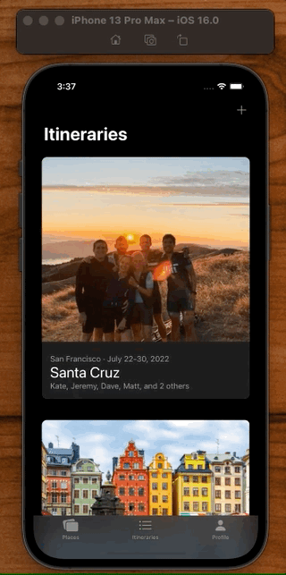
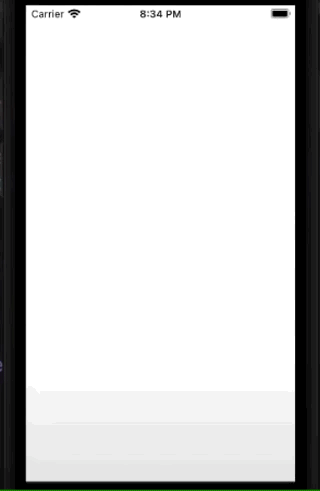

# Sheet

## Present with state



```swift
struct ItinerariesView: View {
    @EnvironmentObject var modelData: ModelData
    @State var showingAddItinerary = false

    var body: some View {
        NavigationStack {
            ScrollView {
                ForEach(modelData.itineraries) { itinerary in
                    NavigationLink(value: itinerary) {
                        ItineraryCard(itinerary: itinerary)
                            .padding()
                    }
                }
            }
            .toolbar {
                Button(action: {
                    self.showingAddItinerary.toggle()
                }) {
                    Image(systemName: "plus")
                }
                .foregroundColor(appColor)
            }
            .navigationTitle("Itineraries")
            .navigationDestination(for: Itinerary.self) { item in
                ItineraryDetail()
            }
            .fullScreenCover(isPresented: $showingAddItinerary) {
                AddItineraryView()
            }
        }
    }
}
```

## Modal sheet that can't be swiped

```swift
import SwiftUI

struct ExampleSheet: View {
    @Environment(\.presentationMode) var presentationMode // to dismiss ourselves
    
    var body: some View {
        VStack {
            Text("Sheet view")
            Button("Dismiss", action: close)
        }
        .interactiveDismissDisabled()
    }
    
    func close() {
        presentationMode.wrappedValue.dismiss()
    }
}

struct ContentView: View {
    @State private var showingSheet = false
    
    var body: some View {
        Button("Show Sheet") {
            showingSheet.toggle()
        }
        .sheet(isPresented: $showingSheet, content: ExampleSheet.init)
    }
}

struct ContentView_Previews: PreviewProvider {
    static var previews: some View {
        ContentView()
    }
}
```


You can bind the dismissal to a condition in the view.

```swift
import SwiftUI

struct ExampleSheet: View {
    @Environment(\.presentationMode) var presentationMode // to dismiss ourselves
    @State private var  termsAccepted = false
    
    var body: some View {
        VStack {
            Text("Terms & Conditions")
                .font(.title)
            Text("Lots of legalese here...")
            Toggle("Accept", isOn: $termsAccepted)
        }
        .padding()
        .interactiveDismissDisabled(!termsAccepted)
    }
    
    func close() {
        presentationMode.wrappedValue.dismiss()
    }
}

struct ContentView: View {
    @State private var showingSheet = false
    
    var body: some View {
        Button("Show Sheet") {
            showingSheet.toggle()
        }
        .sheet(isPresented: $showingSheet, content: ExampleSheet.init)
    }
}

struct ContentView_Previews: PreviewProvider {
    static var previews: some View {
        ContentView()
    }
}
```



# fullScreenCover

Same as `sheet` but full screen.

```swift
.fullScreenCover(isPresented: $showingAddItinerary) {
    AddItineraryView()
}
```
