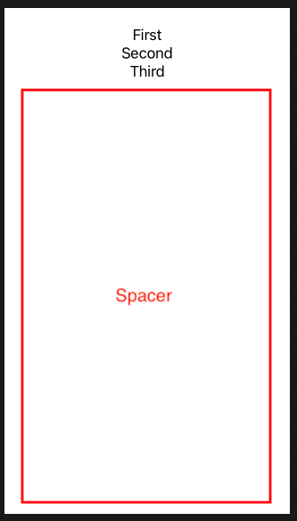

# Stacks

Every `View` needs to return one type of view. Which is why this is OK.

```swift
var body: some View {
    Text("Hello World")
}
```

But this isn't as it returns x2 views.

```swift
var body: some View {
    Text("Hello World")
    Text("This is another text view")
}
```

The way we get around this is with stacks.

## VStack

```swift
var body: some View {
    VStack {
        Text("Hello World")
        Text("This is inside a stack")
    }
}
```


```swift
VStack(alignment: .leading) {
    Text("Hello World")
    Text("This is inside a stack")
}
```


## HStack

```swift
HStack(spacing: 20) {
    Text("Hello World")
    Text("This is inside a stack")
}
```


## ZStack

`ZStack` arranges things by depth. It makes the views overlap.

```swift
ZStack {
    Text("Hello World")
    Text("This is inside a stack")
}
```


## Spacers

Vertical and horizontal stacks automatically fill their available space in the center. If you want to push the content to the side, you need to use a spacer.

These automatically take up all the remaining space. So if you add one at the end of a `VStack` it wil push all your views to the top of the screen.



### Links that help

- [Using stacks to arrange views](https://www.hackingwithswift.com/books/ios-swiftui/using-stacks-to-arrange-views)
