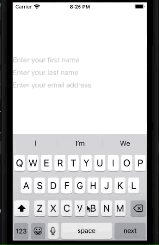

# TextField

You create a text field with a label and a binding to a value. Text field also provides two closures: `EditingChanged` and `onCommit`.


```swift
TextField(
    "Search",
     text: $cityName
) { isEditing in
    // do something
} onCommit: {
    // do something
}
    
TextField(
    "Search",
     text: $cityName,
     onCommit: {
// do something        
})

TextField("Search", text: $cityName) 
    .font(.title)
    .padding(8)
    .background(Color(.systemFill))
        .cornerRadius(10)
    .keyboardType(.asciiCapable)
```

```swift
struct ContentView: View {
    @State private var checkAmount = ""
    
    var body: some View {
        Form {
            Section {
                TextField("Amount", text: $checkAmount)
                    .keyboardType(.decimalPad)
            }

            Section {
                Text("$\(checkAmount)")
            }
        }
    }
}
```


## Placeholder text

```swift
TextField("Enter your word", text: $newWord)
```


## TextfieldStyle

### RoundedBorderTextFieldStyle

```swift
.textFieldStyle(RoundedBorderTextFieldStyle())
.padding()
```


### PlainTextFieldStyle

```swift
.textFieldStyle(PlainTextFieldStyle())
```


## Turn off autocapitilization

```swift
.autocapitalization(.none)
```

## Set background color

```swift
TextField("Search", text: $cityName)
    .font(.title)
    .padding(8)
    .background(Color(.systemFill))
        .cornerRadius(10)
    .keyboardType(.asciiCapable)
```


## Keyboard dismall and focus

Here is my focus state. When true it will focus my thing. When unfocussed will hide the keyboard.

```swift
import SwiftUI

struct ContentView: View {
    @State private var name = ""
    @FocusState private var nameIsFocused: Bool
    
    var body: some View {
        VStack {
            TextField("Enter your name", text: $name)
                .focused($nameIsFocused) // when true focus text field and how keyboard
            Button("Submit") {
                nameIsFocused = false // stop focussing
            }
        }
    }
}

struct ContentView_Previews: PreviewProvider {
    static var previews: some View {
        ContentView()
    }
}
```

Something slightly more complicated.

```swift
import SwiftUI

struct ContentView: View {
    enum Field {
        case firstName
        case lastName
        case emailAddress
    }
    @State private var firstName = ""
    @State private var lastName = ""
    @State private var emailAddress = ""
    
    @FocusState private var focusedField: Field?
    
    var body: some View {
        VStack {
            TextField("Enter your first name", text: $firstName)
                .focused($focusedField, equals: .firstName)
                .textContentType(.givenName)
                .submitLabel(.next)

            TextField("Enter your last name", text: $lastName)
                .focused($focusedField, equals: .lastName)
                .textContentType(.familyName)
                .submitLabel(.next)

            TextField("Enter your email address", text: $emailAddress)
                .focused($focusedField, equals: .emailAddress)
                .textContentType(.emailAddress)
                .submitLabel(.join)
        }
        .onSubmit {
            // figure out where we are and move to next form field
            switch focusedField {
            case .firstName:
                focusedField = .lastName
            case .lastName:
                focusedField = .emailAddress
            default:
                print("Joining chat room...")
            }
        }
    }
}

struct ContentView_Previews: PreviewProvider {
    static var previews: some View {
        ContentView()
    }
}
```




### Links that help

- [Apple docs](https://developer.apple.com/documentation/swiftui/textfield)
- [Reading text from the user with TextField](https://www.hackingwithswift.com/books/ios-swiftui/reading-text-from-the-user-with-textfield)
