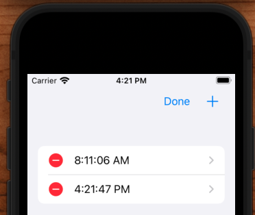
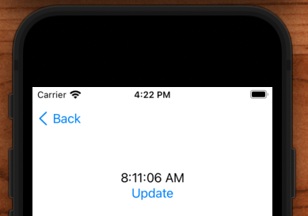

# CoreData

## Create Read Update Delete





**ContentView.swift**

```swift
//
//  ContentView.swift
//  HelloCoreData
//
//  Created by jrasmusson on 2021-07-07.
//

import SwiftUI

struct ContentView: View {
    let coreDM: CoreDataManager
    
    @State private var movieTitle: String = ""
    @State private var movies = [Movie]()
    @State private var needsRefresh = false
    
    var body: some View {
        NavigationView {
            VStack {
                TextField("Enter title", text: $movieTitle)
                    .textFieldStyle(.roundedBorder)
                Button("Save") {
                    coreDM.saveMovie(title: movieTitle)
                    populateMovies()
                }
                List {
                    ForEach(movies, id: \.self) { movie in
                        NavigationLink(destination: MovieDetail(movie: movie, coreDM: coreDM, needsRefresh: $needsRefresh), label: {
                            Text(movie.title ?? "")
                        })
                    }.onDelete(perform: { indexSet in
                        indexSet.forEach { index in
                            let movie = movies[index]
                            coreDM.deleteMovie(movie: movie)
                            populateMovies()
                        }
                    })
                }
                .listStyle(.plain)
                .accentColor(needsRefresh ? .white: .black)
                Spacer()
            }
            .padding()
            .navigationBarTitle("Movies")
            
            .onAppear(perform: {
                populateMovies()
            })
        }
    }
    
    private func populateMovies() {
        movies = coreDM.getAllMovies()
    }
}

struct ContentView_Previews: PreviewProvider {
    static var previews: some View {
        ContentView(coreDM: CoreDataManager())
    }
}
```

**CoreDataManager.swift**

```swift
//
//  CoreDataManager.swift
//  HelloCoreData
//
//  Created by jrasmusson on 2021-07-07.
//

import Foundation
import CoreData

class CoreDataManager {
    let persistentContainer: NSPersistentContainer
    
    init() {
        persistentContainer = NSPersistentContainer(name: "HelloCoreDataModel")
        persistentContainer.loadPersistentStores { (description, error) in
            if let error = error {
                fatalError("Core Data Store failed \(error.localizedDescription)")
            }
        }
    }
    
    func saveMovie(title: String) {
        let movie = Movie(context: persistentContainer.viewContext)
        movie.title = title
        
        do {
            try persistentContainer.viewContext.save()
        } catch {
            print("Failed to save movie \(error)")
        }
    }

    func updateMovie() {
        do {
            try persistentContainer.viewContext.save()
        } catch {
            persistentContainer.viewContext.rollback()
            print("Failed to update movie \(error)")
        }
    }

    func deleteMovie(movie: Movie) {
        persistentContainer.viewContext.delete(movie) // mark for deletion
        
        do {
            try persistentContainer.viewContext.save()
        } catch {
            persistentContainer.viewContext.rollback()
            print("Failed to delete movie: \(movie)")
        }
    }
    
    func getAllMovies() -> [Movie] {
        let fetchRequest: NSFetchRequest<Movie> = Movie.fetchRequest()
        
        do {
            return try persistentContainer.viewContext.fetch(fetchRequest)
        } catch {
            return []
        }
    }
}
```

**MoveDetail.swift**

```swift
//
//  MovieDetail.swift
//  HelloCoreData
//
//  Created by jrasmusson on 2021-07-08.
//

import SwiftUI

struct MovieDetail: View {
    
    let movie: Movie
    let coreDM: CoreDataManager
    
    @State private var movieName: String = ""
    @Binding var needsRefresh: Bool
    
    var body: some View {
        VStack {
            TextField(movie.title ?? "", text: $movieName)
                .textFieldStyle(.roundedBorder)
            Button("Update") {
                if !movieName.isEmpty {
                    movie.title = movieName
                    coreDM.updateMovie()
                    needsRefresh.toggle()
                }
            }
        }
    }
}

struct MovieDetail_Previews: PreviewProvider {
    static var previews: some View {
        let movie = Movie()
        let coreDM = CoreDataManager()
        MovieDetail(movie: movie, coreDM: coreDM, needsRefresh: .constant(false))
    }
}
```

**Movie.swift**

```swift
import Foundation
import CoreData

@objc(Movie)
public class Movie: NSManagedObject {

}
```

### How to get the page to refresh

When we navigate down to the detail view and update the movie title, we need a way of signalling to the parent that our movie array of managed objects has changed.

```swift
@State private var movies = [Movie]()
```

We can hack a refresh in by passing the detail view a binding.

```swift
struct ContentView: View {
	...
    @State private var needsRefresh = false
    
    var body: some View {
        NavigationLink(destination: 
        MovieDetail(movie: movie, coreDM: coreDM, needsRefresh: $needsRefresh), label: {}
        .accentColor(needsRefresh ? .white: .black)
            }
            .onAppear(perform: {
                populateMovies()
            })
        }
    }
}
```

Toggling it in the subview

```swift
struct MovieDetail: View {
    
    @Binding var needsRefresh: Bool
    
    var body: some View {
        VStack {
            Button("Update") {
                if !movieName.isEmpty {
                    needsRefresh.toggle()
                }
            }
        }
    }
}
```

And then using it in the parent.

```swift
.accentColor(needsRefresh ? .white: .black)
```

That will trigger a change of state in the parent, recreate the view, and call which will refresh the view.

```swift
.onAppear(perform: {
    populateMovies()
})
```

### Links that help
- [Sharp](https://www.youtube.com/watch?v=_ui7pxU1rNI&ab_channel=azamsharp)

## Save

```swift
//
//  ContentView.swift
//  Bookworm
//
//  Created by jrasmusson on 2021-05-07.
//

import SwiftUI
import CoreData

struct ContentView: View {
    
    @Environment(\.managedObjectContext) var moc
    @FetchRequest(entity: Student.entity(), sortDescriptors: []) var students: FetchedResults<Student>
    
    var body: some View {
        VStack {
            List {
                ForEach(students, id: \.id) { student in
                    Text(student.name ?? "Unknown")
                }
            }
            Button("Add") {
                let firstNames = ["Ginny", "Harry", "Hermione", "Luna", "Ron"]
                let lastNames = ["Granger", "Lovegood", "Potter", "Weasley"]

                let chosenFirstName = firstNames.randomElement()!
                let chosenLastName = lastNames.randomElement()!

                // Create
                let student = Student(context: self.moc)
                student.id = UUID()
                student.name = "\(chosenFirstName) \(chosenLastName)"
                
                try? self.moc.save()
            }
        }
    }
}

struct ContentView_Previews: PreviewProvider {
    static var previews: some View {
        ContentView().environment(\.managedObjectContext, PersistenceController.preview.container.viewContext)
    }
}
```


## Delete

```swift
func deleteBooks(at offsets: IndexSet) {
    for offset in offsets {
        // find this book in our fetch request
        let book = books[offset]

        // delete it from the context
        moc.delete(book)
    }

    // save the context
    try? moc.save()
}
```

### Links that help

- [How to combine CoreData and SwiftUI](https://www.hackingwithswift.com/books/ios-swiftui/how-to-combine-core-data-and-swiftui)
