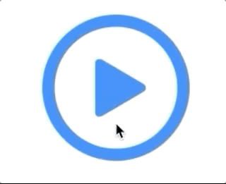

# How Data Flow works

Swift has over six ways to pass around data. And the one you choose depends on whether you are working with:

- a value type (struct)
 - @State - Transient data owned by the view.
 - @Binding - For mutating data owned by another view.

- a reference type (class)
	- @StateObject - Managed by SwiftUI
	- @ObservedObject - Shared data passed between views
	- @EnvironmentObject - Shared data automatically available in subviews


Let's see how each works.

## Value types

SwiftUI's heavy use of structs means we can't just define vars in structs and expect that to mutate with state changes.

```swift
struct PlayerView: View {
    var isPlaying: Bool = true // OK
    
    var body: some View {
        Button(action: {
            self.isPlaying.toggle() // 💥 `self` is immutable
        }) {
            Image(systemName: isPlaying ? "pause.circle" : "play.circle")
        }
    }
}
```

In order to track changes of state in structs, SwiftUI created the @State and @Binding wrappers.

### @State

- A property wrapper for keeping track of transient data owned by the view.
- Add the @State property wrapper to any value type state you want the view to track.
- That state will be tracked transiently for the life time of the view.


```swift
struct PlayerView: View {
    @State private var isPlaying: Bool = false // 🚀
    
    var body: some View {
        Button(action: {
            self.isPlaying.toggle()
        }) {
            Image(systemName: isPlaying ? "pause.circle" : "play.circle")
        }
    }
}
```



## @Binding

- When you want a subview to bi-directionally bind to the @State in the parent, you use @Binding.
- Add the @Binding property wrapper to the struct in the subview, and then bind to it from the parent using the `$` prefix.
- @Binding is for mutating data owned by another view.
- And if the subview changes that state, it will be reflected back in the parent too.

```swift
struct PlayerView: View {
    @State private var isPlaying: Bool = false
    
    var body: some View {
        VStack {
            PlayButton(isPlaying: $isPlaying)
            
            Toggle(isOn: $isPlaying) {
                Text("Hello World")
            }
        }
    }
}

struct PlayButton: View {
    @Binding var isPlaying: Bool
    
    var body: some View {
        Button(action: {
            self.isPlaying.toggle()
        }) {
            Image(systemName: isPlaying ? "pause.circle" : "play.circle")
        }
    }
}
```

SwiftUI controls take `Binding` property wrappers in their initializers to bind to the external properties you define.

```swift
struct Toggle<Label>: View {
    public init(
        isOn: Binding<Bool>,
        label: () -> Label
    )
}
```


### Links that help
- [WWDC 2019 - Data Flow Through SwiftUI](https://developer.apple.com/videos/play/wwdc2019/226/)
- [How to use @EnvironmentObject to share data between views](https://www.hackingwithswift.com/quick-start/swiftui/how-to-use-environmentobject-to-share-data-between-views)