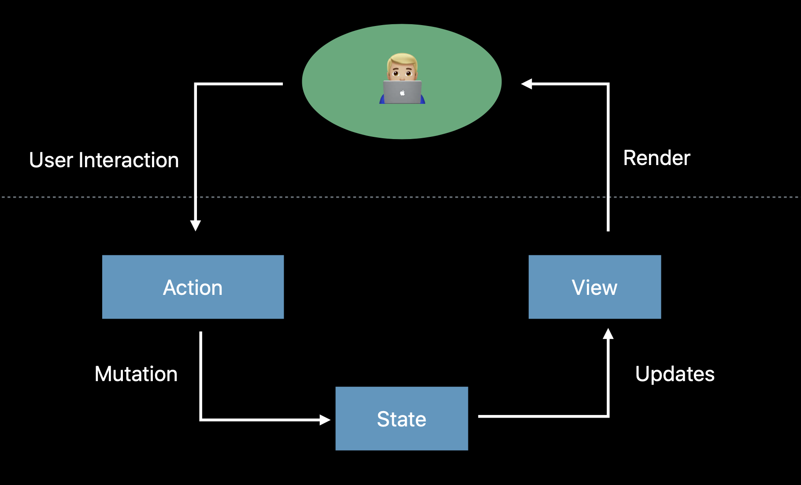
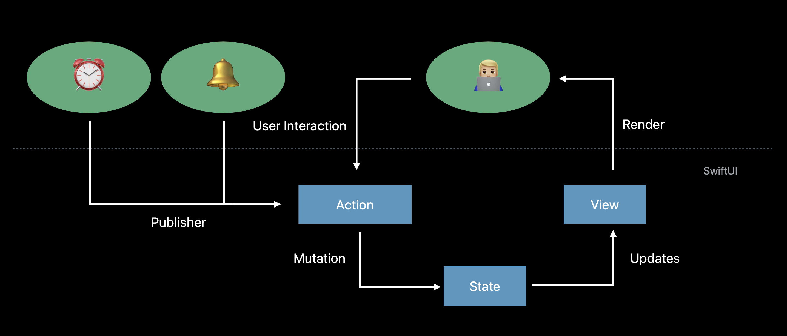

# How Data Flow works in SwiftUI

The type of data structure you need for a SwiftUI view depends on whether your data is a *value type* or a *reference type*.

- Value types (structs)
   - Property - Immutable property that never changes.
   - @State - Transient data owned by the view.
   - @Binding - For mutating data owned by another view.

- Reference type (classes)
	- @StateObject - Managed by SwiftUI
	- @ObservedObject - Shared data passed between views
	- @EnvironmentObject - Shared data automatically available in subviews

## Views are a function of state



When a user does some interaction, that results in a mutation of state which the framework tracks. The framework then updates the views, which re-render themselves with the new state.

In this model, data always flows in a single direction, greatly simplifying things in the app.


## Value types

Value types are instances where each type keeps a unique copy of its data (`struct`, `enum`, tuple).

### Property

- Simply pass in the read-only value type you want to be reflected locally in your view.

```swift
import SwiftUI

struct ContentView_Previews: PreviewProvider {
    static var previews: some View {
        ContentView()
    }
}

struct PlayerView: View {
    var isPlaying: Bool = true			// 1. Define your property
    
    var body: some View {
        Button(action: {
            
        }) {
            Image(systemName: isPlaying ? "pause.circle" : "play.circle")
                .resizable()
                .scaledToFit()
                .frame(width: 300, height: 300)
        }
    }
}

struct ContentView: View {
    var body: some View {
        PlayerView(isPlaying: false)		// 2. Pass it into your view.
    }
}
```

This works until your property wants to change.

```swift
struct PlayerView: View {
    var isPlaying: Bool = true 
    
    var body: some View {
        Button(action: {
            self.isPlaying.toggle() // 💥 `self` is immutable
        }) {
            Image(systemName: isPlaying ? "pause.circle" : "play.circle")
        }
    }
}
```

To handle this we need something that can synthesize and track state in a `struct`. This is where we use `@State`.

### @State

- A read-write property wrapper for keeping track of transient state owned by the view.

```swift
import SwiftUI

struct ContentView_Previews: PreviewProvider {
    static var previews: some View {
        ContentView()
    }
}

struct PlayerView: View {
    @State private var isPlaying: Bool = false // 1. Define your state 🚀.
    
    var body: some View {
        Button(action: {
            
        }) {
            Image(systemName: isPlaying ? "pause.circle" : "play.circle")
                .resizable()
                .scaledToFit()
                .frame(width: 300, height: 300)
        }
    }
}

struct ContentView: View {
    var body: some View {
        PlayerView() 						// 2. No need to set down here.
    }
}
```

### @Binding

- How we pass `@State` down to subviews, and bi-directionally bind it back.


```swift
import SwiftUI

struct ContentView_Previews: PreviewProvider {
    static var previews: some View {
        ContentView()
    }
}

struct PlayerView: View {
    @State private var isPlaying: Bool = false // 1. Define State
    
    var body: some View {
        VStack {
            PlayButton(isPlaying: $isPlaying)  // 2. Pass with `$`
            
            Toggle(isOn: $isPlaying) {
                Text("Hello World")
            }
        }.padding()
    }
}

struct PlayButton: View {
    @Binding var isPlaying: Bool              // 3. Define Binding
    
    var body: some View {
        Button(action: {
            self.isPlaying.toggle()           // 4. Bi-directional
        }) {
            Image(systemName: isPlaying ? "pause.circle" : "play.circle")
                .resizable()
                .aspectRatio(contentMode: .fit)
                .frame(width: 100, height: 100)
        }
    }
}

struct ContentView: View {
    var body: some View {
        PlayerView()
    }
}
```


SwiftUI controls take `Binding` property wrappers in their initializers to bind to the external properties you define.

```swift
struct Toggle<Label>: View {
    public init(
        isOn: Binding<Bool>,
        label: () -> Label
    )
}
```

`@State` and `@Binding` can also be used with `structs` you create.

```swift
import SwiftUI

// Define your struct
struct Book {
    var title: String
    var author: String
}

// Inject into parent view at the top
struct ContentView: View {
    @State var book: Book // 1
    
    var body: some View {
        DetailView(book: $book)
    }
}

// Then explicitly pass binding to each child
struct DetailView: View
{
    @Binding var book: Book // 2
    
    var body: some View {
        VStack {
            DetailHeader(book: $book)
        }
    }
}

// And subview (tighter coupling)
struct DetailHeader: View
{
    @Binding var book: Book // 3

    var body: some View {
        VStack {
            Text(book.title)
            Text(book.author)
            Button(action: {
                book.author = "Jonathan"
            }) {
                Text("Tap me!")
            }
        }
    }
}

struct ContentView_Previews: PreviewProvider {
    static var previews: some View {
        let book = Book(title: "Lord of the Rings",
                        author: "Tolkien")
        ContentView(book: book)
    }
}
```

This will update the UI when the button is tapped because the views are bound to the `Book` `struct`.


## Reference types

Reference type - instances share a single copy of the data (`class`).

### Working with external data



- Sometimes data changes externally for our views. And we need a way of being notified.
- As good as `structs` are, because they can't share the same instance of data (their values are copied), reference types like `class` are instead used to publish and share external data changes to SwiftUI views.
- To facilitate this sharing of data, SwiftUI created a [`ObservableObject`](https://developer.apple.com/documentation/combine/observableobject) protocol, a `class` implementing that protocol, can be observed from any other view.

**ObservableObject.swift**

```swift
public protocol ObservableObject : AnyObject {
 
    /// The type of publisher that emits before the object has changed.
    associatedtype ObjectWillChangePublisher : Publisher = ObservableObjectPublisher where Self.ObjectWillChangePublisher.Failure == Never
 
    /// A publisher that emits before the object has changed.
    var objectWillChange: Self.ObjectWillChangePublisher { get }
}
```

- A type of object with a publisher that emits before the object has changed.
- Enforces its implementers be classes via `AnyObject` extension.
- Synthesizes an `objectWillChange` publisher that emits the changed value before any of its @Published properties changes.

An example.

```swift
class Contact: ObservableObject {
   @Published var name: String
   @Published var age: Int

   init(name: String, age: Int) {
       self.name = name
       self.age = age
   }

   func haveBirthday() -> Int {
       age += 1
       return age
   }
}

let john = Contact(name: "John Appleseed", age: 24)
cancellable = john.objectWillChange
   .sink { _ in
       print("\(john.age) will change")
}
print(john.haveBirthday())
// Prints "24 will change"
// Prints "25"
```

#### @Published
- Automatically works with `ObservableObject`
- Publishes every time the value changes in `willSet`
- `projectedValue` is a publisher


SwifUI has three property wrappers it uses to share via via the `ObservableObject` protocol:

- @ObservedObject
- @StateObject
- @EnvironmentObject

### @ObservedObject

To make a SwiftUI object observable, we need to define it as a `class`, and make its properties `@Published`.

So continuing with our book example, we need to convert this:

```swift
struct Book {
    var title: String
    var author: String
}
```

to this:

```swift
class Book: ObservableObject {
    @Published var title: String
    @Published var author: String

    init(title: String, author: String) {
        self.title = title
        self.author = author
    }
}
```

Now that we can have our state stored in an external object, we can use that object in multiple views and have them all point to the same shared values.

```swift
import SwiftUI

// Define your observable
class Book: ObservableObject {
    @Published var title: String
    @Published var author: String

    init(title: String, author: String) {
        self.title = title
        self.author = author
    }
}

// Inject into parent view at the top
struct ContentView: View {
    @ObservedObject var book: Book // 1
    
    var body: some View {
        DetailView(book: book)
    }
}

// And then explicitly pass to each child
struct DetailView: View
{
    @ObservedObject var book: Book // 2
    
    var body: some View {
        VStack {
            DetailHeader(book: book)
        }
    }
}

// And subview (tighter coupling)
struct DetailHeader: View
{
    @ObservedObject var book: Book // 3

    var body: some View {
        VStack {
            Text(book.title)
            Text(book.author)
        }
    }
}

struct ContentView_Previews: PreviewProvider {
    static var previews: some View {
        let book = Book(title: "The Hitchhiker's Guide to the Galaxy", author: "Douglas Adams")
        ContentView(book: book)
    }
}
```


### @StateObject

- Just like @ObservedObject, but life cycle is managed by SwiftUI.


Mechanically `@StateObject` works just like `ObservedObject`. The difference is that `ObservedObject` gets created everytime a new subview is built - which can be expensive.

If your shared data isn't used outside your view hierarchy, use `StateObject` instead. This transfers ownership to SwiftUI, it will control the `StateObject` lifecyle, resulting in a more performant app.


```swift
import SwiftUI

// Define your observable
class Book: ObservableObject {
    @Published var title: String
    @Published var author: String

    init(title: String, author: String) {
        self.title = title
        self.author = author
    }
}

// Inject into parent view at the top
struct ContentView: View {
    @StateObject var book: Book // 1
    
    var body: some View {
        DetailView(book: book)
    }
}

// And then explicitly pass to each child
struct DetailView: View
{
    @StateObject var book: Book // 2
    
    var body: some View {
        VStack {
            DetailHeader(book: book)
        }
    }
}

// And subview (tighter coupling)
struct DetailHeader: View
{
    @StateObject var book: Book // 3

    var body: some View {
        VStack {
            Text(book.title)
            Text(book.author)
        }
    }
}

struct ContentView_Previews: PreviewProvider {
    static var previews: some View {
        let book = Book(title: "The Hitchhiker's Guide to the Galaxy", author: "Douglas Adams")
        ContentView(book: book)
    }
}
```

### @EnvironmentObject

- Like `@ObservedObject` and `@StatObject` but without the coupling.
- Here you inject `EnvironmentObject` at the top of your view, and it will magically be made available to all subviews without having to explicitly reference.
- Handy for getting to those hard to reach places.

Set it up like this.


```swift
//
//  ContentView.swift
//  Demo
//
//  Created by jrasmusson on 2021-06-16.
//

import SwiftUI

// Define your observable
class Book: ObservableObject {
    @Published var title: String
    @Published var author: String

    init(title: String, author: String) {
        self.title = title
        self.author = author
    }
}

// Inject once at the top
struct ContentView_Previews: PreviewProvider {
    static var previews: some View {
        let book = Book(title: "The Hitchhiker's Guide to the Galaxy", author: "Douglas Adams")

        ContentView()
            .environmentObject(book) // 1
    }
}

// Define once at the top
struct ContentView: View {
    // No need to define
    var body: some View {
        DetailView()
    }
}

// Automtically available
struct DetailView: View {
    // No need to reference
    var body: some View {
        VStack {
            DetailHeader()
        }
    }
}

// Pull out when needed
struct DetailHeader: View {
    @EnvironmentObject var book: Book // 2

    var body: some View {
        VStack {
            Text(book.title)
            Text(book.author)
        }
    }
}
```

### Difference between Environment and Environment Object

SwiftUI gives us both `@Environment` and `@EnvironmentObject` property wrappers, but they are subtly different: whereas `@EnvironmentObject` allows us to inject arbitrary values into the environment, `@Environment` is specifically there to work with SwiftUI’s own pre-defined keys.

For example, `@Environment` is great for setting contextual information about your views that flows down the view hierarchy and changes different aspects of any contained views all at once.

For example we could change the size category of all our views to extra large and see what that looks like in our previews like this.

```swift
ContentView(store: RoomStore(rooms: testData))
   .environment(\.sizeCategory, .extraExtraExtraLarge)
```

So `Environment` for iOS type style things about the look of our controls. `EnvironmentObject` for app data we control and want to share.

### How to choose?


### Links that help
- [WWDC 2019 - Data Flow Through SwiftUI](https://developer.apple.com/videos/play/wwdc2019/226/)
- [Hacking in Swift - How to use @EnvironmentObject to share data between views](https://www.hackingwithswift.com/quick-start/swiftui/how-to-use-environmentobject-to-share-data-between-views)
- [Apple Docs ObservableObject](https://developer.apple.com/documentation/combine/observableobject)
- [Learn App Making - How to pass data between views](https://learnappmaking.com/pass-data-between-views-swiftui-how-to/)