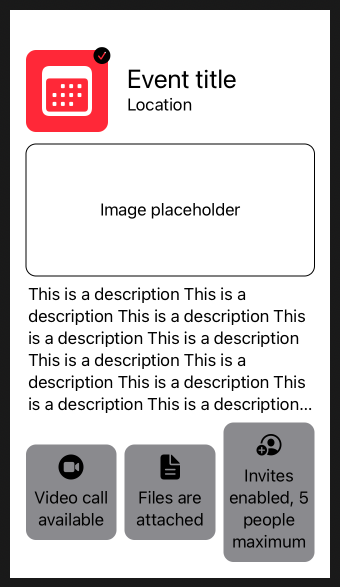
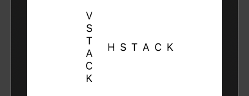
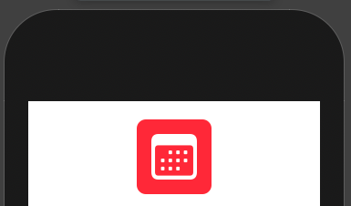
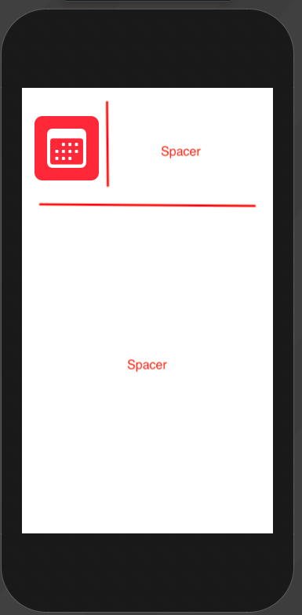
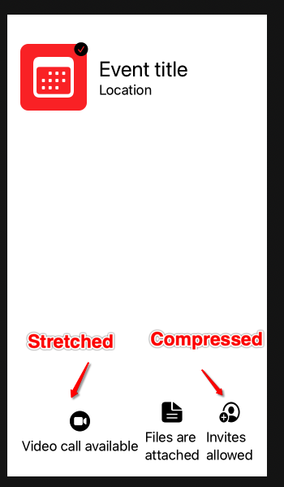
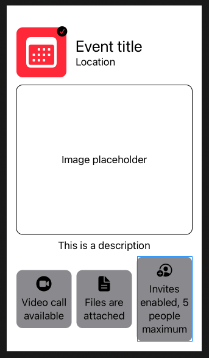
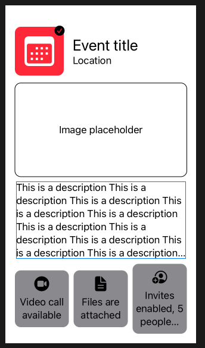
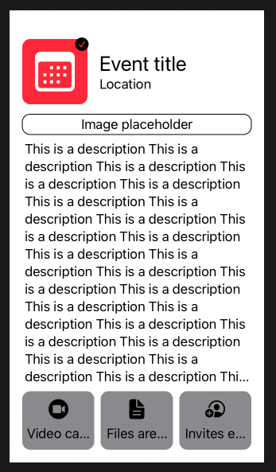
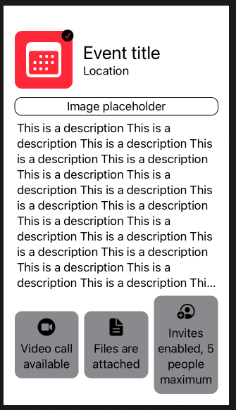

# How layout works



## Setting a view's frame

```swift
struct ContentView: View {
    var body: some View {
        Image(systemName: "calendar")
            .frame(width: 50, height: 50)
    }
}
```

Problem is image won't fill the frame. For that we need resizeable.

```swift
struct CalendarView: View {
    var body: some View {
        Image(systemName: "calendar")
            .resizable()
            .frame(width: 50, height: 50)
            .padding()
            .background(Color.red)
            .cornerRadius(10)
            .foregroundColor(.white)
    }
}
```

## Stacks and spacers



```swift
struct ContentView: View {
    var body: some View {
        VStack {
            CalendarView()
        }
    }
}
```

- `VStacks` don't stretch themselves to occupy their parent.
- Instead they simply resize themselves according to the total size of their children.
- To actually move your view we need a spacer.

```swift
struct ContentView: View {
    var body: some View {
        VStack {
            CalendarView()
            Spacer()
        }
    }
}
```



To push to the top leading corner.

```swift
struct ContentView: View {
    var body: some View {
        HStack {
            VStack {
                CalendarView()
                Spacer()
            }
            Spacer()
        }.padding()
    }
}
```



By default HStack keeps everything centered.

```swift
struct ContentView: View {
    var body: some View {
        HStack {
            VStack {
                CalendarView()
                Spacer()
            }
            Text("Event title").font(.title)
            Spacer()
        }.padding()
    }
}
```


To get our text to the top we can tell our HStack to align at top.

```swift
struct ContentView: View {
    var body: some View {
        HStack(alignment: .top) {
            VStack {
                CalendarView()
                Spacer()
            }
            Text("Event title").font(.title)
            Spacer()
        }.padding()
    }
}
```


## ZStacks and offset

Say we want to optionally add a checkmark to the top trailing corner of a view. We can generically do that by wrapping any view within a `ZStack` (which in itself won't affect the views layout), and optionally add a checkmark.

```swift
extension View {
    func addVerifiedBadge(_ isVerified: Bool) -> some View {
        ZStack(alignment: .topTrailing) {
            self

            if isVerified {
                Image(systemName: "checkmark.circle.fill")
                    .offset(x: 3, y: -3)
            }
        }
    }
}
```

Can then add our conditional badge to `CalendarView` like this:

```swift
struct CalendarView: View {
    var eventIsVerified = true

    var body: some View {
        Image(systemName: "calendar")
            .resizable()
            .frame(width: 50, height: 50)
            .padding()
            .background(Color.red)
            .cornerRadius(10)
            .foregroundColor(.white)
            .addVerifiedBadge(eventIsVerified)
    }
}
```


### Summary

- SwiftUI’s core layout engine works by asking each child view to determine its own size based on the bounds of its parent, and then asks each parent to position its children within its own bounds.
- Using the `.frame()` and `.padding()` modifiers lets us adjust a view’s size and internal margin, as long as that view is configured to resize itself accordingly.
- Using `offset()` we can move a view without affecting its surroundings, which is very useful when implementing overlays and other kinds of overlapping views.

## Handling dynamic content

Say we want to add some event badges down at the bottom by embedding them in a HStack.



```swift
struct EventInfoBadge: View {
    var iconName: String
    var text: String

    var body: some View {
        VStack {
            Image(systemName: iconName)
                .resizable()
                .frame(width: 25, height: 25)
            Text(text)
        }
    }
}

struct ContentView: View {
    var body: some View {
        VStack {
            EventHeader()
            Spacer()
            HStack {
                EventInfoBadge(
                    iconName: "video.circle.fill",
                    text: "Video call available"
                )
                EventInfoBadge(
                    iconName: "doc.text.fill",
                    text: "Files are attached"
                )
                EventInfoBadge(
                    iconName: "person.crop.circle.badge.plus",
                    text: "Invites allowed"
                )
            }
        }.padding()
    }
}
```

We can first fix the image compression by using `aspectRatio` with a content mode of `fit`.

```swift
struct EventInfoBadge: View {
    var iconName: String
    var text: String

    var body: some View {
        VStack {
            Image(systemName: iconName)
                .resizable()
                .aspectRatio(contentMode: .fit)
                .frame(width: 25, height: 25)
            Text(text)
        }
    }
}
```


Then we can make our badges occupy the same amount of space, by asking them to occupy as much space as possible forcing the parent to distribute them evently. We do this with `.frame(maxWidth: .infinity)`.

```swift
struct EventInfoBadge: View {
    var iconName: String
    var text: String

    var body: some View {
        VStack {
            Image(systemName: iconName)
                .resizable()
                .aspectRatio(contentMode: .fit)
                .frame(width: 25, height: 25)
            Text(text)
                .frame(maxWidth: .infinity)
        }
    }
}
```


Can improve further by:
- center aligning text
- padding
- background color
- rounded corners

```swift
struct EventInfoBadge: View {
    var iconName: String
    var text: String

    var body: some View {
        VStack {
            Image(systemName: iconName)
                .resizable()
                .aspectRatio(contentMode: .fit)
                .frame(width: 25, height: 25)
            Text(text)
                .frame(maxWidth: .infinity)
                .multilineTextAlignment(.center)
        }
        .padding(.vertical, 10)
        .padding(.horizontal, 5)
        .background(Color.secondary)
        .cornerRadius(10)
    }
}
```

See [Part 2](https://www.swiftbysundell.com/articles/swiftui-layout-system-guide-part-2/) for how to deal with badges of different heights.

## Dealing with conflicts

Say we have a placeholder image.

```swift
struct ImagePlaceholder: View {
    var body: some View {
        ZStack {
            RoundedRectangle(cornerRadius: 10).stroke()
            Text("Image placeholder")
        }
    }
}
```

And we add it to our ContentView like this.

```swift
struct ContentView: View {
    var body: some View {
        VStack {
            EventHeader()
            ImagePlaceholder()
            Text("This is a description")
            Spacer()
            EventInfoList()
        }.padding()
    }
}
```



This is fine until our text description gets very long.



What's going on here is that each view is responsible for determining its own size, and only *after that* does each parent decide how to position and fit its childre within its own frame.

Since `ImagePlaceholder` and description are both requesting frame larger then can simultaneously satisfied, the layout system is forced to compromise, by first compresseach each view as much as possible and the splitting the available space evenly among its children.

We can fix this by setting different layout priorities.

### Layout priorities

Each view starts out with a layout prioerity of zero. We can increase a priority by assigning it a value of 1.

```swift
struct ContentView: View {
    var body: some View {
        VStack {
            EventHeader()
            ImagePlaceholder()
            Text(makeDescription()).layoutPriority(1)
            Spacer()
            EventInfoList()
        }.padding()
    }
}
```



This is better in that it gives our text higher priority. But our badge text is still squished. To fix that we could lower the priority of our image.

```swift
struct ContentView: View {
    var body: some View {
        VStack {
            EventHeader()
            ImagePlaceholder().layoutPriority(-1)
            Text(makeDescription())
            Spacer()
            EventInfoList()
        }.padding()
    }
}
```



But it still a little small. We can fix the image frame height my giving it a minimum size using the `.frame()` modifier.

```swift'struct ContentView: View {
    var body: some View {
        VStack {
            EventHeader()
            ImagePlaceholder()
                .layoutPriority(-1)
                .frame(minHeight: 100)
            Text(makeDescription())
            Spacer()
            EventInfoList()
        }.padding()
    }
}
```


Nice. But our badge text is now truncated. Let's fix that by increasing its layout priority.

```swift
struct ContentView: View {
    var body: some View {
        VStack {
            EventHeader()
            ImagePlaceholder()
                .layoutPriority(-1)
                .frame(minHeight: 100)
            Text(makeDescription())
            Spacer()
            EventInfoList().layoutPriority(1)
        }.padding()
    }
}
```


And voila. There we go.

## Fixed dimensions

Problem with layout priorities is it can be a little bit like whack-a-mole. The other modifier we can use for adjusting layout is `fixedSize().

Here we can get the same result, with viewer layout priorities, by giving our `EventInfoList` a fixed vertical size, which prevents it from being compressed.

```swift
struct ContentView: View {
    var body: some View {
        VStack {
            EventHeader()
            ImagePlaceholder()
                .layoutPriority(-1)
                .frame(minHeight: 100)
            Text(makeDescription())
            Spacer()
            EventInfoList().fixedSize(horizontal: false, vertical: true)
        }.padding()
    }
}
```

## Custom alignment guides

An alternative to padding and offset. Originally we added our check mark like this:

```swift
extension View {
    func addVerifiedBadge(_ isVerified: Bool) -> some View {
        ZStack(alignment: .topTrailing) {
            self

            if isVerified {
                Image(systemName: "checkmark.circle.fill")
                    .offset(x: 3, y: -3)
            }
        }
    }
}
```

But another way to do it would be like this:

```swift
extension View {
    func addVerifiedBadge(_ isVerified: Bool) -> some View {
        ZStack(alignment: .topTrailing) {
            self

            if isVerified {
                Image(systemName: "checkmark.circle.fill")
                    .alignmentGuide(HorizontalAlignment.trailing) {
                        $0[HorizontalAlignment.center]
                    }
                    .alignmentGuide(VerticalAlignment.top) {
                        $0[VerticalAlignment.center]
                    }
            }
        }
    }
}
```

The difference is that the first method makes some assumption based on the size of our image, while the second doesn't - it does it all relative.


This is fine. It puts the check mark perfectly horizontall and vertically aligned based on the ZStack.

But if we want to tweak and bring it down every so slightly we can do it by dropping it 80% vertically and horizontally like this.

```swift
extension View {
    func addVerifiedBadge(_ isVerified: Bool) -> some View {
        ZStack(alignment: .topTrailing) {
            self

            if isVerified {
                Image(systemName: "checkmark.circle.fill")
                    .alignmentGuide(HorizontalAlignment.trailing) {
                        $0.width * 0.8
                    }
                    .alignmentGuide(VerticalAlignment.top) {
                        // Here we first align our view's bottom edge
                        // according to its host view's top edge,
                        // and we then subtract 80% of its height.
                        $0[.bottom] - $0.height * 0.8
                    }
            }
        }
    }
}
```


And if we want we could convert to an extension and then use like this.

```swift
extension View {
    func alignAsBadge(withRatio ratio: CGFloat = 0.8,
                      alignment: Alignment = .topTrailing) -> some View {
        alignmentGuide(alignment.horizontal) {
            $0.width * ratio
        }
        .alignmentGuide(alignment.vertical) {
            $0[.bottom] - $0.height * ratio
        }
    }
}
```

## Full source


```swift
//
//  ContentView.swift
//  WeatherySwiftUI
//
//  Created by jrasmusson on 2021-06-04.
//

import SwiftUI

struct ContentView: View {
    var body: some View {
        VStack {
            EventHeader()
            ImagePlaceholder()
                .layoutPriority(-1)
                .frame(minHeight: 100)
            Text(makeDescription())
            Spacer()
            EventInfoList().fixedSize(horizontal: false, vertical: true)
        }.padding()
    }
}

struct ImagePlaceholder: View {
    var body: some View {
        ZStack {
            RoundedRectangle(cornerRadius: 10).stroke()
            Text("Image placeholder")
        }
    }
}

struct EventInfoList: View {
    var body: some View {
        HeightSyncedRow {
            EventInfoBadge(
                iconName: "video.circle.fill",
                text: "Video call available"
            )
            EventInfoBadge(
                iconName: "doc.text.fill",
                text: "Files are attached"
            )
            EventInfoBadge(
                iconName: "person.crop.circle.badge.plus",
                text: "Invites enabled, 5 people maximum"
            )
        }
    }
}

struct EventInfoBadge: View {
    var iconName: String
    var text: String

    var body: some View {
        VStack {
            Image(systemName: iconName)
                .resizable()
                .aspectRatio(contentMode: .fit)
                .frame(width: 25, height: 25)
            Text(text)
                .frame(maxWidth: .infinity)
                .multilineTextAlignment(.center)
        }
        .padding(.vertical, 10)
        .padding(.horizontal, 5)
        .background(Color.secondary)
        .cornerRadius(10)
    }
}

struct EventHeader: View {
    var body: some View {
        HStack(spacing: 15) {
            CalendarView()
            VStack(alignment: .leading) {
                Text("Event title").font(.title)
                Text("Location")
            }
            Spacer()
        }
    }
}

struct CalendarView: View {
    var eventIsVerified = true

    var body: some View {
        Image(systemName: "calendar")
            .resizable()
            .frame(width: 50, height: 50)
            .padding()
            .background(Color.red)
            .cornerRadius(10)
            .foregroundColor(.white)
            .addVerifiedBadge(eventIsVerified)
    }
}

struct HeightSyncedRow<Content: View>: View {
    private let content: Content
    @State private var childHeight: CGFloat?

    init(@ViewBuilder content: () -> Content) {
        self.content = content()
    }

    var body: some View {
        HStack {
            content.frame(height: childHeight)
        }
    }
}

extension View {
    func addVerifiedBadge(_ isVerified: Bool) -> some View {
        ZStack(alignment: .topTrailing) {
            self

            if isVerified {
                Image(systemName: "checkmark.circle.fill")
                    .alignAsBadge()
            }
        }
    }
}

extension View {
    func alignAsBadge(withRatio ratio: CGFloat = 0.8,
                      alignment: Alignment = .topTrailing) -> some View {
        alignmentGuide(alignment.horizontal) {
            $0.width * ratio
        }
        .alignmentGuide(alignment.vertical) {
            $0[.bottom] - $0.height * ratio
        }
    }
}

struct ContentView_Previews: PreviewProvider {
    static var previews: some View {
        ContentView()
    }
}

private extension ContentView {
    func makeDescription() -> String {
        String(repeating: "This is a description ", count: 50)
    }
}
```


### Links that help
- [A guide to the SwiftUI layout system - Part 1](https://www.swiftbysundell.com/articles/swiftui-layout-system-guide-part-1/)
- [A guide to the SwiftUI layout system - Part 2](https://www.swiftbysundell.com/articles/swiftui-layout-system-guide-part-2/)