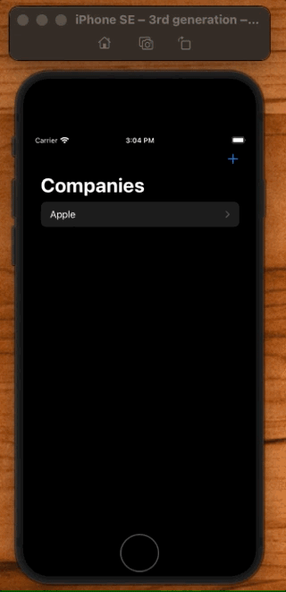

# Task / Result

If you want to use a `Result` with your fetch you need to do something like this:

**CompanyViewModel**

```swift

enum CompanyError: Error {
    case networkFailed, decodeFailed
}

@MainActor
class CompanyViewModel: ObservableObject {

    @Published var companies: [Company] = []
    @Published var showingError = false
    var errorMessage = ""

    func fetchCompanies() async {

        let fetchTask = Task { () -> [Company] in
            let url = URL(string: "https://fierce-retreat-36855.herokuapp.com/company")!
            let (data, _) = try await URLSession.shared.data(from: url)
            let companies = try JSONDecoder().decode([Company].self, from: data)
            return companies
        }

        let result = await fetchTask.result

        switch result {
        case .success(let companies):
            self.companies = companies
        case .failure(let error):
            showError("An error occurred: \(error.localizedDescription).")
        }
    }

    private func showError(_ message: String) {
        self.showingError = true
        self.errorMessage = message
    }
}
```

## How to throw an error

The problem with this is you have no way to set the error in the result.

One way to get around this is to `throw` errors instead of passing them in the `Result`:

```swift
func fetchCompanies() async {

    let fetchTask = Task { () -> [Company] in
        let url = URL(string: "https://fierce-retreat-36855.herokuapp.com/company")!
        let (data, _) = try await URLSession.shared.data(from: url)

        do {
            let companies = try JSONDecoder().decode([Company].self, from: data)
            return companies
        } catch {
            throw CompanyError.decodeFailed
        }
    }

    let result = await fetchTask.result

    do {
        self.companies = try result.get()
        self.showingError = false
    } catch CompanyError.decodeFailed {
        showError("JSON decoding error occurred.")
    } catch {
        showError("Unknown error occurred.")
    }
}
```

### How to deal with response code

```swift
func fetchCompanies() async {
    let fetchTask = Task { () -> [Company] in
        let url = URL(string: "https://fierce-retreat-36855.herokuapp.com/company")!
        let data: Data
        let urlResponse: URLResponse

        do {
            (data, urlResponse) = try await URLSession.shared.data(from: url)
            guard let response = urlResponse as? HTTPURLResponse else { return [Company]() }

            if response.statusCode == 200 {
                if let companies = try JSONDecoder().decode([Company].self, from: data) {
                    return companies
                } else {
                    throw CompanyError.decodeFailed
                }
            }
            else {
                throw CompanyError.invalidResponse
            }
        } catch {
            throw CompanyError.networkFailed
        }
    }

    let result = await fetchTask.result

    do {
        self.companies = try result.get()
        self.showingError = false
    } catch CompanyError.networkFailed {
        showError("Unable to fetch the quotes.")
    } catch CompanyError.decodeFailed {
        showError("Unable to convert quotes to text.")
    } catch CompanyError.invalidResponse {
            showError("Invalid HTTP response.")
    } catch {
        showError("Unknown error.")
    }
}
```

### Everthing is state driven

And of course everthing is state driven. So if we want to display an alert in the UI, we need a change of state - in this case from the `ViewModel`:

**CompanyViewModel**

```swift
@MainActor
class CompanyViewModel: ObservableObject {

    @Published var companies: [Company] = []
    @Published var showingError = false
    var errorMessage = ""
    
    func fetchCompanies() async {
	// Change the state
    do {
        self.companies = try result.get()
        self.showingError = false
    } catch CompanyError.decodeFailed {
        showError("JSON decoding error occurred.")
    }
```

**ContentView**

```swift
struct ContentView: View {
    @StateObject var companyVM: CompanyViewModel
    @State private var showingAddCompany = false

    var body: some View {
        NavigationStack {
            .task {
                await companyVM.fetchCompanies()
            }
            // Update the display
            .alert(companyVM.errorMessage, isPresented: $companyVM.showingError) {
                Button("OK", role: .cancel) { }
            }
        }
    }
}
```

## Full source

**CompanyViewModel**

```swift
import Foundation

struct Company: Codable, Identifiable, Hashable {
    let id: String
    let name: String
    let employees: [Employee]
}

struct Employee: Codable, Identifiable, Hashable {
    let id: String
    let name: String
}

let employee1 = Employee(id: "1", name: "Jobs")
let employee2 = Employee(id: "2", name: "Watson")
let employee3 = Employee(id: "3", name: "Gates")
let employees = [employee1, employee2, employee3]

let company1 = Company(id: "1", name: "Apple", employees: employees)
let company2 = Company(id: "2", name: "IBM", employees: employees)
let company3 = Company(id: "3", name: "Microsoft", employees: employees)

enum CompanyError: Error {
    case networkFailed, decodeFailed
}

@MainActor
class CompanyViewModel: ObservableObject {

    @Published var companies: [Company] = []
    @Published var showingError = false
    var errorMessage = ""

    func fetchCompanies() async {

        let fetchTask = Task { () -> [Company] in
            let url = URL(string: "https://fierce-retreat-36855.herokuapp.com/company")!
            let (data, _) = try await URLSession.shared.data(from: url)

            do {
                let companies = try JSONDecoder().decode([Company].self, from: data)
                return companies
            } catch {
                throw CompanyError.decodeFailed
            }
        }

        let result = await fetchTask.result

        do {
            self.companies = try result.get()
            self.showingError = false
        } catch CompanyError.decodeFailed {
            showError("JSON decoding error occurred.")
        } catch {
            showError("Unknown error occurred.")
        }
    }

    private func showError(_ message: String) {
        self.showingError = true
        self.errorMessage = message
    }
}
```

**ContentView**

```swift
import SwiftUI

struct ContentView: View {
    @StateObject var companyVM: CompanyViewModel
    @State private var showingAddCompany = false

    var body: some View {
        NavigationStack {
            List(companyVM.companies) { company in
                NavigationLink(value: company) {
                    Text(company.name)
                }
            }
            .navigationTitle("Companies")
            .navigationDestination(for: Company.self) { company in
                CompanyView(company: company)
            }
            .toolbar {
                Button(action: {
                    self.showingAddCompany.toggle()
                }) {
                    Image(systemName: "plus")
                }
            }
            .sheet(isPresented: $showingAddCompany) {
                AddCompany(companyVM: self.companyVM)
            }
            .task {
                await companyVM.fetchCompanies()
            }
            .alert(companyVM.errorMessage, isPresented: $companyVM.showingError) {
                Button("OK", role: .cancel) { }
            }
        }
    }
}

struct ContentView_Previews: PreviewProvider {
    static var previews: some View {
        ContentView(companyVM: CompanyViewModel())
            .preferredColorScheme(.dark)
    }
}
```



### Links that help

- [Example](https://designcode.io/swiftui-advanced-handbook-http-request)
- [Hacking in Swift](https://www.hackingwithswift.com/books/ios-swiftui/sending-and-receiving-codable-data-with-urlsession-and-swiftui)
- [Understanding Result](https://www.hackingwithswift.com/books/ios-swiftui/understanding-swifts-result-type)

