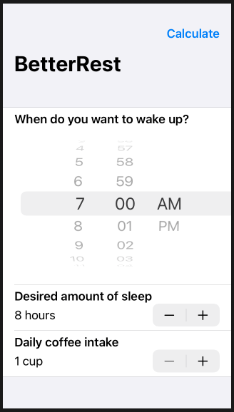
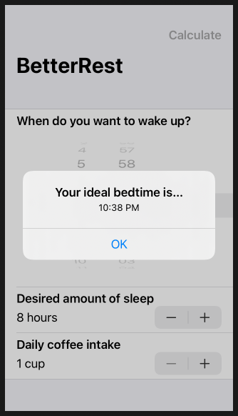

# Better Rest

```swift
import SwiftUI

struct ContentView: View {
    
    @State private var wakeUp = defaultWakeTime
    @State private var sleepAmount = 8.0
    @State private var coffeeAmount = 1
    
    @State private var alertTitle = ""
    @State private var alertMessage = ""
    @State private var showingAlert = false
    
    static var defaultWakeTime: Date {
        var components = DateComponents()
        components.hour = 7
        components.minute = 0
        return Calendar.current.date(from: components) ?? Date()
    }
    
    var body: some View {
    
        NavigationView {
            Form {
                VStack(alignment: .leading, spacing: 0) {
                    Text("When do you want to wake up?")
                        .font(.headline)
                    
                    DatePicker("Please enter a time", selection: $wakeUp, displayedComponents: .hourAndMinute)
                        .labelsHidden()
                        .datePickerStyle(WheelDatePickerStyle())
                }
                
                VStack(alignment: .leading, spacing: 0) {
                    Text("Desired amount of sleep")
                        .font(.headline)
                    
                    Stepper(value: $sleepAmount, in: 4...12, step: 0.25) {
                        Text("\(sleepAmount, specifier: "%g") hours")
                    }
                }
                
                VStack(alignment: .leading, spacing: 0) {
                    Text("Daily coffee intake")
                        .font(.headline)
                    
                    Stepper(value: $coffeeAmount, in: 1...20) {
                        if coffeeAmount == 1 {
                            Text("1 cup")
                        } else {
                            Text("\(coffeeAmount) cups")
                        }
                    }
                }
            }
            .navigationBarTitle("BetterRest")
            .navigationBarItems(trailing:
                Button(action: calculateBedtime) {
                    Text("Calculate")
                }
            )
            .alert(isPresented: $showingAlert) {
                Alert(title: Text(alertTitle), message: Text(alertMessage), dismissButton: .default(Text("OK")))
            }
            
        }
    }
    
    func calculateBedtime() {
        let model = SleepCalculator()
        let components = Calendar.current.dateComponents([.hour, .minute], from: wakeUp)
        let hour = (components.hour ?? 0) * 60 * 60
        let minute = (components.minute ?? 0) * 60
        
        do {
            let prediction = try model.prediction(wake: Double(hour + minute), estimatedSleep: sleepAmount, coffee: Double(coffeeAmount))
            let sleepTime = wakeUp - prediction.actualSleep
            
            let formatter = DateFormatter()
            formatter.timeStyle = .short

            alertMessage = formatter.string(from: sleepTime)
            alertTitle = "Your ideal bedtime is…"
        } catch {
            alertTitle = "Error"
            alertMessage = "Sorry, there was a problem calculating your bedtime."
        }
        
        showingAlert = true
    }
    
}

struct ContentView_Previews: PreviewProvider {
    static var previews: some View {
        ContentView()
    }
}
```




### Links that help

- [Better Rest Intro](https://www.hackingwithswift.com/books/ios-swiftui/betterrest-introduction)