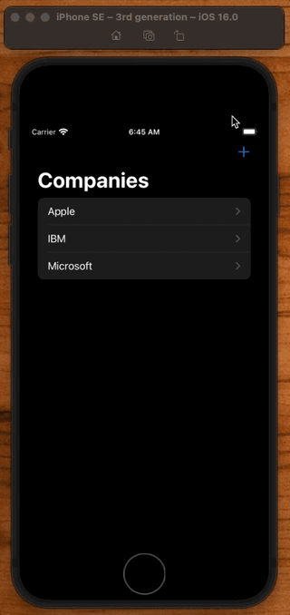

# Company / Employee 

## Basic Setup

**Companies**

```swift
import Foundation

struct Employee: Hashable, Identifiable {
    let id = UUID()
    let name: String
}

struct Company: Hashable, Identifiable {
    let id = UUID()
    let name: String
    let employees: [Employee]
}

let employee1 = Employee(name: "Peter")
let employee2 = Employee(name: "Paul")
let employee3 = Employee(name: "Mary")
let employees = [employee1, employee2, employee3]

let company1 = Company(name: "Apple", employees: employees)
let company2 = Company(name: "IBM", employees: employees)
let company3 = Company(name: "Microsoft", employees: employees)

final class Companies: ObservableObject {
    var items = [company1, company2, company3]
}
```

**MainApp**

```swift
import SwiftUI

@main
struct MainApp: App {
    @StateObject private var companies = Companies()

    var body: some Scene {
        WindowGroup {
            ContentView(companies: companies)
        }
    }
}
```

**ContentView**

```swift
import SwiftUI

struct ContentView: View {
    @StateObject var companies: Companies
    @State var showingAddCompany = false

    var body: some View {
        NavigationStack {
            List(companies.items) { company in
                NavigationLink(value: company) {
                    Text(company.name)
                }
            }
            .navigationTitle("Companies")
            .navigationDestination(for: Company.self) { company in
                CompanyView(company: company)
            }
            .toolbar {
                Button(action: {
                    self.showingAddCompany.toggle()
                }) {
                    Image(systemName: "plus")
                }
            }
            .sheet(isPresented: $showingAddCompany) {
                Text("Add Company")
            }
        }
    }
}

struct ContentView_Previews: PreviewProvider {
    static var previews: some View {
        ContentView(companies: Companies())
            .preferredColorScheme(.dark)
    }
}
```

**CompanyView**

```swift
import SwiftUI

struct CompanyView: View {
    let company: Company

    var body: some View {
        List(company.employees) { employee in
            NavigationLink(value: employee) {
                Text(employee.name)
            }
        }
        .navigationDestination(for: Employee.self) { employee in
            EmployeeView(employee: employee)
        }
        .navigationTitle("Employees")
    }
}

struct CompanyView_Previews: PreviewProvider {
    static var previews: some View {
        NavigationStack {
            CompanyView(company: company1)
                .preferredColorScheme(.dark)
        }
    }
}
```

**EmployeeView**

```swift
import SwiftUI

struct EmployeeView: View {
    let employee: Employee

    var body: some View {
        Text("Hello \(employee.name)")
    }
}

struct EmployeeView_Previews: PreviewProvider {
    static var previews: some View {
        EmployeeView(employee: employee1)
            .preferredColorScheme(.dark)
    }
}
```


## Add Company

Add a `Toolbar` with `@State` variable to toggle `.sheet` display:

**ContentView**

```swift
struct ContentView: View {
    @State var showingAddCompany = false

    var body: some View {
        NavigationStack {
            .navigationTitle("Companies")
            .toolbar {
                Button(action: {
                    self.showingAddCompany.toggle()
                }) {
                    Image(systemName: "plus")
                }
            }
            .sheet(isPresented: $showingAddCompany) {
                Text("Add Company")
            }
        }
    }
}
```

