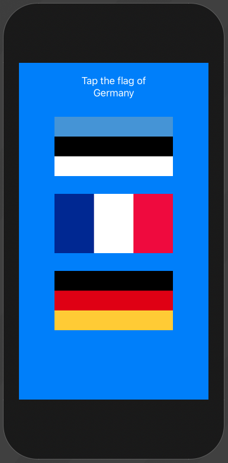

# Guess the flag


## Stacking up button

```swift
struct ContentView: View {
    var countries = ["Estonia", "France", "Germany", "Ireland", "Italy", "Nigeria", "Poland", "Russia", "Spain", "UK", "US"]
    var correctAnswer = Int.random(in: 0...2)
    
    var body: some View {
        
        ZStack {
            Color.blue.edgesIgnoringSafeArea(.all)
            VStack(spacing: 30) {
                VStack {
                    Text("Tap the flag of")
                        .foregroundColor(.white)

                    Text(countries[correctAnswer])
                        .foregroundColor(.white)
                }
                ForEach(0 ..< 3) { number in
                    Button(action: {
                       // flag was tapped
                    }) {
                        Image(self.countries[number])
                            .renderingMode(.original)
                    }
                }
                Spacer()
            }
        }
    }
}
```



- [Stacking up buttons](https://www.hackingwithswift.com/books/ios-swiftui/stacking-up-buttons)

## Showing the players score with an alert

```swift
struct ContentView: View {
    @State private var countries = ["Estonia", "France", "Germany", "Ireland", "Italy", "Nigeria", "Poland", "Russia", "Spain", "UK", "US"].shuffled()
    @State private var correctAnswer = Int.random(in: 0...2)
    
    @State private var showingScore = false
    @State private var scoreTitle = ""
    
    var body: some View {
        
        ZStack {
            Color.blue.edgesIgnoringSafeArea(.all)
            VStack(spacing: 30) {
                VStack {
                    Text("Tap the flag of")
                        .foregroundColor(.white)
                    Text(countries[correctAnswer])
                        .foregroundColor(.white)
                }
                ForEach(0 ..< 3) { number in
                    Button(action: {
                        flagTapped(number)
                    }) {
                        Image(countries[number])
                            .renderingMode(.original)
                    }
                }
                Spacer()
            }
        }.alert(isPresented: $showingScore) {
            Alert(title: Text(scoreTitle), message: Text("Your score is ???"), dismissButton: .default(Text("Continue")) {
                askQuestion()
            })
        }
    }
    
    func flagTapped(_ number: Int) {
        if number == correctAnswer {
            scoreTitle = "Correct"
        } else {
            scoreTitle = "Wrong"
        }

        showingScore = true
    }
    
    func askQuestion() {
        countries.shuffle()
        correctAnswer = Int.random(in: 0...2)
    }
}
```


Note how the state binding works.

```swift
@State private var showingScore = false

.alert(isPresented: $showingScore) {

func flagTapped(_ number: Int) {
    if number == correctAnswer {
        scoreTitle = "Correct"
```

You only bind with `$` when you need something to happen based on the change of state of a control.

You can still change the state like a regular `var`.

```swift
scoreTitle = "Correct"
```

But you only bind to it when a control needs to be updated.

```swift
.alert(isPresented: $showingScore) {
```

Here, our `scoreTitle` isn't bound to anything. We can simply set it's value, and it will display the value when needed.

```swift
@State private var scoreTitle = ""
Alert(title: Text(scoreTitle)
scoreTitle = "Correct"
```

- [Showing score with alert](https://www.hackingwithswift.com/books/ios-swiftui/showing-the-players-score-with-an-alert)

## Styling our flags

```swift
Image(countries[number])
    .renderingMode(.original)
    .clipShape(Capsule())
    .overlay(Capsule().stroke(Color.black, lineWidth: 1))
    .shadow(color: .black, radius: 2)
```


- [Styling flags](https://www.hackingwithswift.com/books/ios-swiftui/styling-our-flags)

## Full source

```swift
//
//  ContentView.swift
//  GuessTheFlag
//
//  Created by jrasmusson on 2021-04-29.
//

import SwiftUI

struct ContentView: View {
    @State private var countries = ["Estonia", "France", "Germany", "Ireland", "Italy", "Nigeria", "Poland", "Russia", "Spain", "UK", "US"].shuffled()
    @State private var correctAnswer = Int.random(in: 0...2)
    
    @State private var showingScore = false
    @State private var scoreTitle = ""
    @State private var scoreMessage = ""
    @State private var score = 0
    
    var body: some View {
        
        ZStack {
            LinearGradient(gradient: Gradient(colors: [.blue, .black]), startPoint: .top, endPoint: .bottom)
                .edgesIgnoringSafeArea(.all)

            VStack(spacing: 30) {
                VStack {
                    Text("Tap the flag of")
                        .foregroundColor(.white)
                    Text(countries[correctAnswer])
                        .foregroundColor(.white)
                        .font(.largeTitle)
                        .fontWeight(.black)
                }
                ForEach(0 ..< 3) { number in
                    Button(action: {
                        flagTapped(number)
                    }) {
                        Image(countries[number])
                            .renderingMode(.original)
                            .clipShape(Capsule())
                            .overlay(Capsule().stroke(Color.black, lineWidth: 1))
                            .shadow(color: .black, radius: 2)
                    }
                }
                Text("Score: \(score)")
                    .foregroundColor(.white)
                Spacer()
            }
        }.alert(isPresented: $showingScore) {
            Alert(title: Text(scoreTitle), message: Text(scoreMessage), dismissButton: .default(Text("Continue")) {
                askQuestion()
            })
        }
    }
    
    func flagTapped(_ number: Int) {
        if number == correctAnswer {
            score += 1
            scoreTitle = "Correct"
            scoreMessage = "Your score is \(score)"
        } else {
            scoreTitle = "Wrong"
            scoreMessage = "Wrong! That's the flag of \(countries[number])"
        }

        showingScore = true
    }
    
    func askQuestion() {
        countries.shuffle()
        correctAnswer = Int.random(in: 0...2)
    }
}

struct ContentView_Previews: PreviewProvider {
    static var previews: some View {
        ContentView()
    }
}
```
