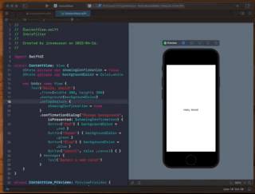
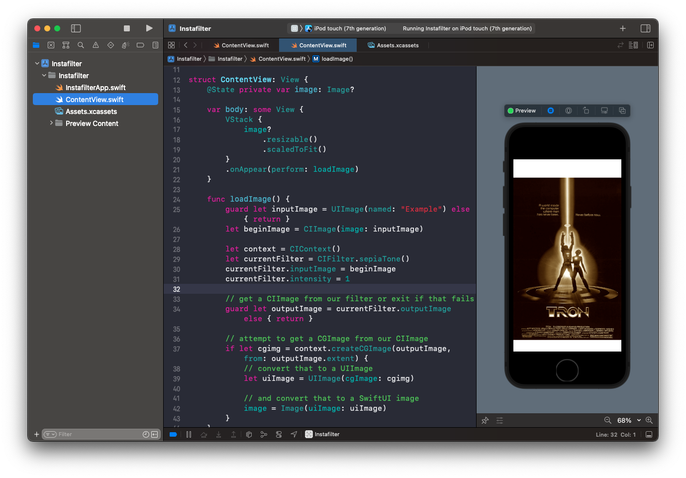

# Instafilter

## How property wrappers become structs

SwiftUI let's us:

- store changing data in `@State` property wrapper
- Bind to a value in a control using `$`
- Redraw the view when the state changes


But what if we want to do more than just update the view when a `@State` value changes. What if we want to run a method, or print something out as part of a debug process.

What won't something like this work?

```swift
@State private var blurAmount = 0.0 {
    didSet {
        print("New value is \(blurAmount)")
    }
}
```

The reason why we don't get any print values here when we adjust the slider is because this `didSet` isn't the real underlying value. 

What we get here in this property observers is the `binding` to that value (i.e. `State<Double>`). The real value behind the binding is `wrappedValue`.

@State property wrapper itself is a struct:

```swift
@propertyWrapper struct State<Value> : DynamicProperty { ... }
```

The underlying value is a nonmutating set:

```swift
public var wrappedValue: Value { get nonmutating set }
```

Which means when we go `didSet` on `blurAmount` we are never triggering the change to the underlying value. That only happens on real UI events.

So how can to run some code every time a bound @State object changes? 🤔 For that we have `onChange()`.

## Responding to state changes using onChange()

Because we can't detect or trigger a change in SwiftUI bindings like this:

```swift
struct ContentView: View {
    @State private var blurAmount: CGFloat = 0.0 {
        didSet {
            print("New value is \(blurAmount)")
        }
    }

    var body: some View {
        VStack {
            Text("Hello, World!")
                .blur(radius: blurAmount)

            Slider(value: $blurAmount, in: 0...20)
        }
    }
}
```

We can instead use the `onChange()` modifier like this:

```swift
struct ContentView: View {
    @State private var blurAmount = 0.0

    var body: some View {
        VStack {
            Text("Hello, World!")
                .blur(radius: blurAmount)

            Slider(value: $blurAmount, in: 0...20)
                .onChange(of: blurAmount) { newValue in
                    print("New value is \(newValue)")
                }
        }
    }
}
```

On change wil fire everytime that underlying wrappedValue changes. And will give us a hook into running code when values change.

### Showing multiple options with confirmationDialog()

ShiftUI gives us:

- `alert()` for showing one or two button pop-ups
- `sheet()` for presenting whole views
- `confirmationDialog()` which is like an alert but with more buttons



```swift
struct ContentView: View {
    @State private var showingConfirmation = false
    @State private var backgroundColor = Color.white

    var body: some View {
        Text("Hello, World!")
            .frame(width: 300, height: 300)
            .background(backgroundColor)
            .onTapGesture {
                showingConfirmation = true
            }
            .confirmationDialog("Change background", isPresented: $showingConfirmation) {
                Button("Red") { backgroundColor = .red }
                Button("Green") { backgroundColor = .green }
                Button("Blue") { backgroundColor = .blue }
                Button("Cancel", role: .cancel) { }
            } message: {
                Text("Select a new color")
            }
    }
}
```

## Integrating Core Image with SwiftUI

Apple has a framework that is really good for applying complex filtures to images called [Core Image](https://developer.apple.com/library/archive/documentation/GraphicsImaging/Conceptual/CoreImaging/ci_intro/ci_intro.html#//apple_ref/doc/uid/TP30001185).



```swift
import SwiftUI
import CoreImage
import CoreImage.CIFilterBuiltins

struct ContentView: View {
    @State private var image: Image?

    var body: some View {
        VStack {
            image?
                .resizable()
                .scaledToFit()
        }
        .onAppear(perform: loadImage)
    }

    func loadImage() {
        guard let inputImage = UIImage(named: "Example") else { return }
        let beginImage = CIImage(image: inputImage)

        let context = CIContext()
        let currentFilter = CIFilter.sepiaTone()
        currentFilter.inputImage = beginImage
        currentFilter.intensity = 1

        // get a CIImage from our filter or exit if that fails
        guard let outputImage = currentFilter.outputImage else { return }

        // attempt to get a CGImage from our CIImage
        if let cgimg = context.createCGImage(outputImage, from: outputImage.extent) {
            // convert that to a UIImage
            let uiImage = UIImage(cgImage: cgimg)

            // and convert that to a SwiftUI image
            image = Image(uiImage: uiImage)
        }
    }
}
```

## Wrapping a UIViewController in a SwiftUI view


```swift
import SwiftUI
import CoreImage
import CoreImage.CIFilterBuiltins
import PhotosUI

struct ContentView: View {
    @State private var image: Image?
    @State private var showingImagePicker = false

    var body: some View {
        VStack {
            image?
                .resizable()
                .scaledToFit()

            Button("Select Image") {
               showingImagePicker = true
            }
        }
        .sheet(isPresented: $showingImagePicker) {
            ImagePicker()
        }
    }
}

struct ImagePicker: UIViewControllerRepresentable {

    typealias UIViewControllerType = PHPickerViewController

    func makeUIViewController(context: Context) -> PHPickerViewController {
        var config = PHPickerConfiguration()
        config.filter = .images

        let picker = PHPickerViewController(configuration: config)
        return picker
    }

    func updateUIViewController(_ uiViewController: PHPickerViewController, context: Context) {
        // do nothing
    }
}
```

## Using coordinators to manage SwiftUI view controllers

- Coordinators are designed to act as delegates for UIKit view controllers.

### Links that help

- [Intro](https://www.hackingwithswift.com/books/ios-swiftui/instafilter-introduction)
- [How property wrappers become structs](https://www.hackingwithswift.com/books/ios-swiftui/how-property-wrappers-become-structs)
- [Responding to state changes using onChange()](https://www.hackingwithswift.com/books/ios-swiftui/responding-to-state-changes-using-onchange)
- [Showing multiple options with confirmationDialog()](https://www.hackingwithswift.com/books/ios-swiftui/showing-multiple-options-with-confirmationdialog)
- [Integrating Core Image with SwiftUI](https://www.hackingwithswift.com/books/ios-swiftui/integrating-core-image-with-swiftui)
- [Wrapping a UIViewController in a SwiftUI view](https://www.hackingwithswift.com/books/ios-swiftui/wrapping-a-uiviewcontroller-in-a-swiftui-view)
- [Using coordinators to manage SwiftUI view controllers](https://www.hackingwithswift.com/books/ios-swiftui/using-coordinators-to-manage-swiftui-view-controllers)
- [How to save images to the user’s photo library
](https://www.hackingwithswift.com/books/ios-swiftui/how-to-save-images-to-the-users-photo-library)
- [Building our basic UI](https://www.hackingwithswift.com/books/ios-swiftui/building-our-basic-ui)
- [Importing an image into SwiftUI using PHPickerViewController](https://www.hackingwithswift.com/books/ios-swiftui/importing-an-image-into-swiftui-using-phpickerviewcontroller)
- [Basic image filtering using Core Image](https://www.hackingwithswift.com/books/ios-swiftui/basic-image-filtering-using-core-image)
- [Customizing our filter using confirmationDialog()
](https://www.hackingwithswift.com/books/ios-swiftui/customizing-our-filter-using-confirmationdialog)
- [Saving the filtered image using UIImageWriteToSavedPhotosAlbum()](https://www.hackingwithswift.com/books/ios-swiftui/saving-the-filtered-image-using-uiimagewritetosavedphotosalbum)
- [Wrap up](https://www.hackingwithswift.com/books/ios-swiftui/instafilter-wrap-up)


### Others

- [Core Image](https://developer.apple.com/library/archive/documentation/GraphicsImaging/Conceptual/CoreImaging/ci_intro/ci_intro.html#//apple_ref/doc/uid/TP30001185)