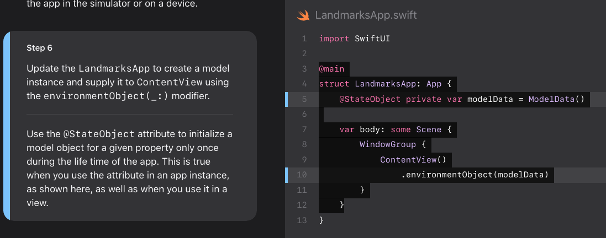
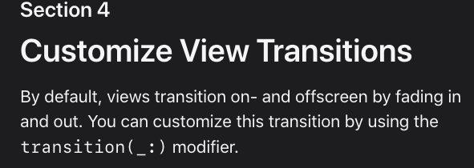
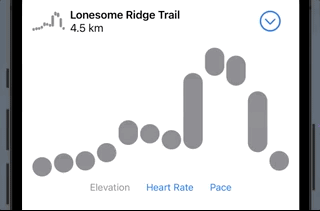
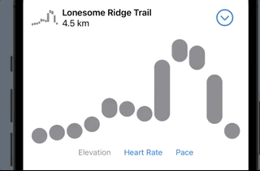
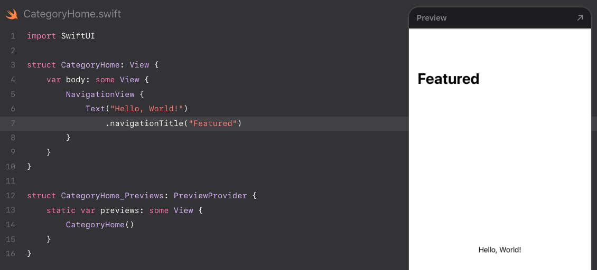
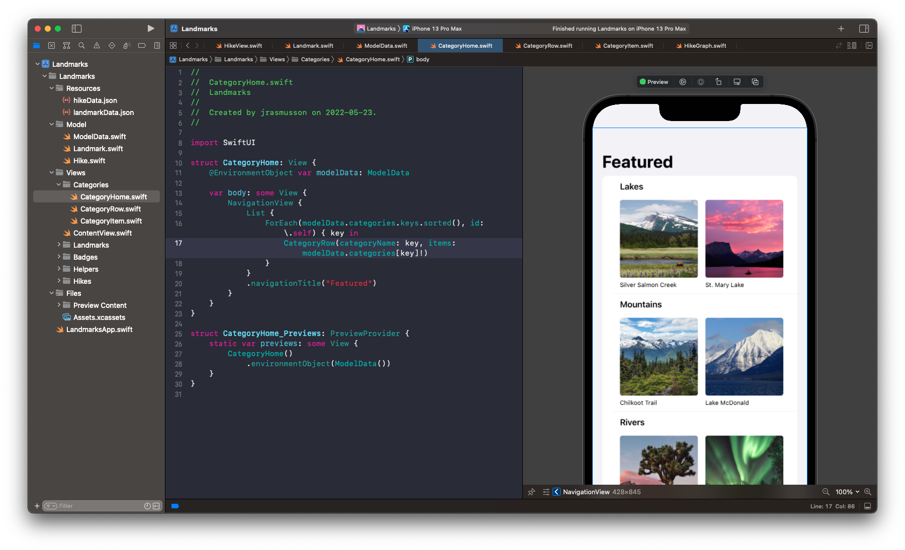

# Lankmarks

## Handling user input


In order to add a show favorites toggle, the Apple tutorial says:

 

You need to add a `ForEach` to the list in order to combine static and dynamic views. Why is that?

### What happens if we don't add the for each

Here is what happens if we keep the `List` and add the toggle on top:


SwiftUI keeps the `Toogle` and `List` views separate. It treats the static `Toggle` View as a view of its own and embeds the `List` view inside it.

In order to combine dynamic and static views together, we need to do what the tutorial says and transform the landmarks into rows:


which `NavigationView` will then combine into a single view.

## Use an Observable Object for Storage


```swift
final class ModelData: ObservableObject {
    @Published var landmarks: [Landmark] = load("landmarkData.json")
}

struct LandmarkList: View {
    @EnvironmentObject var modelData: ModelData
}

@main
struct LandmarksApp: App {
    @StateObject private var modelData = ModelData()

    var body: some Scene {
        WindowGroup {
            ContentView()
                .environmentObject(modelData)
        }
    }
}
```



## Create a Favorite Button


When you need to set someting `true` or `false` on a binding use `.constant`.

```swift
struct FavoriteButton: View {
    @Binding var isSet: Bool

    var body: some View {
		Text("Hello, World!")    
	}
}

struct FavoriteButton_Previews: PreviewProvider {
    static var previews: some View {
        FavoriteButton(isSet: .constant(true))
    }
}
```

Now this is interesting. Look at how Apple passes in the `modelData` to a subview, while keeping the data powering that view `Landmark` independent as a `var`. Along with the helper `landmarIndex: Int`:


They need the index helper because that is what they use to access the landmark they need as a reference from the `modelData`.

```swift
struct LandmarkDetail: View {
    @EnvironmentObject var modelData: ModelData
    var landmark: Landmark

    var landmarkIndex: Int {
        modelData.landmarks.firstIndex(where: { $0.id == landmark.id })!
    }

	HStack {
        Text(landmark.name).font(.title)
        FavoriteButton(isSet: $modelData.landmarks[landmarkIndex].isFavorite)
    }
```

### Links that help

- [Handling User Input](https://developer.apple.com/tutorials/swiftui/handling-user-input)

## Animating Views and Transitions

### Add Animations to Individual Views


If the view is equatable, SwiftUI can animate the following with `animation(_:)`:

- color
- opacity
- rotation
- size

If the view is no equatable, you can animate on any value change using `animation(_:value:)`.

For example, to rotate and scale the system image on a `Label`, you tie the effect to the stage of the `showDetail` boolean, and then add a `animation(_:value:)` to animate the change of state.

```swift
struct HikeView: View {
    var hike: Hike
    @State private var showDetail = false

    var body: some View {
        Button {
            showDetail.toggle()
        } label: {
            Label("Graph", systemImage: "chevron.right.circle")
                .rotationEffect(.degrees(showDetail ? 90 : 0))
                .scaleEffect(showDetail ? 1.5 : 1)
                .animation(.easeInOut, value: showDetail) //
        }
    }
}
```

The animation modifier applies to all animatable changes withing the views it wraps.


This is an example of an `implicit` animation. One where we apply animations to views via `ViewModifiers` and animate around changes in values.

- [Stanford animation lectecture](https://github.com/jrasmusson/swiftui/blob/main/Stanford/2021/Lecture7/README.md)


### Animate the Effects of State Changes


State change animations are examples of explicit animations. We do those using the function:

- `withAnimation { ... }`

Take the action the causes the state changes and wrap it in this:

```swift
Button {
    withAnimation {
        showDetail.toggle()
    }
}
```

By doing this, all views affected by this change of state will now be included in the animation.


You can slow it down even more by doing this:

```swift
withAnimation(.easeInOut(duration: 4)) {
    showDetail.toggle()
}
```

### Customize View Transtions



```swift
if showDetail {
    HikeDetail(hike: hike)
        .transition(.slide)
}
```


For reuse you can extract this as a `static` extension:

```swift
HikeDetail(hike: hike)
    .transition(.moveAndFade)

extension AnyTransition {
    static var moveAndFade: AnyTransition {
        AnyTransition.slide
    }
}
```

You can also try other things like:

```swift
AnyTransition.move(edge: .trailing)
```


Or more complicated things like:

```swift
extension AnyTransition {
    static var moveAndFade: AnyTransition {
        .asymmetric(
            insertion: .move(edge: .trailing).combined(with: .opacity),
            removal: .scale.combined(with: .opacity)
        )
    }
}
```


## Compose Animations for Complex Effects


Let's add a ripple effect to the `GraphCapsule` in the `HikeGraph` view:

### Default

**HikeGraph**

```swift
extension Animation {
    static func ripple() -> Animation {
        Animation.default
    }
}

GraphCapsule(
    index: index,
    color: color,
    height: proxy.size.height,
    range: observation[keyPath: path],
    overallRange: overallRange
)
.animation(.ripple())
```



### Spring

```swift
extension Animation {
    static func ripple() -> Animation {
        Animation.spring(dampingFraction: 0.5)
    }
}
```



This is an implicit animation that is tied to the appearance of the capsule. When the capsule appears, it animations from the old to the new using this ripple effect.

Note how it also changes and animates the color. All automtically.

### Speed


```swift
extension Animation {
    static func ripple() -> Animation {
        Animation.spring(dampingFraction: 0.5)
            .speed(0.25)
    }
}
```


### Delay


```swift
extension Animation {
    static func ripple(index: Int) -> Animation {
        Animation.spring(dampingFraction: 0.5)
            .speed(2)
            .delay(0.03 * Double(index))
    }
}

.animation(.ripple(index: index))
```


### Links that help

- [Animating Views and Transitions](https://developer.apple.com/tutorials/swiftui/animating-views-and-transitions)

## Composing Complex Interfaces


### NavigationView with Title

Not how we set the navigation title as a simple text label with the `navigationTitle` view modifier.



**CategoryHome**

```swift
struct CategoryHome: View {
    var body: some View {
        NavigationView {
            Text("Hello, World!")
                .navigationTitle("Featured")
        }
    }
}
```

### Create a Category List


Add a model data environemnt object:

**CategoryHome**

```swift
struct CategoryHome: View {
    @EnvironmentObject var modelData: ModelData

    var body: some View {
        Text("Hello World")
    }
}

struct CategoryHome_Previews: PreviewProvider {
    static var previews: some View {
        CategoryHome()
            .environmentObject(ModelData())
    }
}
```

Create a `List` with a `ForEach` inside to more rows for each category.


**CategoryHome**

```swift
struct CategoryHome: View {
    @EnvironmentObject var modelData: ModelData

    var body: some View {
        NavigationView {
            List {
                ForEach(modelData.categories.keys.sorted(), id: \.self) { key in
                    Text(key)
                }
            }
            .navigationTitle("Featured")
        }
    }
}
```

## Creating a Category Row


Here is a pattern for making data availabe in a view - use a `static var`:

**CategoryRow**

```swift
struct CategoryRow: View {
    var categoryName: String
    var items: [Landmark]

    var body: some View {
        Text("Hello, World!")
    }
}

struct CategoryRow_Previews: PreviewProvider {
    static var landmarks = ModelData().landmarks
    static var previews: some View {
        CategoryRow(
            categoryName: landmarks[0].category.rawValue,
            items: Array(landmarks.prefix(3))
        )
    }
}
```

So we start by embedded the horizontal elements in an `HStack` and then we embed that and the title in a `VStack`:


It's interested how these tutorials seem to be OK with hardcoded values for heights like `frame(height: 185)`. 

But note how we can make our `HStack` scrollable by embedding it in a `ScrollView`:


Let's now create an item for our horizontal scroll.


And then use it in our view:


## Complete the Category View


Pass in the data to the row:



Add `isFeatured` to `ModelData` and display the first `isFeatured` like this:

### 

### Links that help

- [Composing Complex Interfaces](https://developer.apple.com/tutorials/swiftui/composing-complex-interfaces)


