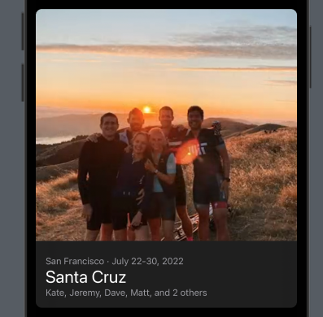
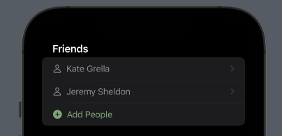

# Places

## Building the Home screen


### Data

**ModelData**

```swift
import Foundation

struct Place: Hashable, Identifiable {
    let id: UUID = UUID()
    let location: String
    let title: String
    let description: String
    let imageName: String
}

final class ModelData: ObservableObject {
    var places: [Place] = [
        place,
        place2
    ]
}

let place = Place(location: "Colorado, US", title: "Aspen", description: "14 Routes · Mountainous", imageName: "aspen")
let place2 = Place(location: "California, US", title: "San Francisco", description: "12 Routes · Coastal", imageName: "sf")
```

**PlacesApp**

```swift
@main
struct PlacesApp: App {
    @StateObject private var modelData = ModelData()

    var body: some Scene {
        WindowGroup {
            ContentView()
                .environmentObject(modelData)
        }
    }
}
```

### PlaceCard


**PlaceCard**

```swift
import SwiftUI

struct PlaceCard: View {
    let place: Place

    var body: some View {
        VStack(spacing: 6) {
            HStack {
                Text(place.location)
                    .foregroundColor(.secondary)
                Spacer()
                Image(systemName: "ellipsis.circle")
                    .tint(.primary)
            }

            VStack(alignment: .leading, spacing: 10) {
                HStack {
                    Text(place.title)
                        .font(.title)
                    Spacer()
                }

                HStack {
                    Image(systemName: "map")
                    Text(place.description)
                    Spacer()
                }

                Image(place.imageName)
                    .resizable()
                    .scaledToFit()
                    .cornerRadius(10)
            }
            .foregroundColor(.primary)
        }
        .padding()
        .background(.thinMaterial)
        .cornerRadius(10)
    }
}

struct PlaceCard_Previews: PreviewProvider {
    static var previews: some View {
        PlaceCard(place: place)
            .preferredColorScheme(.dark)
    }
}
```

**PlaceDetail**

```swift
import SwiftUI

struct PlaceDetail: View {
    let place: Place
    var body: some View {
        Text("Hello, World!")
    }
}

struct PlaceDetail_Previews: PreviewProvider {
    static var previews: some View {
        PlaceDetail(place: place)
    }
}
```

## Scrollable TabView


**ContentView**

```swift
import SwiftUI

enum Tab {
    case places
    case itineraries
    case profile
}

struct ContentView: View {
    @EnvironmentObject var modelData: ModelData
    @State var selection: Tab = .places

    var body: some View {
        TabView(selection: $selection) {
            NavigationStack {
                ScrollView {
                    ForEach(modelData.places) { place in
                        NavigationLink(value: place) {
                            PlaceCard(place: place)
                        }
                    }
                }
                .navigationTitle("Places")
                .navigationDestination(for: Place.self) { item in
                    PlaceDetail(place: place)
                }
            }
            .tabItem {
                Label("Places", systemImage: "rectangle.fill.on.rectangle.angled.fill")
            }
            .tag(Tab.places)

            Text("Itineraries")
                .tabItem {
                    Label("Itineraries", systemImage: "list.bullet")
                }
                .tag(Tab.itineraries)

            Text("Profile")
                .tabItem {
                    Label("Profile", systemImage: "person.fill")
                }
                .tag(Tab.profile)
        }

    }
}

struct ContentView_Previews: PreviewProvider {
    static var previews: some View {
        ContentView()
            .preferredColorScheme(.dark)
            .environmentObject(ModelData())
    }
}
```

### Adding the Menu


**PlaceCard**

```swift
import SwiftUI

struct PlaceCard: View {
    let place: Place

    var body: some View {
        VStack(spacing: 6) {
            HStack {
                Text(place.location)
                    .foregroundColor(.secondary)
                Spacer()
                Menu {
                    Button("Share", action: share)
                    Button("Save as PDF", action: saveAsPDF)
                } label: {
                    Image(systemName: "ellipsis.circle")
                        .tint(.primary)
                }
            }
    }

    func share() {  }
    func saveAsPDF() {  }
}
```


## Place Detail


### Nav Bar Buttons



Trick here is to place preview in a `NavigationStack` that would have been set in the parent so you can preview:

**PlaceDetail**


```swift
import SwiftUI

struct PlaceDetail: View {
    let place: Place
    var body: some View {
        Text("Hello, World!").padding()
            .toolbar {
                ToolbarItemGroup(placement: .navigationBarTrailing) {
                    Button(action: {
                        print("Share")
                    }) {
                        Image(systemName: "square.and.arrow.up")
                    }

                    Button(action: {
                        print("Like")
                    }) {
                        Image(systemName: "heart")
                    }
                }
            }
    }
}

struct PlaceDetail_Previews: PreviewProvider {
    static var previews: some View {
        NavigationStack {
            PlaceDetail(place: place)
                .preferredColorScheme(.dark)
        }
    }
}
```

### Background Image


Thinking here is `VStack` ignoring safe area with details pulled up overlapping background image.


### Overlapping details

It is possible to pull content up and make it overlap with negative spacing:


But that relies on the background picture being dark. So we won't here:



### Noteworthy


This we can to with a list and navigation link:


