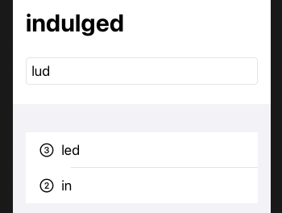

# Word Scramble


## Loading resources from your app bundle

```swift
if let fileURL = Bundle.main.url(forResource: "some-file", withExtension: "txt") {
    // we found the file in our bundle!
}
```

```swift
if let fileContents = try? String(contentsOf: fileURL) {
    // we loaded the file into a string!
}
```

- [Resource bundle](https://www.hackingwithswift.com/books/ios-swiftui/loading-resources-from-your-app-bundle)

## Checking for spelling

```swift
let word = "swift"
let checker = UITextChecker()
let range = NSRange(location: 0, length: word.utf16.count)
let misspelledRange = checker.rangeOfMisspelledWord(in: word, range: range, startingAt: 0, wrap: false, language: "en")
let allGood = misspelledRange.location == NSNotFound
```


- [Working with Strings](https://www.hackingwithswift.com/books/ios-swiftui/working-with-strings)

## Adding to a list of words

```swift
struct ContentView: View {
    @State private var usedWords = [String]()
    @State private var rootWord = ""
    @State private var newWord = ""

    var body: some View {
        NavigationView {
            VStack {
                TextField("Enter your word", text: $newWord, onCommit: addNewWord)
                    .textFieldStyle(RoundedBorderTextFieldStyle())
                    .autocapitalization(.none)
                    .padding()

                List(usedWords, id: \.self) {
                    Image(systemName: "\($0.count).circle")
                    Text($0)
                }
            }
            .navigationBarTitle(rootWord)
        }
    }
    
    func addNewWord() {
        // lowercase and trim the word, to make sure we don't add duplicate words with case differences
        let answer = newWord.lowercased().trimmingCharacters(in: .whitespacesAndNewlines)

        // exit if the remaining string is empty
        guard answer.count > 0 else {
            return
        }

        // extra validation to come

        usedWords.insert(answer, at: 0)
        newWord = ""
    }
}
```

- [Adding to a list of words](https://www.hackingwithswift.com/books/ios-swiftui/adding-to-a-list-of-words)

## Full source

```swift
//
//  ContentView.swift
//  WordScramble
//
//  Created by jrasmusson on 2021-05-01.
//

import SwiftUI

struct ContentView: View {
    
    @State private var usedWords = [String]()
    @State private var rootWord = ""
    @State private var newWord = ""
    
    // make showing alerts easier
    @State private var errorTitle = ""
    @State private var errorMessage = ""
    @State private var showingError = false

    var body: some View {
        NavigationView {
            VStack {
                TextField("Enter your word", text: $newWord, onCommit: addNewWord)
                    .textFieldStyle(RoundedBorderTextFieldStyle())
                    .autocapitalization(.none)
                    .padding()

                List(usedWords, id: \.self) {
                    Image(systemName: "\($0.count).circle")
                    Text($0)
                }
            }
            .navigationBarTitle(rootWord)
            .onAppear(perform: startGame)
            .alert(isPresented: $showingError) {
                Alert(title: Text(errorTitle), message: Text(errorMessage), dismissButton: .default(Text("OK")))
            }
        }
    }
    
    func addNewWord() {
        // lowercase and trim the word, to make sure we don't add duplicate words with case differences
        let answer = newWord.lowercased().trimmingCharacters(in: .whitespacesAndNewlines)

        // exit if the remaining string is empty
        guard answer.count > 0 else {
            return
        }

        guard isOriginal(word: answer) else {
            wordError(title: "Word used already", message: "Be more original")
            return
        }

        guard isPossible(word: answer) else {
            wordError(title: "Word not recognized", message: "You can't just make them up, you know!")
            return
        }

        guard isReal(word: answer) else {
            wordError(title: "Word not possible", message: "That isn't a real word.")
            return
        }

        usedWords.insert(answer, at: 0)
        newWord = ""
    }
    
    func isOriginal(word: String) -> Bool {
        !usedWords.contains(word)
    }
    
    func isPossible(word: String) -> Bool {
        var tempWord = rootWord

        for letter in word {
            if let pos = tempWord.firstIndex(of: letter) {
                tempWord.remove(at: pos)
            } else {
                return false
            }
        }

        return true
    }
    
    func isReal(word: String) -> Bool {
        let checker = UITextChecker()
        let range = NSRange(location: 0, length: word.utf16.count)
        let misspelledRange = checker.rangeOfMisspelledWord(in: word, range: range, startingAt: 0, wrap: false, language: "en")

        return misspelledRange.location == NSNotFound
    }
    
    func wordError(title: String, message: String) {
        errorTitle = title
        errorMessage = message
        showingError = true
    }
    
    func startGame() {
        // 1. Find the URL for start.txt in our app bundle
        if let startWordsURL = Bundle.main.url(forResource: "start", withExtension: "txt") {
            // 2. Load start.txt into a string
            if let startWords = try? String(contentsOf: startWordsURL) {
                // 3. Split the string up into an array of strings, splitting on line breaks
                let allWords = startWords.components(separatedBy: "\n")

                // 4. Pick one random word, or use "silkworm" as a sensible default
                rootWord = allWords.randomElement() ?? "silkworm"

                // If we are here everything has worked, so we can exit
                return
            }
        }

        // If were are *here* then there was a problem – trigger a crash and report the error
        fatalError("Could not load start.txt from bundle.")
    }
}

struct ContentView_Previews: PreviewProvider {
    static var previews: some View {
        ContentView()
    }
}
```



### Links that help

- [Word Scramble Intro](https://www.hackingwithswift.com/books/ios-swiftui/word-scramble-introduction)
