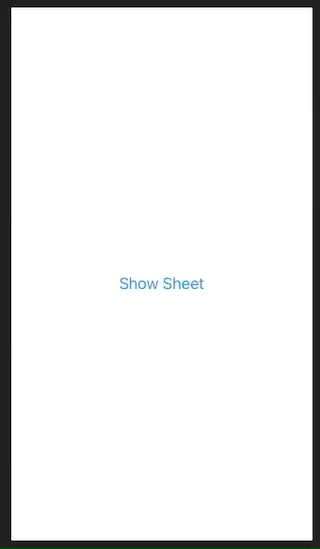

# iExpense

## Why @State only works with structs

@State is a property wrapper that monitors changes in our structs. Each time a value inside our struct changes the *whole* struct changes. We get a new struct every time.

There are two important differences between structs and classes:

- structs have unique owners
- classes can have multiple owners

With classes, multiple things can point to the same value. Classes are referenced based. Many have access to it's reference or pointer.

But structs are value based. There can be only one owner.

What that means is that if we have two SwiftUI views and we send them both the same struct to work with, they actually each have a unique copy of that struct; ifone changes it, the other won't see that change. On the other hand, if we create an instance of a classes and send that to both views, they *will* share changes.

The reason why @State only works with structs is because when we change @State in a class, we aren't changing the reference of state. It remains the same.

Yes we are changing the values of state. But everyone gets the same value. No change.

With struct, because they are never shared, we do get a change in state. That's why @State only works in SwiftUI for structs.

If we want to share state change via a classes, we need something else. We need an `@ObservedObject`.

## Sharing state with @ObservedObject

If you want to use a class with your SwiftUI data - which you *will* want to do if that data should be shared across more than one view - then SwiftUI gives us two property wrappers that are useful:

- @ObserveredObject, and
- @EnvironmentObject

Let's now look at @ObservedObject. To make a SwiftUI class observable, we need to declare what is publishable.

```swift
class User {
    @Published var firstName = "Bilbo"
    @Published var lastName = "Baggins"
}
```

`@Published` is more or less have of `@State`. It tells Swift that whenever either of those two properties change, it should send an announcement out to any SwiftUI views that are watching that they should reload.

How do those views know which classes ight send out these modifications? That's another property wrapper, `@ObservedObject`. Which is the other half of `@State`. it tells SwiftUI to watch a class for any change annoucements.

```swift
@ObservedObject var user = User()
```

So really to make something observable we go from this:

```swift
class User {
    var firstName = "Bilbo"
    var lastName = "Baggins"
}

struct ContentView: View {
    @State private var user = User()
```

To this:

```swift
class User: ObservableObject {
    @Published var firstName = "Bilbo"
    @Published var lastName = "Baggins"
}

struct ContentView: View {
    @ObservedObject var user = User()
```

The end result here is that we can have our state stored in an exeternal object, and we can now use that object in multiple views and have them all point to the same values.

## Showing and hiding views

There are several ways of showing views in SwiftUI, and one of the most basic is a sheet: a new view presented on top of our existing one. On iOS this automatically gives us a card-like presentation where the current view slides away into the distance a little and the new view animates in on top.

Sheets work much like alerts, in that we don’t present them directly with code such as `mySheet.present()` or similar. Instead, we define the conditions under which a sheet should be shown, and when those conditions become true or false the sheet will either be presented or dismissed respectively.

Let’s start with a simple example, which will be showing one view from another using a sheet. First, we create the view we want to show inside a sheet, like this:

```swift
struct SecondView: View {
    var body: some View {
        Text("Second View")
    }
}

struct ContentView: View {
    @State private var showingSheet = false

    var body: some View {
        Button("Show Sheet") {
            self.showingSheet.toggle()
        }
        .sheet(isPresented: $showingSheet) {
            SecondView()
        }
    }
}
```


First we defined some state to track if the sheet is showing.

```swift
@State private var showingSheet = false
```

Then we toggle that state in the button.

```swift
self.showingSheet.toggle()
```

Then the magic to make the new sheet appear is here.

```swift
.sheet(isPresented: $showingSheet) {
    // contents of the sheet
}
```

This is a two-way binding to our state property. It fires when `$showingSheet` changes.

### Passing data

You can pass information to another view by defining a var in the view.

```swift
struct SecondView: View {
    var name: String

    var body: some View {
        Text("Hello, \(name)!")
    }
}
```

And then passing it to the view when constructed.

```swift
.sheet(isPresented: $showingSheet) {
    SecondView(name: "@twostraws")
}
```

### Dismissing the view

The user can dismiss the view by swiping downwards. But let's look at how to make the view disappear programmatically.

We could use a @State property wrapper. Another is to use an @Environment.

@Environment allows us to provide data to other views externally. We can read our views presentation mode from the environment.

To try it out add this property to the second view.

```swift
@Environment(\.presentationMode) var presentationMode
```

The presentation mode of a view contains only two pieces of data, but both are useful: a property storing whether the view is currently presented on screen, and a method to let us dismiss the view immediately.

```swift
struct SecondView: View {
    @Environment(\.presentationMode) var presentationMode
    
    var name: String

    var body: some View {
        Button("Dismiss") {
            presentationMode.wrappedValue.dismiss()
        }
    }
}

struct ContentView: View {
    @State private var showingSheet = false

    var body: some View {
        Button("Show Sheet") {
            self.showingSheet.toggle()
        }
        .sheet(isPresented: $showingSheet) {
            SecondView(name: "Tron")
        }
    }
}
```




### Links that help

- [iExpense Intro](https://www.hackingwithswift.com/books/ios-swiftui/iexpense-introduction)
- [Why state only works with structs](https://www.hackingwithswift.com/books/ios-swiftui/why-state-only-works-with-structs)
- [Sharing SwiftUI state with @ObservedObject](https://www.hackingwithswift.com/books/ios-swiftui/sharing-swiftui-state-with-observedobject)
- [Showing and hiding views](https://www.hackingwithswift.com/books/ios-swiftui/showing-and-hiding-views)