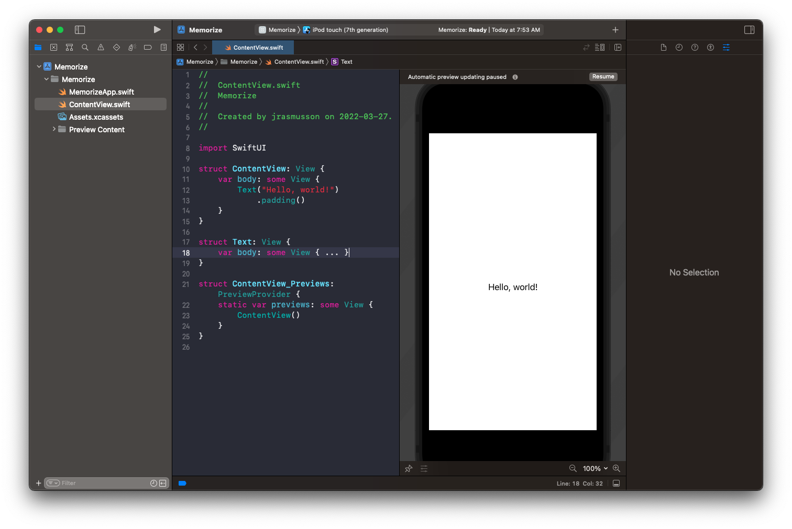
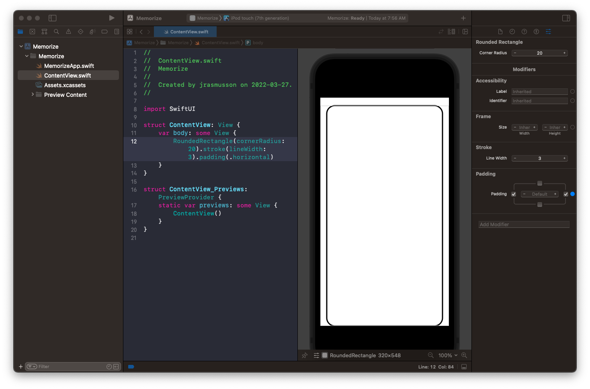
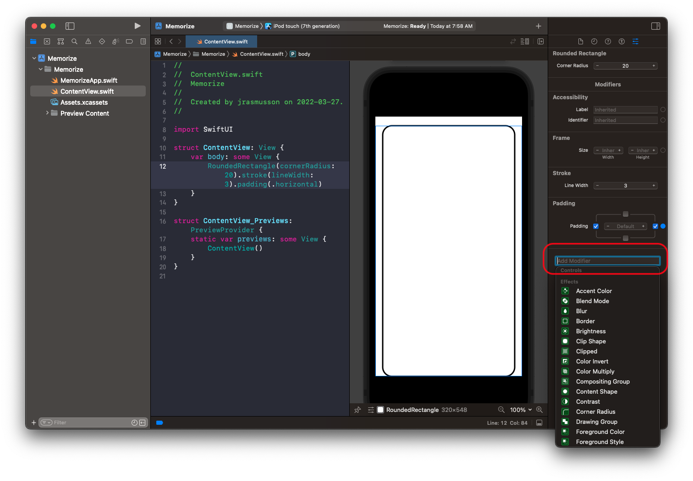
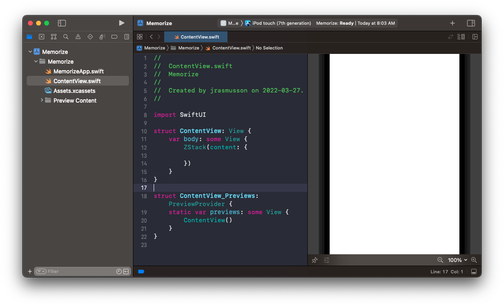
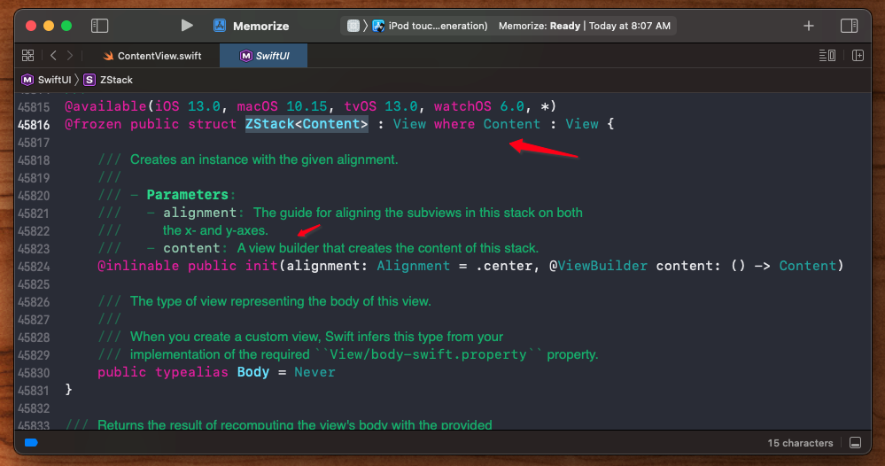
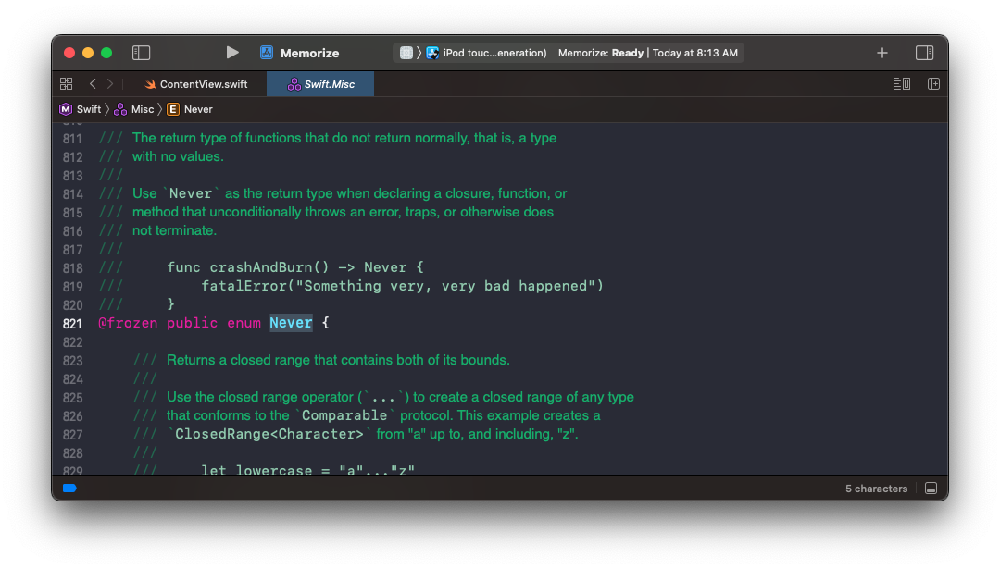
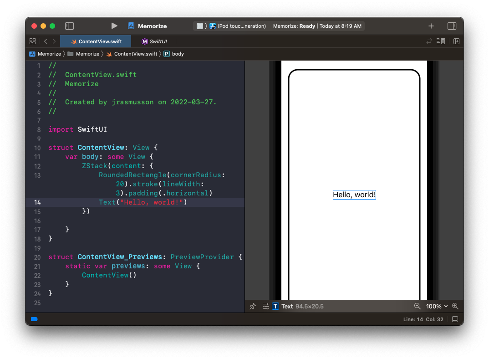
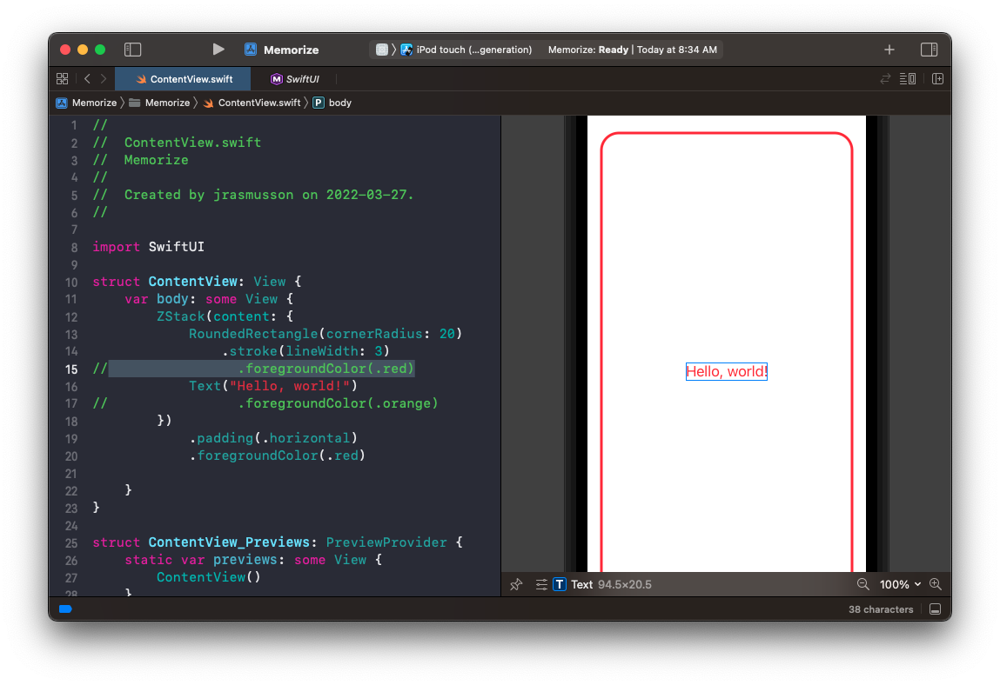
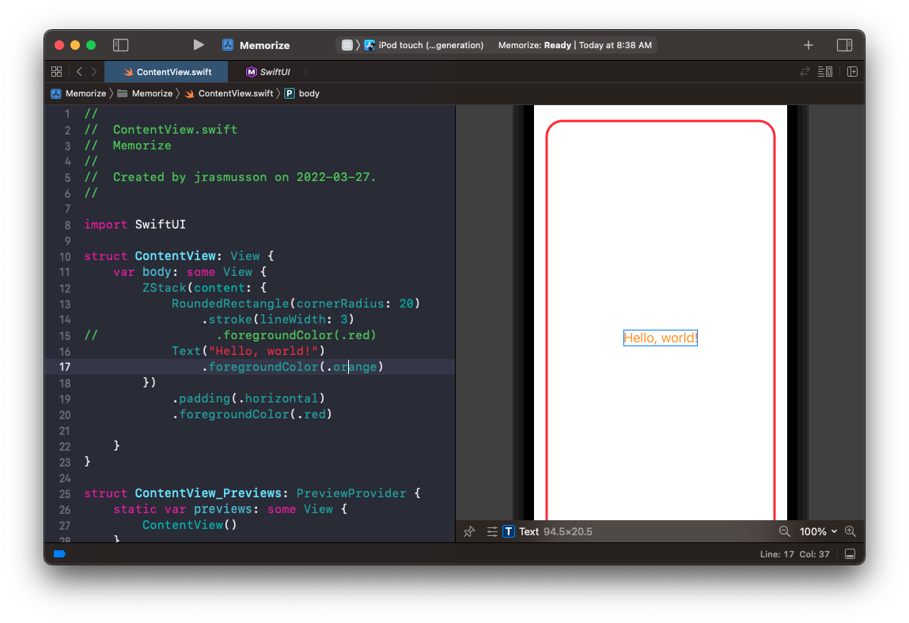
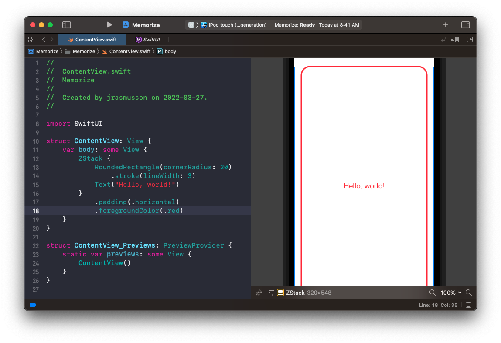

# Lecture 1: Getting started with Swift UI

Everything in SwiftUI is a `View`. Event text.

To views we can add `modifiers`.

Modifiers are cool because they can be added to any view. Gone are the days when every control needed to have its own property (i.e. `alpha`).

Now you can add any modifier to any View and get the change you want. To see a list of which modifieres you can add use that search bar down in the bottom right.

Views are really lego combiners. They can combine subviews and return them as one combined big view. For example look at `ZStack`.

`ZStack` takes `content` in the form of a function. The function here is of type `() -> _` meaning it takes no input but it does return something. It returns a bag of lego.

This bag of lego must be a `View` and it must support the `@ViewBuilder` attributes which means it will treat whatever it is passed as a list of views.

`Never` is an `enum` that represents something bad has happened. or should *Never* happen.

Because Swift knows you are going to want to make these bags of lego a lot it makes it really easy by enhancing the concept of a function to represent a bag of lego.

## ViewBuilder

This function that you pass to a lego combiner view, is known as a [ViewBuilder](https://developer.apple.com/documentation/swiftui/viewbuilder).

This `ViewBuilder` is a custom parameter that constructs a list of views from closures. It essentially list you list other views inside and then bags them together.

But what's cool about building this list of views in a closure is we can use `if/then` statements and even `vars` to dynamically build our views based the state of what is going on inside.

So `ZStack` stacks these views ontop of eachother out towards the user. Good for a stack of cards. And every `View` in SwiftUI is just `some View`. We always let the compiler figure out what's inside.

So this is basically the beginning of our card.

## Modifiers on ZStack

There are two types of modifiers:

- ones that affect the view
- ones that the affect the contained views

### padding

For example, when we add `padding` to a `ZStack` that affects the `ZStack` view.

ZStack is just a view. It can be padded list anything else.

### foreground

But watch what happens when we put `foreground` on the `ZStack`. It affects everything inside.

But we can still override locally.

## Cleanup

Swift can figure out what is going on. So we can clean things up a bit. We don't need to pass in `content` as an argument. It is a `trailing` function, so we can just inline it like this:

### Links that help

- [Lecture 1](https://www.youtube.com/watch?v=bqu6BquVi2M&ab_channel=Stanford)
- [Standford 2021](https://cs193p.sites.stanford.edu/)

