# Lecture 11: Error Handling Persistence

## Error handling

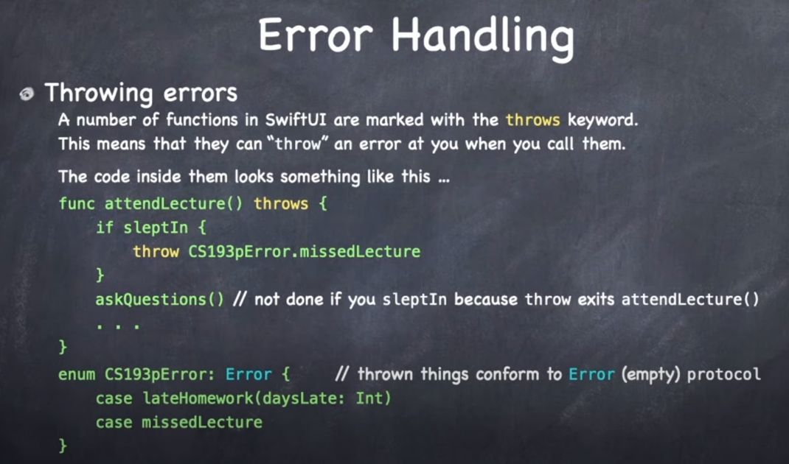

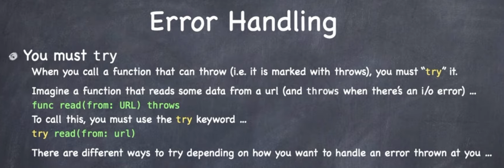

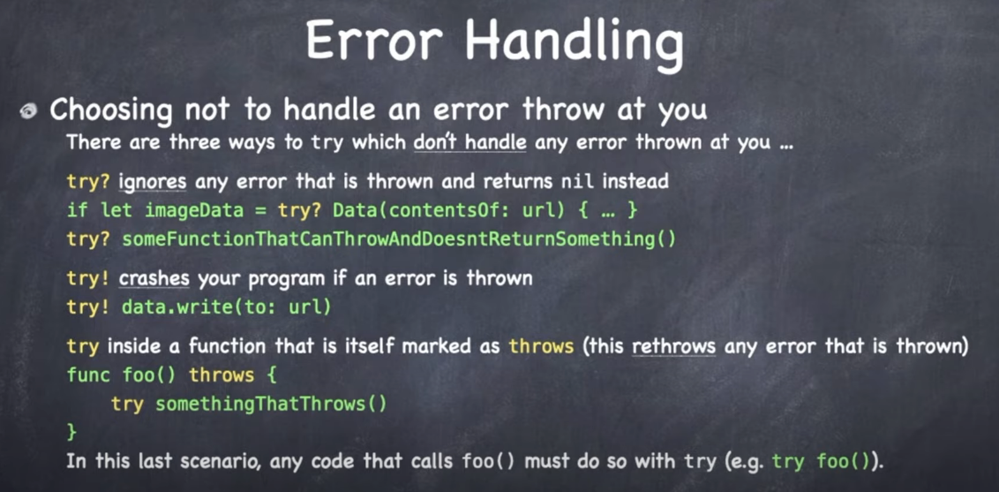

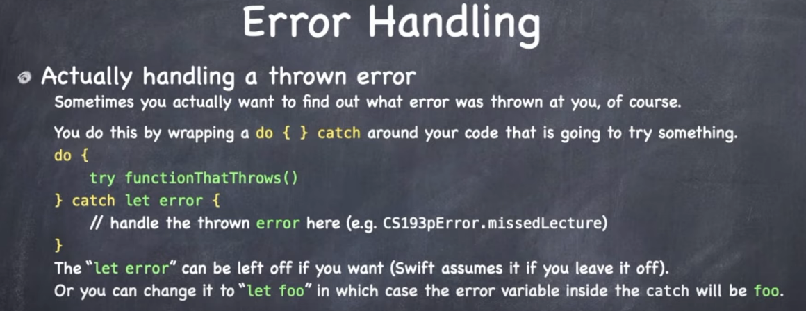

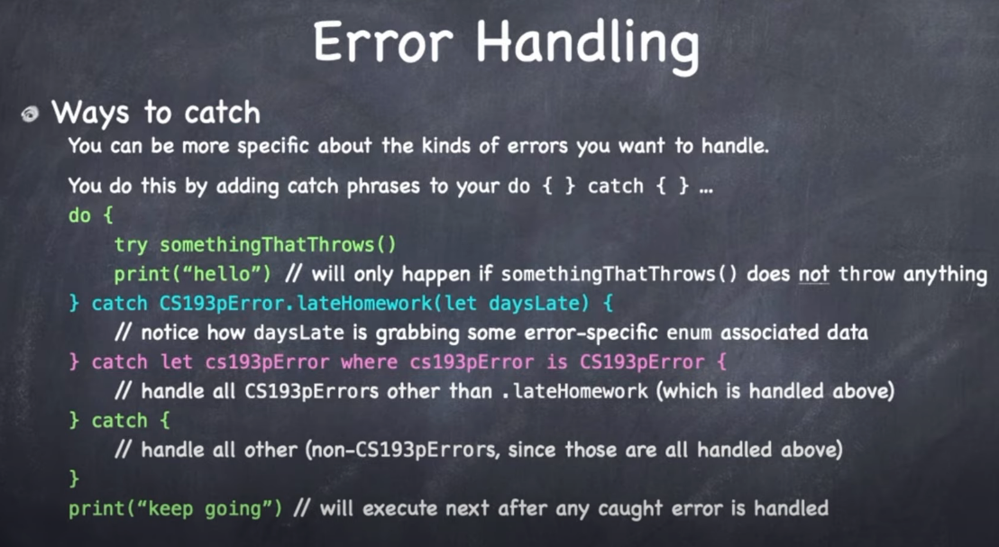

## Persistence

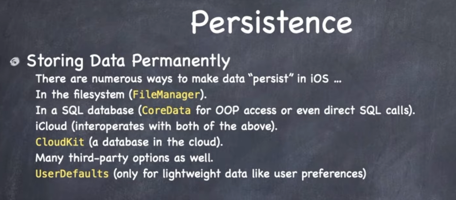

- `iCloud` - data you want to appears on all the users devices
- `CloudKit` - famework for making this happens

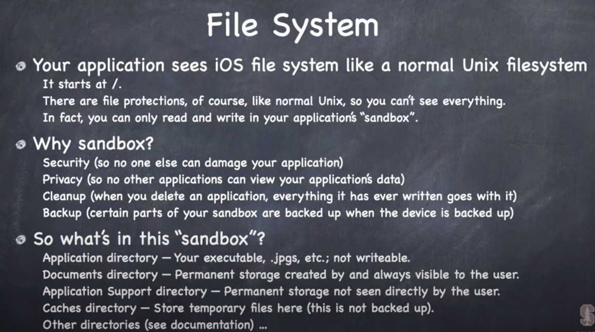

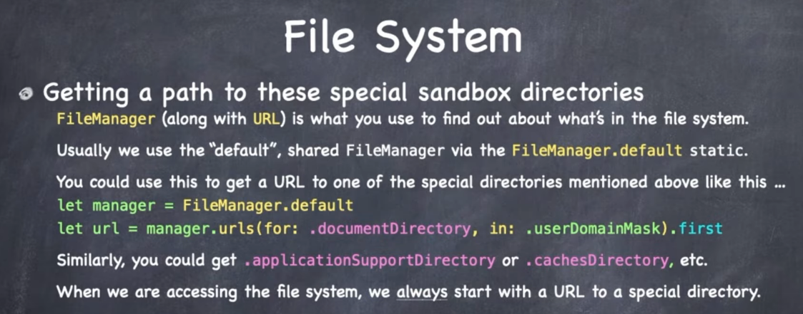

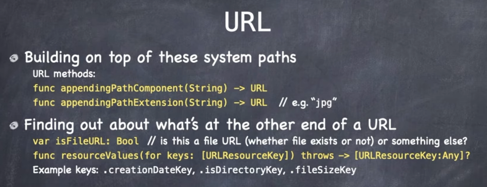

### Archiving

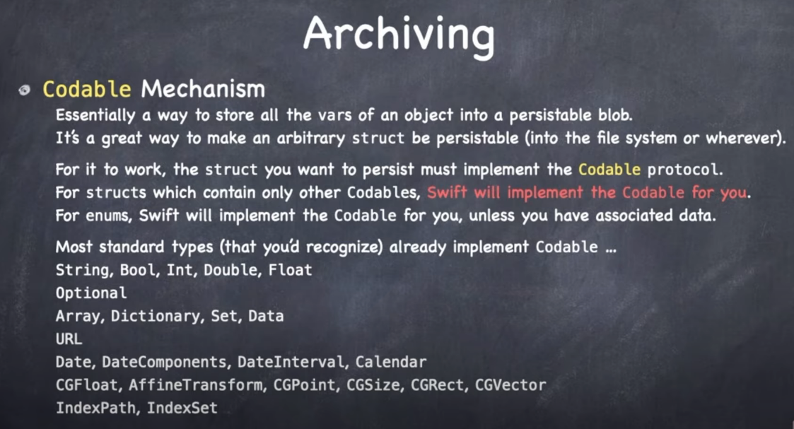

- For structs that contain only other codeables, Swift will implement the Codable for you.
- For enums Swift will implement Codable for you unless you have associated data

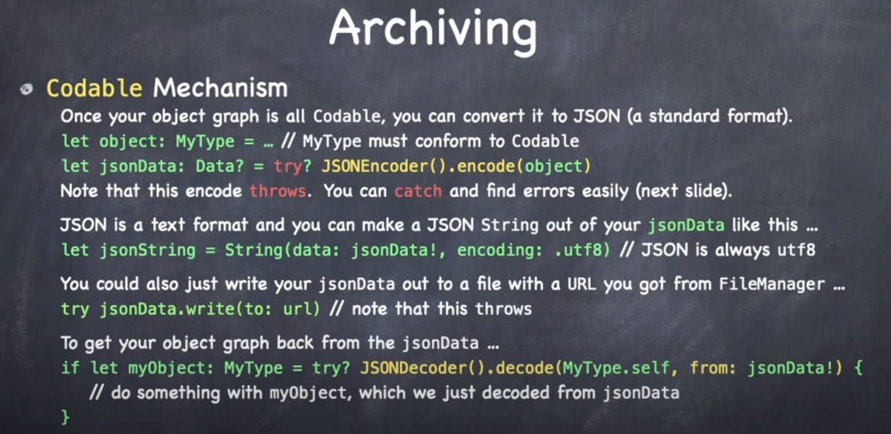

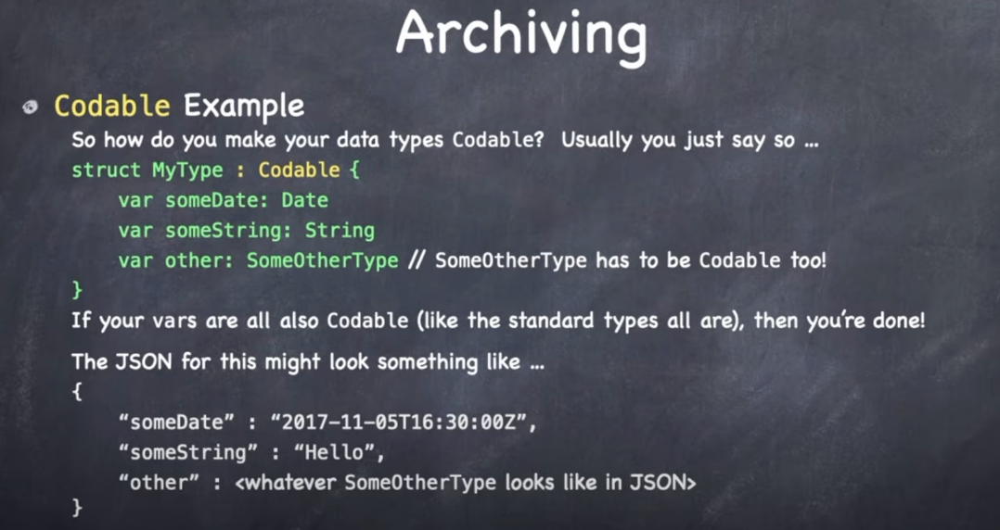

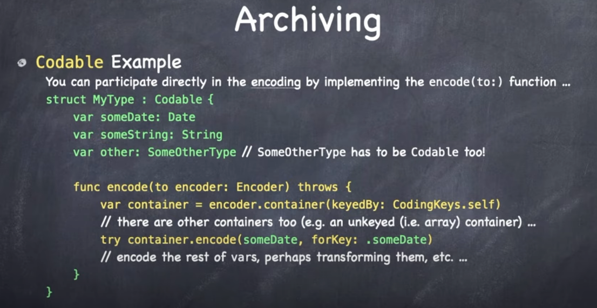

### UserDefaults

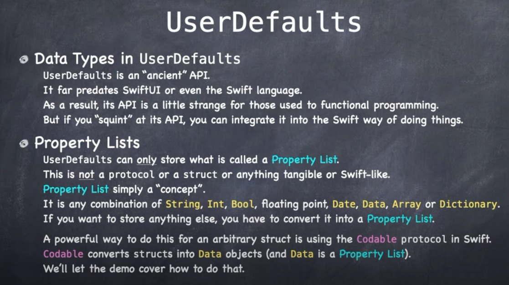

- Things can only be stored in a `Property List`
- This is just an idea or concept.
- Any combination of these things but it has to be a combination of only these things
- The loop whole is that `Data` is one of these types so we can take a `Codable` and store it as `Data` if we which.

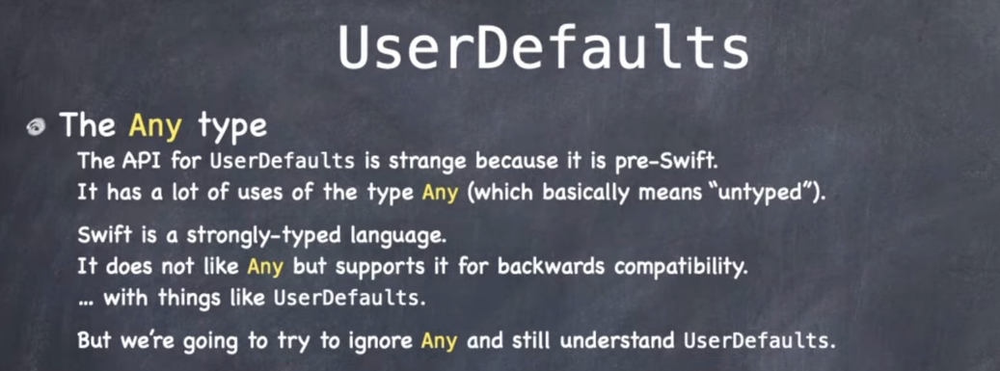

The UserDefaults API has a type in it called `Any`. And Any is anti Swift. It means untyped. And Swift being a typed language doen't like. So we just adjust.

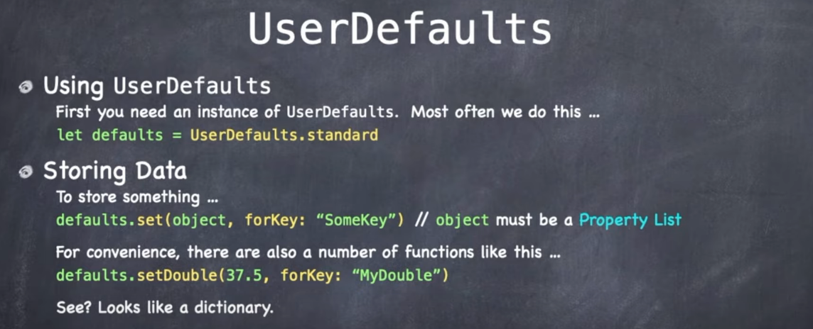

`array(forKey)` returns an `Any`. But you need to figure out how to convert. So we convert into an array of something we know using `as ?`.

Can avoid a lot of this if you use `Codable`.

### Links that help

- [Lectures](https://cs193p.sites.stanford.edu/)
- [Lecture 11](https://www.youtube.com/watch?v=pT5yiBu2xbU&ab_channel=Stanford)

