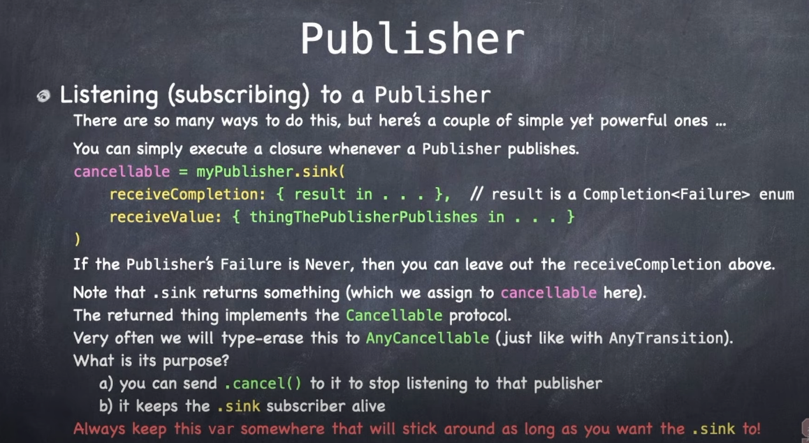
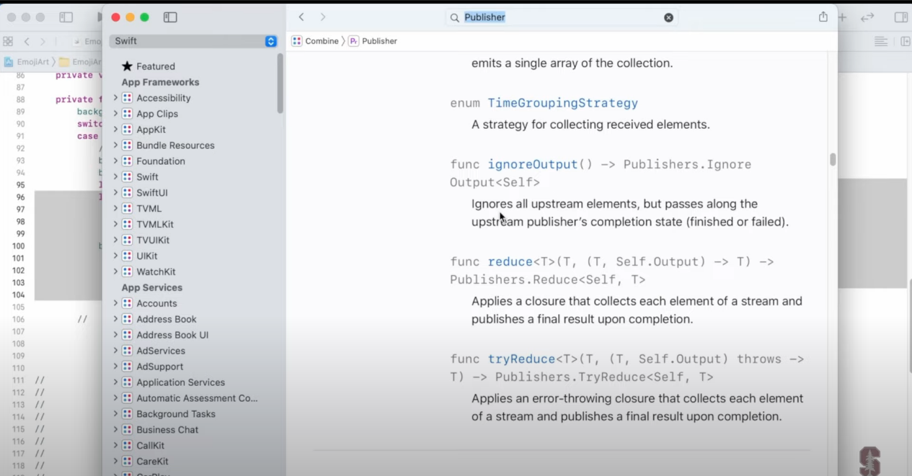

# Lecture 13: Publisher More Persistence


## Publisher


Publisher is a protocol like `Result`. Has Success and Failure but called Output and Failure.

Publishers will often produce something close to what we want but not exactly, so we often transform values on the fly.

Publishers are a part of Combine. Awesome system if you can master. If you don't master or pay attention you can still do most things in SwiftUI. But the more you master, the better your code.

Longer term you will definitely want to master.

## Subscribing

### Sink



How we listen to a publisher. Sink is a place where the values are coming out and you are going to execute a closure everytime they come out, and once at the end.

When you call a Sink it returns you a `cancellable`. If the thing you are Sinking to returns a Failure type of `Never`, you can ignore the `receiveCompletion` block and simply listen for `receiveValue`.

`cancellable` implements the `Cancellable` protocol. They are type-erased. You can `cancel` whenever you want.

But you can also keep that sync subscriber alive as long as the var you have stay alives. Still in scope. So you often want to keep these around to keep the message flow going.

A view can also listen to things being published.


Cool...but most of the time the publisher will be `vars` in your view model. Not really in your View.

We also have `onChange` which why often use instead of `onReceive`.

### Where do publishers come from


- `$` infront of `vars` marked `@Published`

SwiftUI is built onto of the Combine framework. Behind the scenes Combine is what is making events fire and views update themselves.

When you go `$` on any of these property wrappers that implement the `@Published` attribute, you are hooking into a publisher that publishes changes to that var.

Other popular publishers include:

- `URLSession` dataTaskPublisher
- `Timer`
- `NotificationCenter`


## Demo

**EmojiArtDocument**

```swift
@Published var backgroundImage: UIImage?
@Published var backgroundImageFetchStatus = BackgroundImageFetchStatus.idle

enum BackGroundImageFetchState: Equatable {
   case idle
   case fetching
   case failed(URL)
}

private func fetchBackgroundImage() {
	backgroundImageFetchStatus = .fetching
	let session = URLSession.shared
	let publisher = session.dataTaskPublisher(for: url)
		.map { (data, urlResponse) in UIImage(data: data) }
		
	let cancellable = publisher
		.assign(to: \.EmojiArDocument.backgroundImage, on: self)   
}
```

When fetching a background image, we can `assign` the mapped return value to a variable in our class using this Key-Value coding syntax to ourselves.

Except it doesn't quite work. 

```
Referencing instance method (assign(to:on:) on Publisher requires the types Failure
```

Can only do `assign(to:)` output of publisher if publisher does not report errors. Which ours does.

To fix we change the failure mode by replacing any error mode we get with `nil`.

```swift
let publisher = session.dataTaskPublisher(for: url)
	.map { (data, urlResponse) in UIImage(data: data) }
	.replaceError(with: nil) //
```

Now we have a publisher that replaces errors with nil.

Now we just need to keep track of this `cancellable`. We need to keep this around. Else our subscription will stop.

So we need to hold on and track it as a class level `var`.

```swift
import Combine

private var backgroundimageFetchCancellable: AnyCancellable?

backgroundimageFetchCancellable = session.dataTaskPublisher(for: url)
	.map { (data, urlResponse) in UIImage(data: data) }
	.replaceError(with: nil)
```

Now if we run that app we will see that it works, but we still get a spinning activity indicator going.


This spinner is still there because our didn't set our `BackgroundImageFetchStatus` back to `idle`.

### assign vs sink

What that means unfortunately is that we can't use `assign(to:)` here because we need a hook to set our image processing back to `idle`. So instead of `assign` here we can instead use `sink`.

```swift
let cancellable = publisher
	// .assign(to: \.EmojiArDocument.backgroundImage, on: self)   
	.sink { image in 
		self.backgroundImage = image
		self.backgroundImageFetchStatus = (image != nil) ? .idle: .failed(ur)
	}
```

### Avoiding retain cycles

To avoid any retain cycles between this closure (which may never complete) and self, we add the argument parameters `[weak self]`:


```swift
let cancellable = publisher
	// .assign(to: \.EmojiArDocument.backgroundImage, on: self)   
	.sink { [weak self] image in 
		self?.backgroundImage = image
		self?.backgroundImageFetchStatus = (image != nil) ? .idle: .failed(ur)
	}
```

### Not sinking error to nil

Just for kicks, here is what the syntax would to `sink` on `URLSession.dataTaskPublisher` if we didn't `repaceError(with: nil)`:

```swift
let session = URLSession.shared
let publisher = session.dataTaskPublisher(for: url)
	.map { (data, urlResponse) in UIImage(data: data) }
//	.replaceError(with: nil)

backgroundImageFetchCancellable = publisher
//	.assign(to: \EmojiArtDocument.backgroundImage, on: self)
	.sink(
		receiveCompletetion: { result in
			switch result {
			case .fininshed:
				print("Success")
			case .failure(let error):
				print("Failure: \(error)")
			}
		},
		receivedValue: { [weak self] image in
			self?.backgroundImage = image
			self?.backgroundImageFetchStatus = (image != nil) ? .idle : .failed(url)
		}
```

### Deal with errors by cancelling previous fetches

What if we drag out an image and it takes a really long time, or the user starts dragging out another image while this one is going on. What do we do?

Very simple. All we need to do here is cancel any previous fetches of our image. Which we can do here:

```swift
backgroundImageFetchStatus = .fetching
backgroundImageFeetchCancellale?.cancel()
```

### Staying on the main queue

Xcode will give us a warning that we are potentially doing things not on the main queue. So to ensure that we are only updating the UI on the main queue we need to put us back there like this:

```swift
let session = URLSession.shared
let publisher = session.dataTaskPublisher(for: url)
	.map { (data, urlResponse) in UIImage(data: data) }
	.replaceError(with: nil)
	.receive(on: DispatchQueue.main) //
```

## Final product

What you see here, is the `Combine` `SwithUI` way of making a network call:

```swift
@Published var backgroundImage: UIImage?
@Published var backgroundImageFetchStatus = BackgroundImageFetchStatus.idle

enum BackGroundImageFetchState: Equatable {
   case idle
   case fetching
   case failed(URL)
}

private func fetchBackgroundImage() {
	backgroundImageFetchStatus = .fetching
	backgroundImageFetchCancellable?.cancel()
	
	let session = URLSession.shared
	let publisher = session.dataTaskPublisher(for: url)
		.map { (data, urlResponse) in UIImage(data: data) }
		.replaceError(with: nil)
		.receive(on: DispatchQueue.main)
			
	backgroundImageFetchCancellable = publisher
		.sink { [weak self] image in
			self?.backgroundImage = image
			self?.backgroundImageFetchStatus = (image != nil) ? .idle : .failed(url)
}
```

- You hook into `URLSession.dataTaskPublisher` to get the Combine publisher
- You map the result `data` you get back into whatever you expect.
- You place publisher errors with `nil`
- And you receive on the main queue

By `sinking` to the cancellable publisher (and keeping it around as a reference) you take the output you mapped and assign it to whatever variables your SwiftUI view is holding.

Very nice. Very elegant. Doesn't quite to everything you need (like look out for specific HTTP errors). But you could get that by not `replaceError(with: nil)`, grab specific errors from the `failure(let error)` URL case above, and parse for them there.

### Learn more

You can see more of Combines awesome power by looking at the `Publisher` documentation and note how the publisher API is very similar to that of Array.



That's because publishers are really like arrays in their actions. Reduce, map, contains, max, count etc.

### Interesting publishers

There are some really neat ones here:

- Debounce: Publishes elements only after a specificied time interval
- CurrentValueSubject: A subject that wraps a single value and publishes a new element whenever that value changes (conbination of a publisher and subscriber)
- Future: Eventually produces a single value and then finishes or fails
- Just: Emits an output to each just subscribers just once

## Cloud Kit

### Links that help

- [Lectures](https://cs193p.sites.stanford.edu/)
- [Lecture 13](https://www.youtube.com/watch?v=wX3ruVLlWPg&ab_channel=Stanford)


