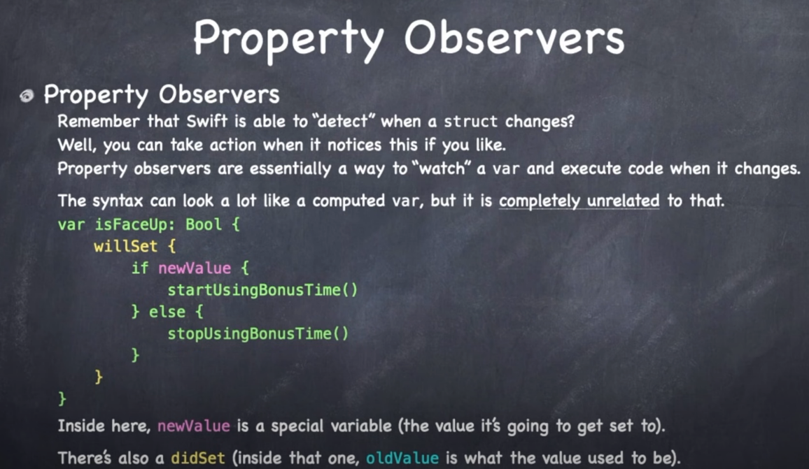
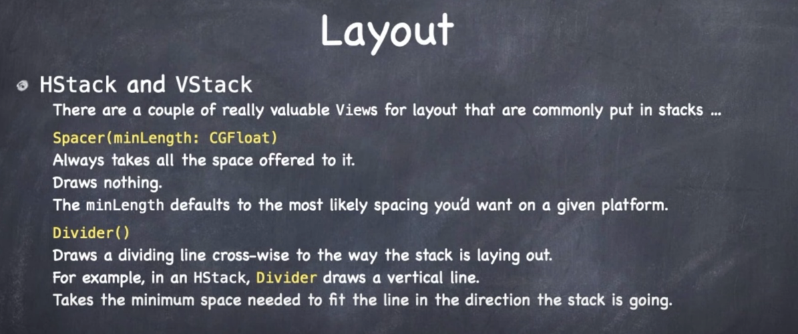
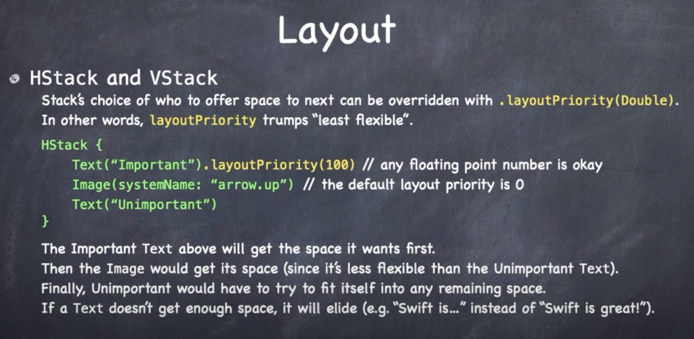
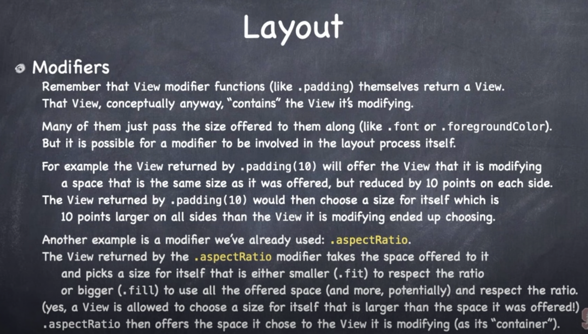

# Lecture 5: Properties Layout @ViewBuilder


## @State


## How to manipulate model struct indices

**MemoryGame**

```swift
struct MemoryGame<CardContent> where CardContent: Equatable {
    private(set) var cards: [Card]

    private var indexOfTheOneAndOnlyFaceUpCard: Int? {
        get { cards.indices.filter { cards[$0].isFaceUp }.oneAndOnly }
        set { cards.indices.forEach { cards[$0].isFaceUp = ($0 == newValue) }}
    }

extension Array {
    var oneAndOnly: Element? {
        if self.count == 1 {
            return self.first
        } else {
            return nil
        }
    }
}
```

## Property Observers



## Layout










### Links that help

- [Lecture 5](https://www.youtube.com/watch?v=ayQl_F_uMS4&ab_channel=Stanford)
- [Standford 2021](https://cs193p.sites.stanford.edu/)


