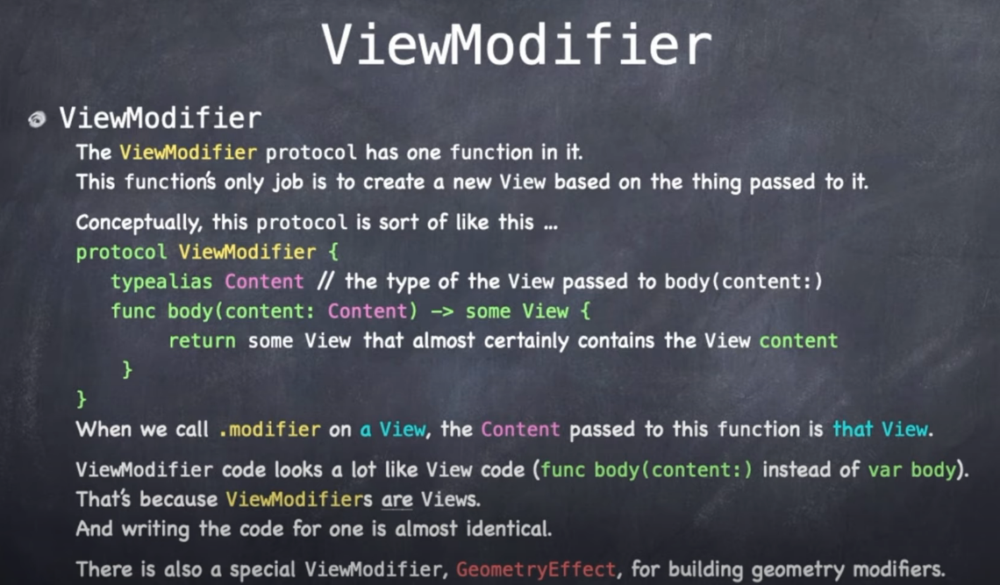

# Lecture 7: ViewModifier Animation


Animation is important and SwiftUI tries to make it easy.

One way to do animation is to animate the view itself (i.e. `Shape`). Which we'll do later.

But a much more common way to animate views is via their `ViewModifier`s.


So what's a `ViewModifier`?


`ViewModifiers` are extensions on protocols that give us functionality via protocol-inheritance.

`aspectRatio`, `padding` are all `ViewModifiers`. They implement the `ViewModifier` protocol.

This protocol only has one function in it. To create a `View`.



It's very similar to how to build view in a `View`. Only here we have a function called:

```swift
protocol ViewModifier {
	typealias Content // the type of the view passed in
	func body(content: Content) -> some View {
	   return some new view based on the content view passed in
	}
}
```

`ViewModifiers` are themselves views.

Let's look at an example. Let's `cardify` a view.


It's pretty easy. Simply:

- create a new `struct`
- implement `ViewModifier`
- and do your work in `func body()` 

Notice however a couple of important things. First, notice how the `content` we pass in, is the view we modify.


The text denoted in yellow is our `content`. And that is how the view modifier gets it's hands on it.

Secondly notice how our modifier can have arguments. `Cardify` is a struct that can take arguments. So we can pass arguments to view modifiers simply by defining their `var`s in our struct.

When these `vars` change, the view changes. We'll use this later to kick off animations.

Then just remember that the view modifier itself returns a new `View`.


Next, how do we get from `Cardify` to `.cardify`? Easy. Add an extension.


### Links that help

- [Lecture 7 Video](https://www.youtube.com/watch?v=PoeaUMGAx6c&ab_channel=Stanford)


