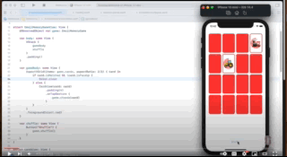
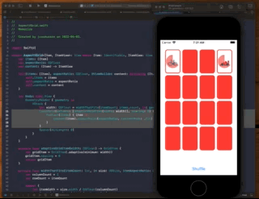
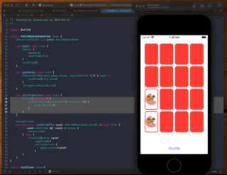
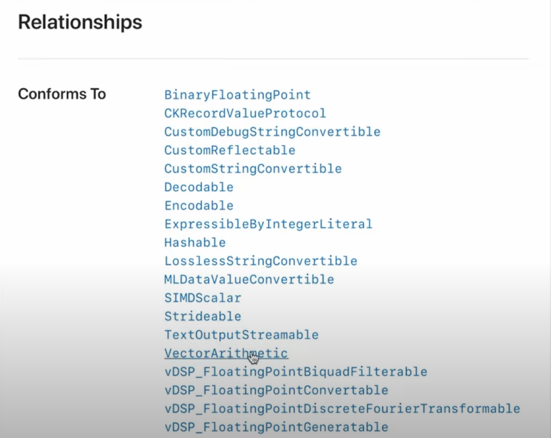
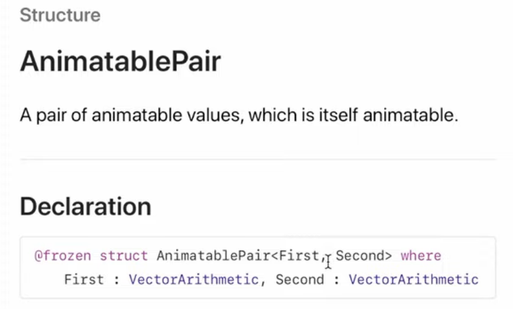
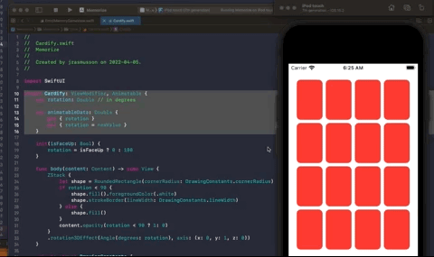
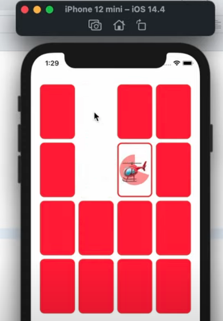
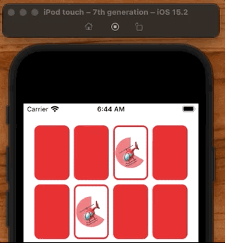
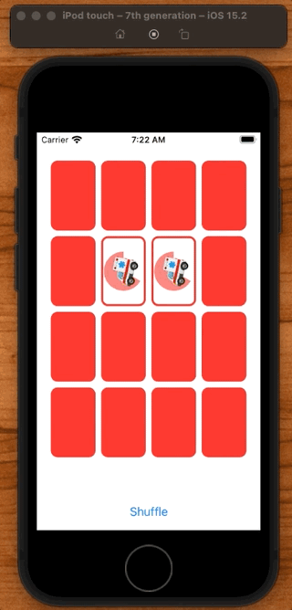

# Lecture 8: Animation Demonstration

## Explicit Animation

Let's add a feature called a shuffle button.

### Shuffle

Let's start by adding an intent in our game called `shuffle`:

**EmojiMemoryGame**

```swift
class EmojiMemoryGame: ObservableObject {
    func shuffle() {
        model.shuffle()
    }
}
```

**MemoryGame**

```swift
struct MemoryGame<CardContent> where CardContent: Equatable {
    mutating func shuffle() {
        cards.shuffle()
    }
}
```

One cool thing we can do is you can replace:

```swift
Rectangle().opacity(0)
```

with:

```swift
Color.clear
```

The rectangle was originally there to fill a space we needed filling for when our card view was face down. But `Color.clear` is a SwiftUI `View` to. It will create a rectangle filled with its view. So if you ever need a filler you can try that out.

`Path` can behave like a `View` as well:

```swift
Path { p in
   p.move(to: ...)
   p.addLine(to: ...)
}.stroke().fill()
```

This will also draw a rectangle as a `View` and lay things out.



Now this is great. It shuffles. But would be a lot cooler if those shuffles were animated.

This is really easy. Here we can just add an `explicit` call to `withAnimation` on our suffle `Button`:

**EmojiGameView**

```swift
Button("Shuffle") {
    withAnimation {
        game.shuffle()
    }
}
```


So what's actually happening here when we add `withAnimation`?

We know animation only animates `Shapes` and `ViewModifiers`. So there are not any shapes that are being animated here. It's just the positions of all these views are being moved around.

It's actually the `LazyVGrid` that is changing the cards position, size and frame. 

```swift
LazyVGrid(columns: [adaptiveGridItem(width: width)], spacing: 0) {
    ForEach(items) { item in
        content(item).aspectRatio(aspectRatio, contentMode: .fit)
    }
}
```

When `LazyVGrid` changes those via its `ViewModifiers`, those get animated.

So when we say `withAnimation` all `ViewModifiers` that can be animated are being animated.

Another really cool feature is that if you hammer on the shuffle button the animation is interuptable.



Now sometimes it can be hard to figure out how to handle the interuption. Like if we slow things down and watch what happens:

```swift
Button("Shuffle") {
    withAnimation(.easeInOut(duration: 5)) {
        game.shuffle()
    }
}
```



And you can see what we wanted the cards to be an `implicit` animation. We want those to happen independently of what is going on at the higher-level.

### Use explicit animations on intent functions

So when should we use explicit animations? You almost always want to use these on intent functions.

When you use an intent you are almost always expressing that intent as a change in the model.

If you are modifying the model because of the reactive nature of the UI, its likely something is going to change.

And when it changes its likely we want to animate. Which is why you will often seen `withAnimation` used with a change of intenet.

```swift
var shuffleButton: some View {
    Button("Shuffle") {
        withAnimation()) {
            game.shuffle()
        }
    }
}
```

### Animating choose

The other intent we have is `choose(:card` so we should animate that as well.

**EmojiMemoryGameView** 

```swift
@ViewBuilder
private func cardView(for card: EmojiMemoryGame.Card) -> some View {
    if card.isMatched && !card.isFaceUp {
        Color.clear
    } else {
        CardView(card: card)
            .padding(4)
            .onTapGesture {
                withAnimation {
                    game.choose(card)
                }
            }
    }
}
```


Fades in and fades out. Not the same as flipping over. Not just for the cards we choose. But all changes to the model were animated.

`withAnimation` can use the same arguments as an implicit animation.

Not task is to make it so the cards flip.

### Flipping the cards

Let's slow things down a bit:

```swift
CardView(card: card)
    .padding(4)
    .onTapGesture {
        withAnimation(.easeInOut(duration: 3)) {
            game.choose(card)
        }
    }
```

By default, changing the state and animation the appears of view view over another is a fade.

To do a real flip, it is like a 3D rotation thing. Tiles on end, and the flips back down. Need to flip in 3D towards us.

Turns out there is a really easy way to do that in SwiftUI.

```swift
struct ContentView: View {
    @State private var showDetail = false

    var body: some View {
        VStack {
            Button("Animate") {
                // explicit
                withAnimation {
                    showDetail.toggle()
                }
            }
            Text(showDetail ? "👻" : "🎃")
                .rotation3DEffect(Angle(degrees: showDetail ? 0 : 180), axis: (x: 0, y: 1, z: 0))
        }
    }
}
```


**Cardify**

```swift
struct Cardify: ViewModifier {
    var isFaceUp: Bool

    func body(content: Content) -> some View {
        ZStack {
            let shape = RoundedRectangle(cornerRadius: DrawingConstants.cornerRadius)
            if isFaceUp {
                shape.fill().foregroundColor(.white)
                shape.strokeBorder(lineWidth: DrawingConstants.lineWidth)
            } else {
                shape.fill()
            }
            content.opacity(isFaceUp ? 1: 0)
        }
        .rotation3DEffect(Angle(degrees: isFaceUp ? 0 : 180), axis: (x: 0, y: 1, z: 0))
    }
}
```


Not bad. It is flipping the card over. But it's animating the icon in a little bit early. You should not see the image until it really flips.

What's going on here is choose is changing the model. And that eventually causes faceup to change. When we do that these two views come on screen:

```swift
if isFaceUp {
    shape.fill().foregroundColor(.white)
    shape.strokeBorder(lineWidth: DrawingConstants.lineWidth)
}
```

And because they are in a ZStack already on screen, the appearance of these get animated. Then when we flip to the other side, the dissappearance of these gets animated.

So this fading in and out are happening because of `transition` animations. Views coming or going because of views appearing in a container.

The other thing being animated here is the `opacity` of the emoji or content itself:

```swift
content.opacity(isFaceUp ? 1: 0)
```

That's why these things are fading. The default transition is to fade when then come in/out, opactity, plus the rotation of the entire ZStack.

So how to fix?

We don't want these two animations to occur until the card is at 90 degrees:

```swift
if isFaceUp {
    shape.fill().foregroundColor(.white)
    shape.strokeBorder(lineWidth: DrawingConstants.lineWidth)
}
```

Also we don't want any fading in or out. When the card hits 90 degress we want the face card and all its parts displayed in full.

So that is quite a different thing going on. And there is no way to make these views do that with any standard modifiers.

But we have our own view modifier. So we can do that work in there.

### Tracking the 90° rotation

To do this, we are going to have to track the 90° rotation. So we'll do that with a var.

**Cardify**

```swift
struct Cardify: ViewModifier {
    var isFaceUp: Bool
    var rotation: Double // in degrees
```

And this is the thing that is going to drive what our user interface looks like. Not isFaceUp.

For example isFaceUp isn't when we want to show the front. It is when the `rotation < 90`.

```swift
struct Cardify: ViewModifier {
    var isFaceUp: Bool
    var rotation: Double // in degrees

    func body(content: Content) -> some View {
        ZStack {
            let shape = RoundedRectangle(cornerRadius: DrawingConstants.cornerRadius)
            if rotation < 90 {
                shape.fill().foregroundColor(.white)
                shape.strokeBorder(lineWidth: DrawingConstants.lineWidth)
            } else {
                shape.fill()
            }
            content.opacity(rotation < 90 ? 1: 0)
        }
        .rotation3DEffect(Angle(degrees: rotation), axis: (x: 0, y: 1, z: 0))
    }
}
```

So the state of rotation is what's going to drive this thing.

isFaceUp is no longer a var. It's something we just set in the `init()`.

```swift
struct Cardify: ViewModifier {
    var rotation: Double // in degrees

    init(isFaceUp: Bool) {
        rotation = isFaceUp ? 0 : 180
    }
```

So this is a good start but it's not enough. Because we have not yet animated the rotation through 90. It is only 0 or 180.

We need to start out at 0 and animate to 90. 

### Animatable

We can do that by making our view modifier `Animatable`.

```swift
struct Cardify: ViewModifier, Animatable {
```


`Animatable` has one `var animateableData:` which is simply the data to animate.

`Self` means things that are animatable are self referencing which means you can't use them as types. You can't have an array of `animatableData` you have to use them as where clauses.

This associated type is `VectorArithmetic` is what can multiple and add vectors. Which is what we are doing with animations. Matrix multiplication.

Things that implement `VectorArithmetic` are Doubles. If you go look at the documentation for `Double` you will see that it confoms to `VectoreArithmetic`.



Same with `CGFloat`. And lots of others. `AnimatablePair` takes a first thing and a second thing.



These are all abstractions SwiftUI has made to help us out with our animations. 

So for our `ViewModifier` to be `Animatable` we need to implement that `var`. And while we could use that in our code as the animation amoung, it is better to use it purely as a wrapper for the variable we are animating. Almost like a rename:

```swift
struct Cardify: ViewModifier, Animatable {
    var rotation: Double // in degrees

    var animatableData: Double {
        get { rotation }
        set { rotation = newValue }
    }
```

Now we just have to tell SwiftUi what data we want to animate. Because it is the `rotation` var that is driving the animation, we are going to be calling this view over and over and over creating a new view every time our animation runs.

Then when it passes 90 we'll switch our background.

**Cardify**

```swift
import SwiftUI

struct Cardify: ViewModifier, Animatable {
    var rotation: Double // in degrees

    var animatableData: Double {
        get { rotation }
        set { rotation = newValue }
    }

    init(isFaceUp: Bool) {
        rotation = isFaceUp ? 0 : 180
    }

    func body(content: Content) -> some View {
        ZStack {
            let shape = RoundedRectangle(cornerRadius: DrawingConstants.cornerRadius)
            if rotation < 90 {
                shape.fill().foregroundColor(.white)
                shape.strokeBorder(lineWidth: DrawingConstants.lineWidth)
            } else {
                shape.fill()
            }
            content.opacity(rotation < 90 ? 1: 0)
        }
        .rotation3DEffect(Angle(degrees: rotation), axis: (x: 0, y: 1, z: 0))
    }

    private struct DrawingConstants {
        static let cornerRadius: CGFloat = 10
        static let lineWidth: CGFloat = 3
    }
}
```



### What's going on here 🤔

The key to understanding what's going on are these lines of code here:

```swift
struct Cardify: ViewModifier, Animatable {
    var rotation: Double // in degrees

    var animatableData: Double {
        get { rotation }
        set { rotation = newValue }
    }

    init(isFaceUp: Bool) {
        rotation = isFaceUp ? 0 : 180
    }

    func body(content: Content) -> some View {
        ZStack {
            let shape = RoundedRectangle(cornerRadius: DrawingConstants.cornerRadius)
            if rotation < 90 {
```

First, understand that the variable that drives our animation is `rotation`. Whatever the value `rotation` is, that is what we are going to apply in our `3D` rotation.

```swift
struct Cardify: ViewModifier, Animatable {
    var rotation: Double // in degrees
```

Secondly, because our view modifier is `Animatable` we have an animation hook called:

```swift
var animatableData: Double {
    get { rotation }
    set { rotation = newValue }
}
```

that is going to fetch and set our value as we animate. That is how it nows where it is at an the animation.

Now here is the crux of it. The animation doesn't occur until the card flips:

```swift
rotation = isFaceUp ? 0 : 180
```

Only when the card becomes `isFaceUp` does the `rotation` value switch from `0` to `180`. When this happens, now the animation occurs. And SwiftUI will contantly call our view from `0, 1, 2, 3, 4, .... 180` degrees and we will draw it each time animating from one degrees to the next.

Then internally, we use the value of `rotation` to decide things like `opactity`:

```swift
content.opacity(rotation < 90 ? 1: 0)
```

As well as where the rotation is in the `3DEffect`:

```swift
.rotation3DEffect(Angle(degrees: rotation), axis: (x: 0, y: 1, z: 0))
```

So the key takeway is `rotation` is `Animatable` data. And 


## Transitions

Transitions are the comings and goings of views. Just view modifiers for the coming and another set of view modifiers for going.

Usually there are x4 precanned transitions we can use. 

**AnyTransition**

```swift
extension AnyTransition {
    public static var scale: AnyTransition { get }
    public static let opacity: AnyTransition
    public static var slide: AnyTransition { get }
    public static let identity: AnyTransition
}
```

Let's see where we have a view disappearing on us.

When we have a match and we click on another card...the previously x2 matched cards fade away.



That was a transtion animation. These views transitioned to not being in the UI anymore and when through a little transition animation.

Let's go change that animation to something else so we can see how to control it.

**EmojiMemoryGameView**

```swift
@ViewBuilder
private func cardView(for card: EmojiMemoryGame.Card) -> some View {
    if card.isMatched && !card.isFaceUp {
        Color.clear
    } else {
        CardView(card: card)
            .padding(4)
            .transition(AnyTransition.scale) // add
            .onTapGesture {
                withAnimation {
                    game.choose(card)
                }
            }
    }
}
```

This `AnyTransition` is a static struct we call a `typeerased` transition. Means it type is erased when used.

`scale` is a transition that makes the view shrink down into nothing, or up into its full sized view.


You can make the animation longer also like this:

```swift
.transition(AnyTransition.scale.animation(Animation.easeInOut(duration: 2)))
```


The places you most often see view coming and going is `if/then`.

### Asymetric transitions

Asymentric transitions are tranistions where you define the coming and going animations differently (there are not symetric).

For example here we could define the coming animation one way, and the going animation another:

```swift
.transition(AnyTransition.asymmetric(insertion: .scale, removal: .opacity)
```



Hmmm. This cards appeared on screen... but they didn't `scale` in 🤔. But the opactity worked - it faded out. Why no scale in?

This is our old problem again where these views:

```swift
@ViewBuilder
private func cardView(for card: EmojiMemoryGame.Card) -> some View {
    if card.isMatched && !card.isFaceUp {
        Color.clear
    } else {
        CardView(card: card)
            .padding(4)
            .transition(AnyTransition.asymmetric(insertion: .scale, removal: .opacity))
            .onTapGesture {
                withAnimation {
                    game.choose(card)
                }
            }
    }
}
```

Did not appear/disappear on screen from a container that was already on screen.

```swift
var gameBody: some View {
    AspectVGrid(items: game.cards, aspectRatio: 2/3) { card in
        cardView(for: card)
    }
    .foregroundColor(.red)
}
```

This `AspectVGrid` came on screen with these cards already there. So they're not appearing on screen inside a container already there. They appeared `with` their container. 

So it's the transition of the `AspectVGrid` which is going to control that appearance or disappearce because it is the thing that's appearing.

This shows a big difference between transitions and view modifiers. Transitions apply to the containers themselves. View modifiers on containers apply the animations to each individual view inside.

So for us to animatie this `CardView` we really need to animate the `AspectVGrid`.

So how can we scale in these cards on app startup? To do that the AsepctVGrid needs to come on first and then after the cards will appear.

### Dealing the cards

This is something we often want to do. We often want our containers to appear on screen first, and then have our subviews appear after. And there is a really good view modifer that can do that for us on any container called `onAppear`:

```swift
var gameBody: some View {
    AspectVGrid(items: game.cards, aspectRatio: 2/3) { card in
        cardView(for: card)
    }
    .onAppear {
        // deal cards
    }
    .foregroundColor(.red)
}
```

What we are going to do here is deal our cards out into our UI. Going to have to keep track of whether a card has been dealt. Could put into model. But here is it more a pure UI thing.

So that's where `@State` comes in. It's a temporary state for this local UI control. This is only for use in our view (so make private). 

We will track this by creating a `Set<Int>` of the identifiers for each card.

**EmojiMemoryGameView**

```swift
struct EmojiMemoryGameView: View {
    @ObservedObject var game: EmojiMemoryGame
    @State private var dealt = Set<Int>()
    
    var gameBody: some View {
    AspectVGrid(items: game.cards, aspectRatio: 2/3) { card in
        cardView(for: card)
    }
    .onAppear {
        // deal cards
    }
}
```

Adding some helpers...

```swift
struct EmojiMemoryGameView: View {
    @ObservedObject var game: EmojiMemoryGame
    @State private var dealt = Set<Int>() // 

    private func deal(_ card: EmojiMemoryGame.Card) { // 
        dealt.insert(card.id)
    }

    private func isUndealt(_ card: EmojiMemoryGame.Card) -> Bool { //
        !dealt.contains(card.id)
    }

    var gameBody: some View {
        AspectVGrid(items: game.cards, aspectRatio: 2/3) { card in
            cardView(for: card)
        }
        .onAppear {
            withAnimation { //
                for card in game.cards {
                    deal(card)
                }
            }
        }
        .foregroundColor(.red)
    }

    @ViewBuilder
    private func cardView(for card: EmojiMemoryGame.Card) -> some View {
        if isUndealt(card) ||  (card.isMatched && !card.isFaceUp) {
            Color.clear
        } else {
            CardView(card: card)
                .padding(4)
                .transition(AnyTransition.asymmetric(insertion: .scale, removal: .opacity)) //
                .onTapGesture {
                    withAnimation {
                        game.choose(card)
                    }
                }
        }
    }
```

So what we have really done here is:

- Added `@State` to track change in our UI
- Added the `CardViews` explicitly to our container separately in `onAppear`
- Added an `explicit` animation to our container viw `withAnimation`
- Added a `transition` animation to our `CardView`

If we slow things down a bit:

```swift
CardView(card: card)
    .padding(4)
    .transition(AnyTransition.asymmetric(insertion: .scale, removal: .opacity).animation(.easeInOut(duration: 3)))
```

We should now see our `CardView` scale in.


And our fade out.



So we really learned x3 things here:

- Transitions
- OnAppear for containers
- @State for controlling how UI operates

## Dealing off of a deck

Now as good as this looks, it would be really cool if we could deal these off of a deck.


