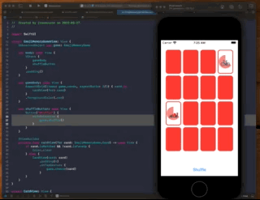

# Lecture 8: Animation Demonstration

## Explicit Animation

Let's add a feature called a shuffle button.

### Shuffle

Let's start by adding an intent in our game called `shuffle`:

**EmojiMemoryGame**

```swift
class EmojiMemoryGame: ObservableObject {
    func shuffle() {
        model.shuffle()
    }
}
```

**MemoryGame**

```swift
struct MemoryGame<CardContent> where CardContent: Equatable {
    mutating func shuffle() {
        cards.shuffle()
    }
}
```

One cool thing we can do is you can replace:

```swift
Rectangle().opacity(0)
```

with:

```swift
Color.clear
```

The rectangle was originally there to fill a space we needed filling for when our card view was face down. But `Color.clear` is a SwiftUI `View` to. It will create a rectangle filled with its view. So if you ever need a filler you can try that out.

`Path` can behave like a `View` as well:

```swift
Path { p in
   p.move(to: ...)
   p.addLine(to: ...)
}.stroke().fill()
```

This will also draw a rectangle as a `View` and lay things out.


Now this is great. It shuffles. But would be a lot cooler if those shuffles were animated.

This is really easy. Here we can just add an `explicit` call to `withAnimation` on our suffle `Button`:

**EmojiGameView**

```swift
Button("Shuffle") {
    withAnimation {
        game.shuffle()
    }
}
```



So what's actually happening here when we add `withAnimation`?

We know animation only animates `Shapes` and `ViewModifiers`. So there are not any shapes that are being animated here. It's just the positions of all these views are being moved around.

It's actually the `LazyVGrid` that is changing the cards position, size and frame. 

```swift
LazyVGrid(columns: [adaptiveGridItem(width: width)], spacing: 0) {
    ForEach(items) { item in
        content(item).aspectRatio(aspectRatio, contentMode: .fit)
    }
}
```

When `LazyVGrid` changes those via its `ViewModifiers`, those get animated.

So when we say `withAnimation` all `ViewModifiers` that can be animated are being animated.

Another really cool feature is that if you hammer on the shuffle button the animation is interuptable.


Now sometimes it can be hard to figure out how to handle the interuption. Like if we slow things down and watch what happens:

```swift
Button("Shuffle") {
    withAnimation(.easeInOut(duration: 5)) {
        game.shuffle()
    }
}
```


And you can see what we wanted the cards to be an `implicit` animation. We want those to happen independently of what is going on at the higher-level.

### Use explicit animations on intent functions

So when should we use explicit animations? You almost always want to use these on intent functions.

When you use an intent you are almost always expressing that intent as a change in the model.

If you are modifying the model because of the reactive nature of the UI, its likely something is going to change.

And when it changes its likely we want to animate. Which is why you will often seen `withAnimation` used with a change of intenet.

```swift
var shuffleButton: some View {
    Button("Shuffle") {
        withAnimation()) {
            game.shuffle()
        }
    }
}
```

### Animating choose

The other intent we have is `choose(:card` so we should animate that as well.

**EmojiMemoryGameView** 

```swift
@ViewBuilder
private func cardView(for card: EmojiMemoryGame.Card) -> some View {
    if card.isMatched && !card.isFaceUp {
        Color.clear
    } else {
        CardView(card: card)
            .padding(4)
            .onTapGesture {
                withAnimation {
                    game.choose(card)
                }
            }
    }
}
```


Fades in and fades out. Not the same as flipping over. Not just for the cards we choose. But all changes to the model were animated.

`withAnimation` can use the same arguments as an implicit animation.

Not task is to make it so the cards flip.

### Flipping the cards

Let's slow things down a bit:

```swift
CardView(card: card)
    .padding(4)
    .onTapGesture {
        withAnimation(.easeInOut(duration: 3)) {
            game.choose(card)
        }
    }
```

U R HERE

### Links that help

- [Lecture 8 Video](https://www.youtube.com/watch?v=-N1UR7Y105g)
