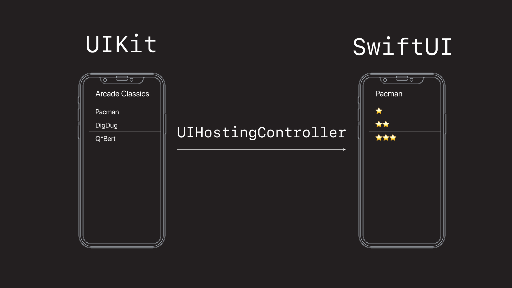

# UIHostingController

## UIViewController

The way we host SwiftUI views in `UIKit` view controllers is via the `UIHostingController`:

```swift
let vc = UIHostingController(rootView: Text("Hello"))
```

## UIView

To add a SwiftUI view in Interface Builder we use a `Container View`.



Programmatically we do it like this:

```swift
let childView = UIHostingController(rootView: SwiftUIView())
addChild(childView)
view.addSubview(childView.view)
childView.didMove(toParent: self)
```

## Example

Here is a more complicated example of a `UITableView` where upon row selection, a SwiftUI view is presented called `GameView`.

We facilitate communication back via a `BindableObject` fired through `Combine`:


### Links that help

- [How to use SwiftUI in UIKit](https://sarunw.com/posts/swiftui-in-uikit/)
- [Passing Data from SwiftUI to UIKit](https://www.youtube.com/watch?v=CNhcAz40Myw&ab_channel=azamsharp)


