# Building Custom Views with SwiftUI

- [Video](https://developer.apple.com/videos/play/wwdc2019/237/)

## Layout Basics

Let's start by taking a lot at this simple view. There are actually three views at work here:

- There's the `Text` at the bottom of the view hierarchy
- Your `ContentView` which always has the same bounds as the body of the text.
- And finally the `RootView` which in this case has the dimensions of the device minus the safe area insets.

You can still layout stuff in the safe area using this modifier:

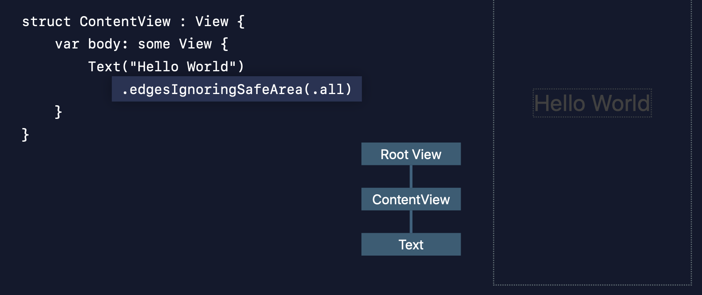

But by default you are in the safe zone.

Now, the top layer of any view with a body is always what we call layout neutral. So its bounds are defined by the bounds of its body. They act the same. So you can realy treat them as the same view for the purposes of layout.

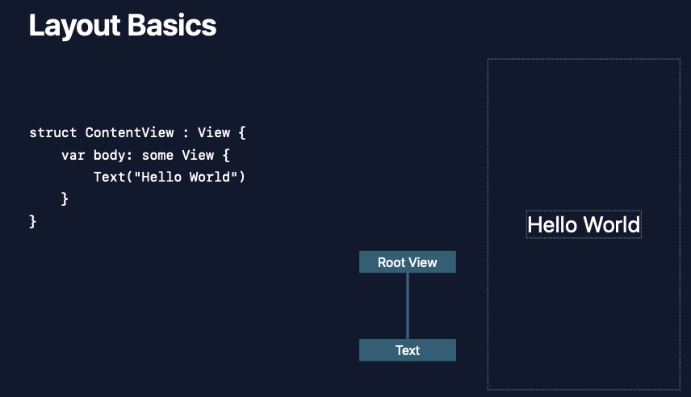

So there are really only two views of interest here and the layout process has three steps.

First, the root view offers the text a proposed size and that's repressented by those two big wide arrows. And because it's at the root, it offers the size of the whole safe area.

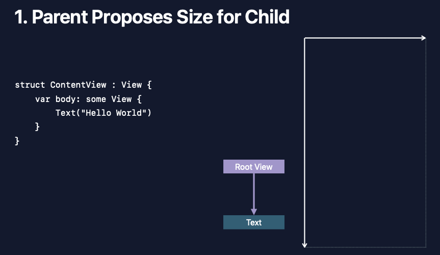

Next, the text replies, well that's mighty generous of you but I'm really only this big. 

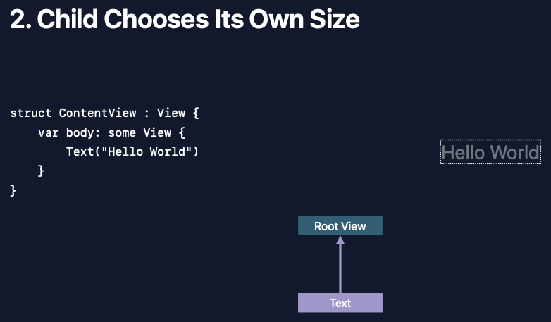

*And in SwiftUI there's no way to force a size on your child. The parent has to respect that choice.*

And now the root view says OK, well I need to put you somewhere, so I'll put you in the middle.

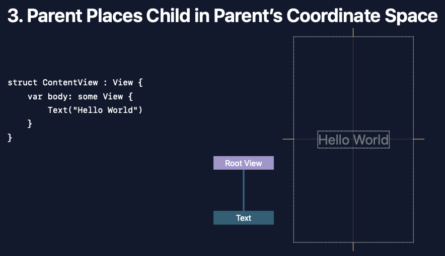

And that's basically it! That's a simple example, but every layout interaction plays out in the same way between parents and children. And the bhavior of your whole layout emerges from these parent child interactions.

But I want to highlight the second step (the children chosing their own size), because it's different from what yo umight be used to.

### Child chooses its own size

*It means that your views have sizing behavior.*

Since every view controls its own size, it means when you build a view, you get to decide how and when it resizes.

For example, this view is a non-negitiable 50x10 pts by virture of the fixed size from at its root.

 

And this one is flexible but the height and width are always the same. So it's always got a one to one aspect ratio. So sizing is encapsultinged in the view definition.

We also saw this in action with text.

So in SwiftUI, the bounds of text never stretch beyond the height and width of its displayed lines, and we'll see why that's important when we talk about stacks in a minute.

Finally, one important thing you don't need to worry about but is good to know is that SwiftUI rounds the corners of your view to the nearest pixel. So no anti-aliasing. Always crisp, clear edges.

## Avacado Example

This background modifier wraps the text view in a background view witht he color view as a secondary child.

So now the green background exactly matches the bounds of the text.

So pro tip number tow, throwing a background or border color on a view is a really useful trick if you want to observe the view's bounds and don't have a preview canvas handy.

Here is how layout works when offering things like padding:

First, the root view proposes its entire size to the background view.

And much like our toast view, the background view is layout neutral so it's just going to pass that size proposal along to the padding view.

Now, the padding view knows it's going to add 10 points on a side to its child, so it offers that much less to its child -- the text.

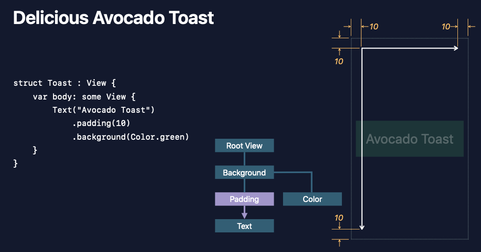

and the text takes the width it needs and returns that to the padding view 

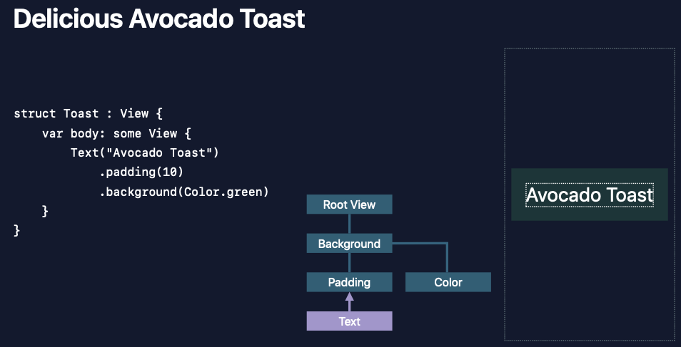

which knows it should be bigger than its child by 10 points on each side and it situates the text appropriated in its coordinate space.

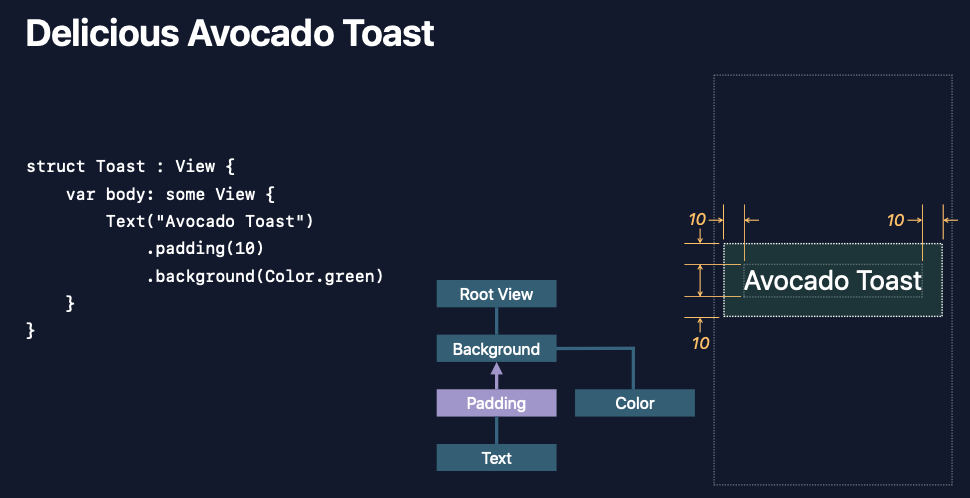

Now, we said the background view was layout neutral so it's just going to report that size upwards. But before it does, it offers that size to its secondary child, the color.

Now colors are very compliant when it comes to layout. They accept the size offered to them. So the color of the size is just the same as that of the padding view.

Finally, the background reports its size to the root view:

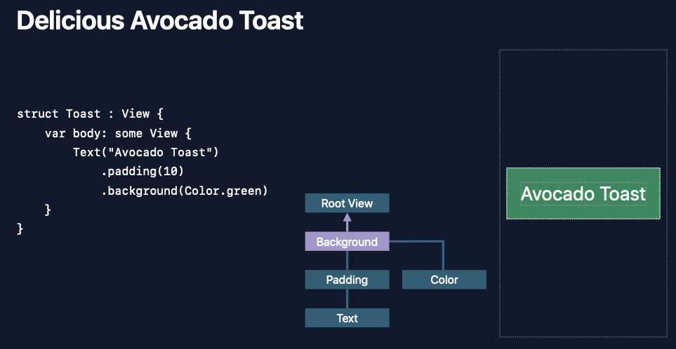

 and the root view centers it as before. And that's the whole process.

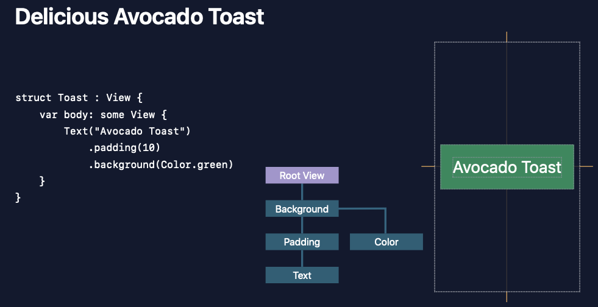

Here is another example. In this case the view's body is just a fixed size 20x20.

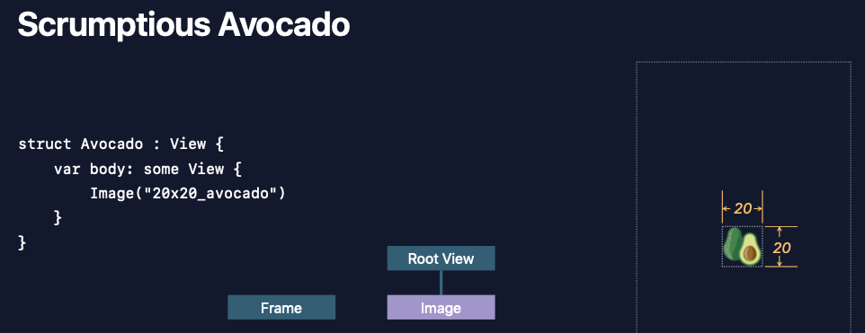

In SwiftUI, unless you mark an image as resizable, either in the asset catalog or in code, it's fixed size.

Now, I'd like our view, our whole view to be about half again as big so let's add a 30x30 frame modifier like this:

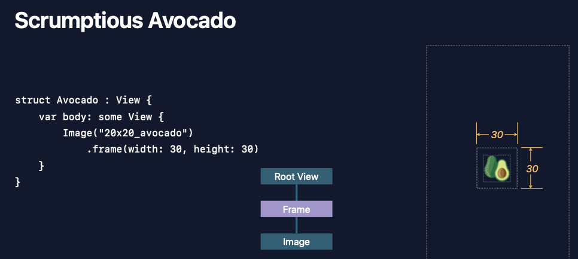

Now, you might have noticed that the image, though undeniably appetizing, has not changed its size. But that shouldn't be surporising should it? We said it was fixed sized. Around it you'll find a 30x30 frame and that's the size of the body of our view. So the view we've defined is in fact 50% bigger than it was before we added the modifier.

So, is it a contradiction that the size of the frame doesn't match the size of our image? Actually no.

This is the layout system doing what's it's supposed to do.

It's important to recognize that the frame is not a constraint in SwiftUI. It;s just a view which you can think of like a picture frame.

It proposes fixed dimensions for its child, but like every other view, the chold ultimately chooses its own size.

So in that sense, SwiftUI layout uses a light touch than you might be used to.

The payoff, though, is that there are no underconstrainted or overconstrained system in SwiftUI which means eveyrthing you can express has a well-defined effit.

So there no such thing as an incorrect layout unless you don't like the result you're getting.

## Stacks

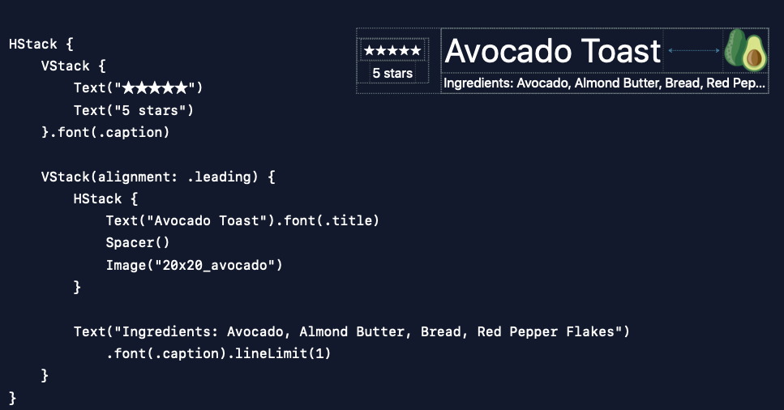

SwiftUI doesn't slam all stacks together. It left some space between them because adaptive spacing is in effect.

So the way stacks work is the children who are initially are giving equal space:

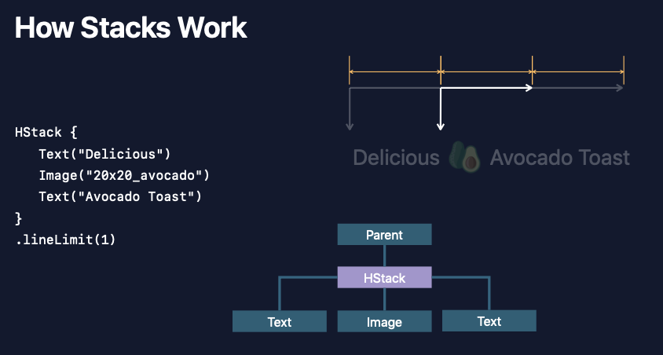

but then the children with the least flexiblity get there space first (in this case the image) and then the remaining space is divided up and given to the others.

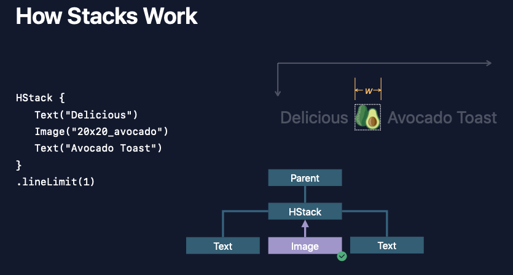

### Layout Priority

Now if you want to control who gets more space we have layout priority:

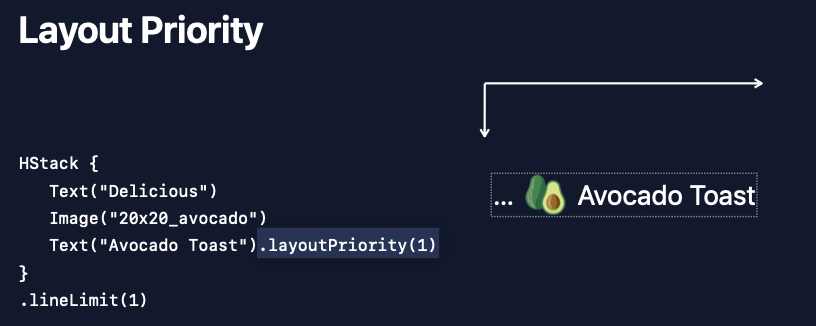

### Alignments

If you want everything to line up nicely on the bottom we have `.lastTextBaseLine`.

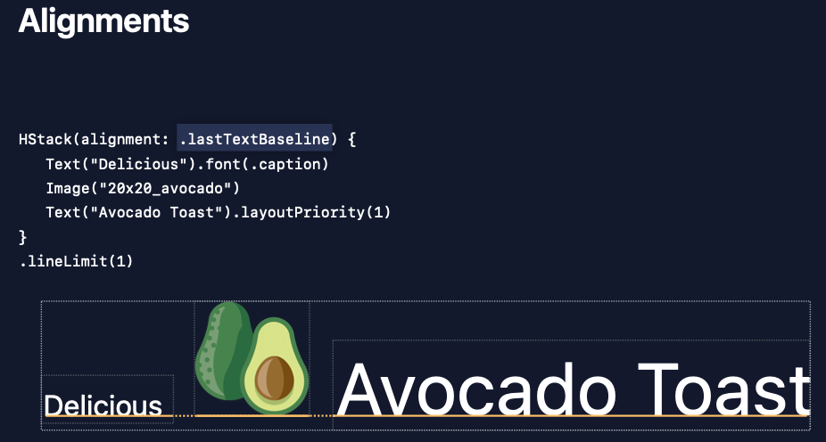

If you want you can define your own custom alignment:

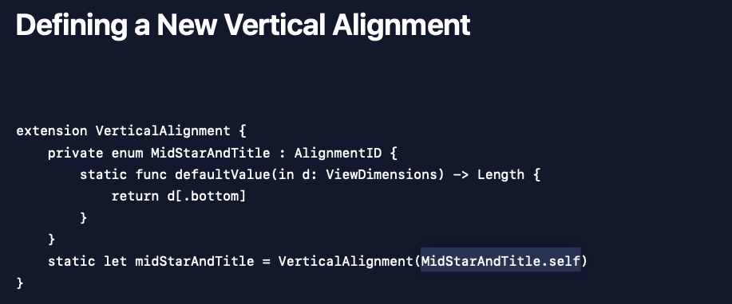

# Graphics

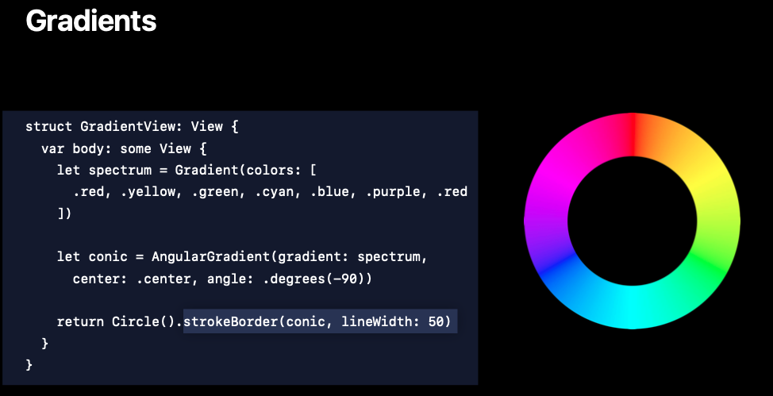

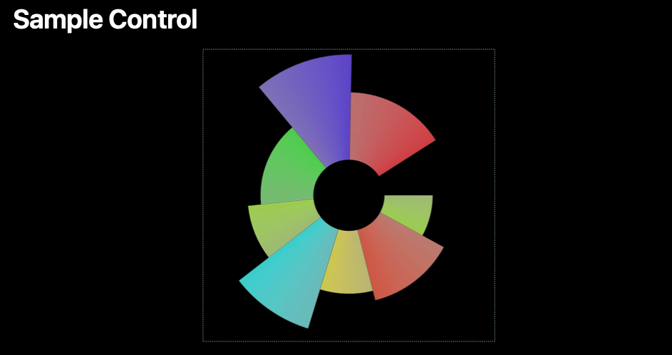