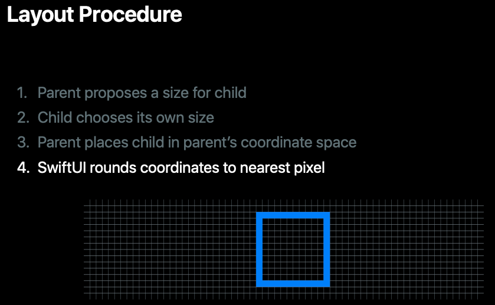

# Building Custom Views with SwiftUI

- [Video](https://developer.apple.com/videos/play/wwdc2019/237/)

## Layout Basics

Let's start by taking a lot at this simple view. There are actually three views at work here:

- There's the `Text` at the bottom of the view hierarchy
- Your `ContentView` which always has the same bounds as the body of the text.
- And finally the `RootView` which in this case has the dimensions of the device minus the safe area insets.

You can still layout stuff in the safe area using this modifier:

But by default you are in the safe zone.

Now, the top layer of any view with a body is always what we call layout neutral. So its bounds are defined by the bounds of its body. They act the same. So you can realy treat them as the same view for the purposes of layout.

So there are really only two views of interest here and the layout process has three steps.

First, the root view offers the text a proposed size and that's repressented by those two big wide arrows. And because it's at the root, it offers the size of the whole safe area.

Next, the text replies, well that's mighty generous of you but I'm really only this big. 

*And in SwiftUI there's no way to force a size on your child. The parent has to respect that choice.*

And now the root view says OK, well I need to put you somewhere, so I'll put you in the middle.

And that's basically it! That's a simple example, but every layout interaction plays out in the same way between parents and children. And the bhavior of your whole layout emerges from these parent child interactions.

But I want to highlight the second step (the children chosing their own size), because it's different from what yo umight be used to.

### Child chooses its own size

*It means that your views have sizing behavior.*

Since every view controls its own size, it means when you build a view, you get to decide how and when it resizes.

For example, this view is a non-negitiable 50x10 pts by virture of the fixed size from at its root.

 

And this one is flexible but the height and width are always the same. So it's always got a one to one aspect ratio. So sizing is encapsultinged in the view definition.

We also saw this in action with text.

So in SwiftUI, the bounds of text never stretch beyond the height and width of its displayed lines, and we'll see why that's important when we talk about stacks in a minute.

Finally, one important thing you don't need to worry about but is good to know is that SwiftUI rounds the corners of your view to the nearest pixel. So no anti-aliasing. Always crisp, clear edges.

