# Explore navigation design for iOS

Familiar navigation patterns can help people easily explore the information within your app — and save them from unnecessary confusion.

- [Video](https://developer.apple.com/videos/play/wwdc2022/10001/)

## Tab bar Navigation

### Say no to home tabs

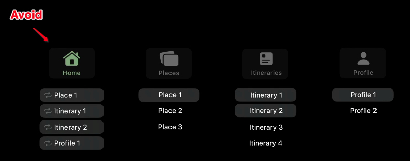

- Avoid home tabs.
- They disrupt an app's hierarchy.
- And lead to confusion because the tab is trying to solve a problem of discoverability. But in reality, it creates a dissociation between understanding content and how to act on it.

### Don't tab jump

- It's jarring and confusing

### Avoid hiding or showing

- Always show the tab bar. Unless you are presenting a modal - then OK.
- Persisent access important.

## Hierarchical Navigation

### Push

- Use push for transitioning through hierarchical navigation
- Here you are drilling down further into the application
- Great because reflects your information hierarchy
- User chevrons

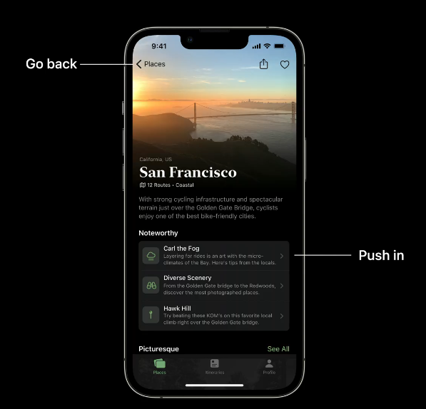

### Modal Presentations

- Are about a context shift.
- Here you are isolating someone into a focussed work flow.
- Modals are good for when someone has enough information in a view to make decisions and complete a task.
- They create focus by. separating people from the information hierarchy

#### Always present from the bottom of the screen

#### Self contained tasks

Use modals for self contained tasks. Three examples are:

- simple task
- multi-step task
- full screen content

##### Simple task

- creating an event or setting a reminder

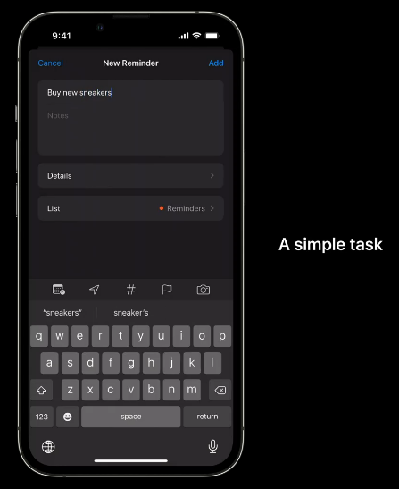

##### Multi-step task

May seem counterintuiive to use a model for a complicated task, but remember, the purpose is to reinfoce focus by hiding the tab bar and preventing people from moving around the app before the task is complete or canceled.

- adding a transit card to a wallet

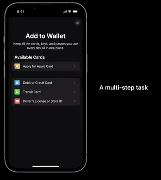

##### Full screen content

- viewing an article, video, or full-screen content that requires minimal additional navigation.

### The anatomy of a modal

- Use the navigation bar of your modal as a guide for way finding.

#### Right label preferred action

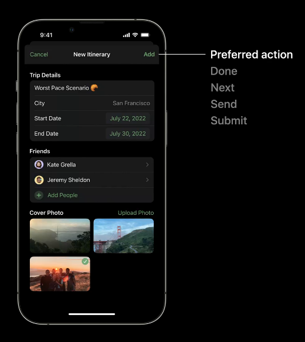

- Often seen in a bolder font to emphasize importance.
- Label itself is a nice confirmative verb. 
- It should tell the user exactly what to expect when tapped

You can disable the preferred action button if the user has not yet entered enough information.

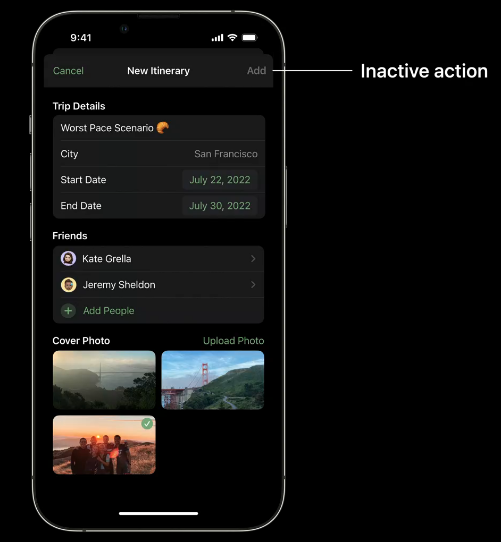

#### Left action to dismiss

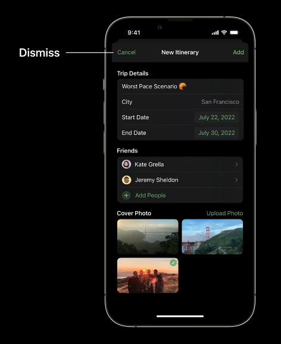

Display action sheet to warn users they will lose edited data. But if I haven't interacted with the UI, tapping cancel should simply dismiss the modal.

#### User close symbols sparingly

And only when modals require no interactions and minimal text input.

Close symbol works here because there is no user input.

Here's an example where the close symbol is problematic. When I hit close do the selections get applied or cancelled?

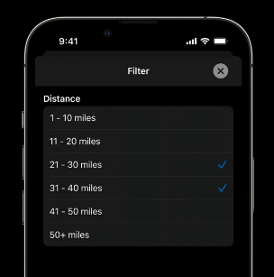

Instead here we should use the navigation bar as the actions are more clear and explicit.

#### Avoid modals on modals

- Generaly we want to avoid.
- But sometimes required.

Here for example is a modal that also does a push and photo modal on top of this modal. Not ideal, but is OK in this context as these are all part of the original intent.

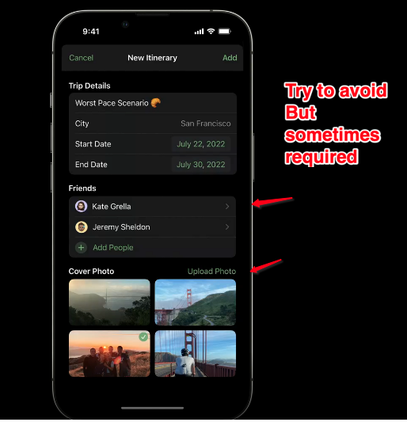

Also note how the intent colors here all indicate that something is tappable and actionable.

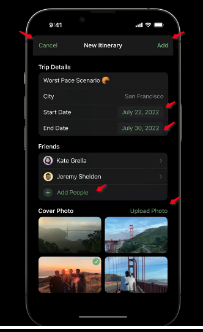

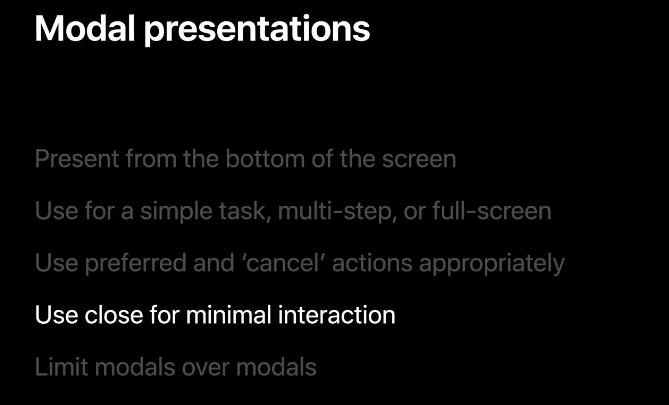

