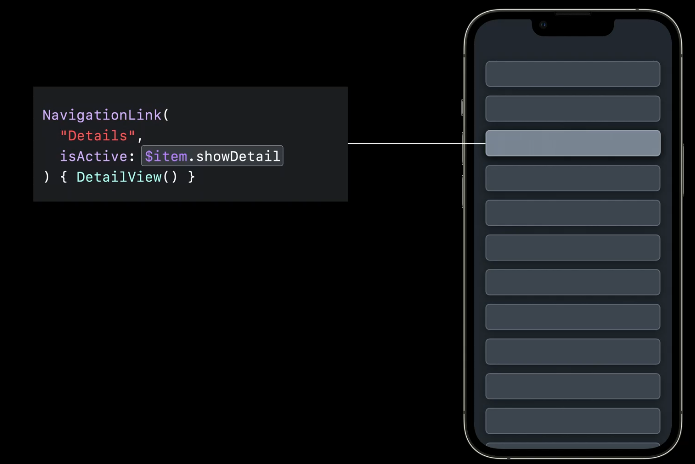
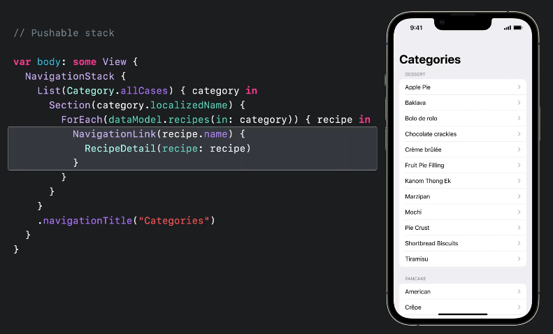
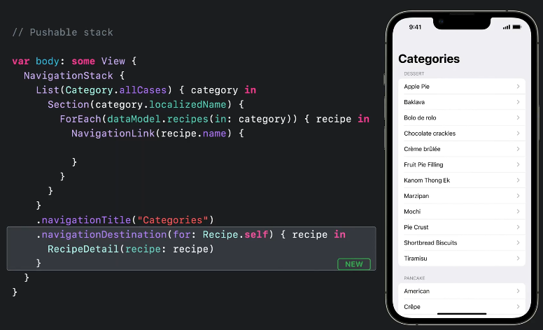
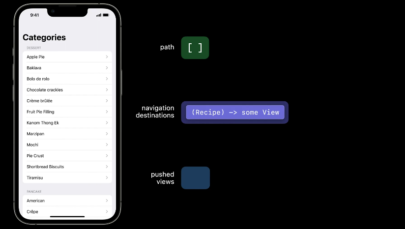
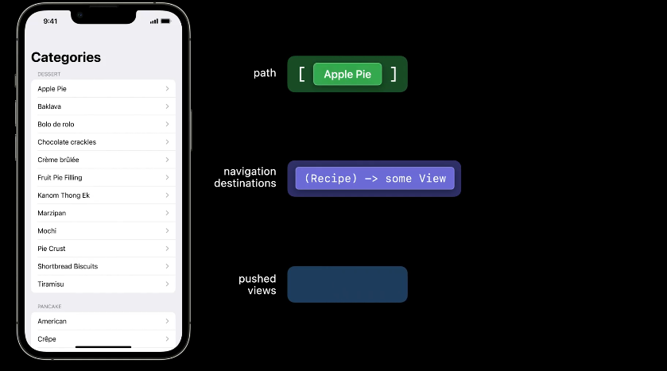
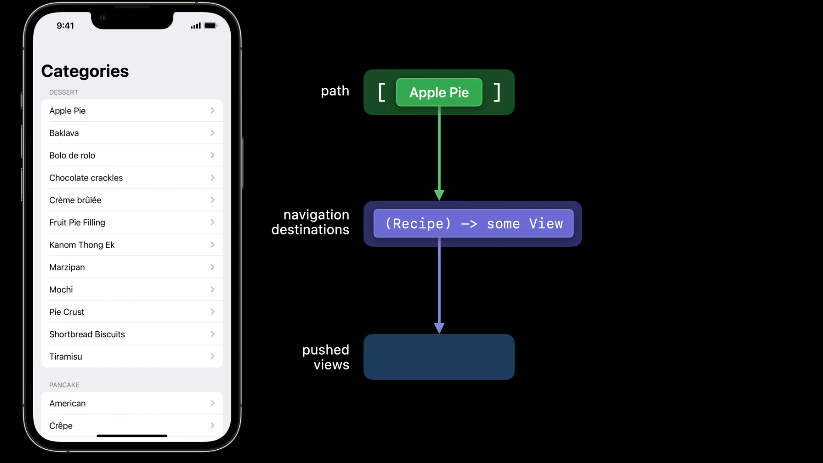
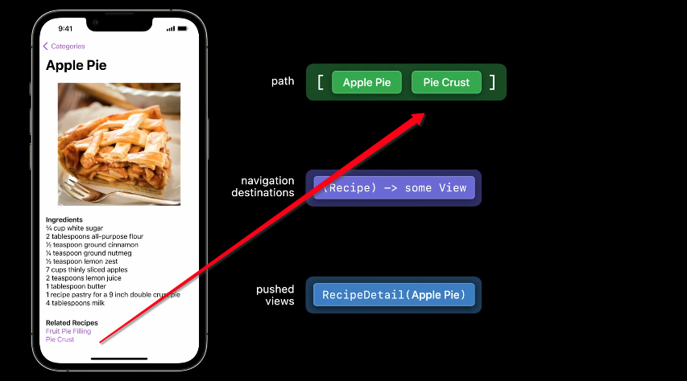
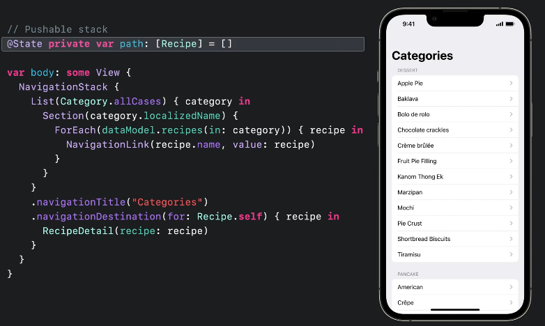
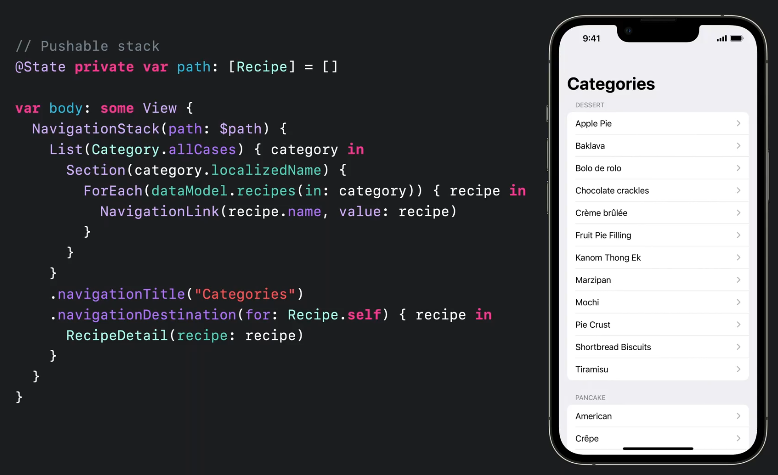

# Swift UI Cookbook for navigation

Old `NavigationLink` you needed an property on each item to decide whether to show:

With new `NavigationStack` that property is lifted up to the top and captured in the form of a path:

- Navigation values append values to the path.
- Can deeplink by mutating the path.
- Or pop to the root view by removing all items from the path.

Old way (and still valid) was to set view in closure. New way is to pass `value`:

- `NavigationLink` is smart. It's behavior depends on the `NavigationStack` or `List` it's link appears in.

Here is the old (current) way to setup a `NavigationLink`:

But what about programmatic navigation?

## Programmatic navigation

Need to tease apart two parts of navigation link:

- the value
- the view

First we pull the view we want to navigate to out of the link closure and into a `navigationDestination` modifier:

 
This modifier declares the type of the data it's view is responsible for:

 

The modifer takes a `ViewBuilder` which describes the view that gets pushed onto the stack when a `Recipe` value is presented.

Then we just present the `recipe` value using the new `NavigationLink` constructor like this:

## How does it work?

Every navigation stack keeps track of a path that represents all the data that the stack is showing. Here is the root view when the path is empty:

Next, the navigation stack also keeps track of all the navigation destinations declared inside it, or pushed onto it. It is a set but in this example we only push one view:

When you tap a value to a link, it appends that value to the path:

Then the path maps its values over the destination views to decide what view to push onto the stack:

Now, if we drill deeper, the new view gets appended to the path:

 

Navigation stack does it's magic, and pushes another detailed view onto the stack:

And when you click back, views simply get popped off the view.

## Path and binding

Navigation stack has one more trick. The `path` and connect itself to a binding.

To bind the path, first we'll add some state:

If you need to present multiple types onto a path, check out the new type erasing `NavigationPath` for mixed data:

Once you've got your path state, you can pass it as a binding to the stack:

With that in place you can now do all sorts of things. For example you could add a method to show a specific recipe:

Or pop back to the root, simply by resetting the path:

And that is an example of how to create a pushable stack:

### Links that help

- [Video](https://developer.apple.com/videos/play/wwdc2022/10054/)

